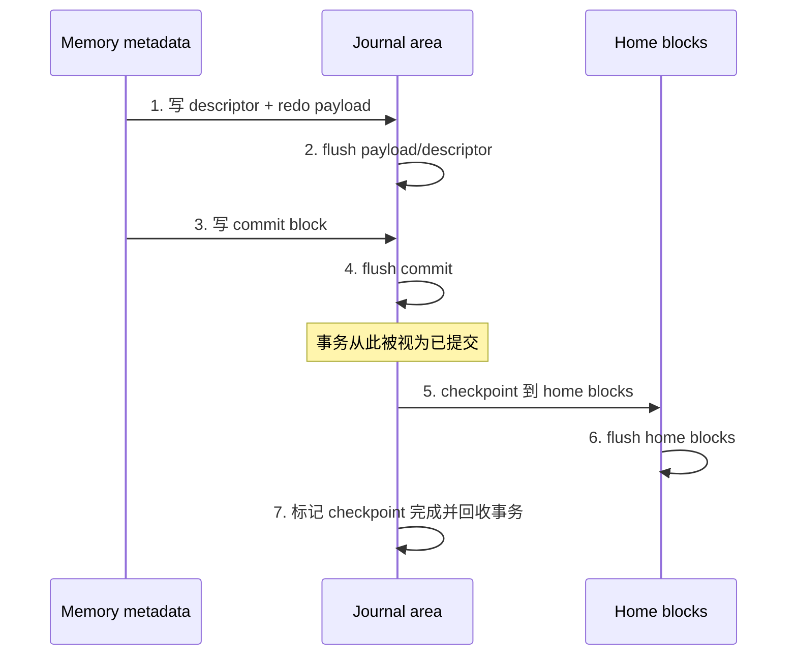
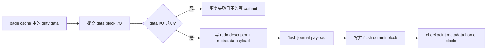
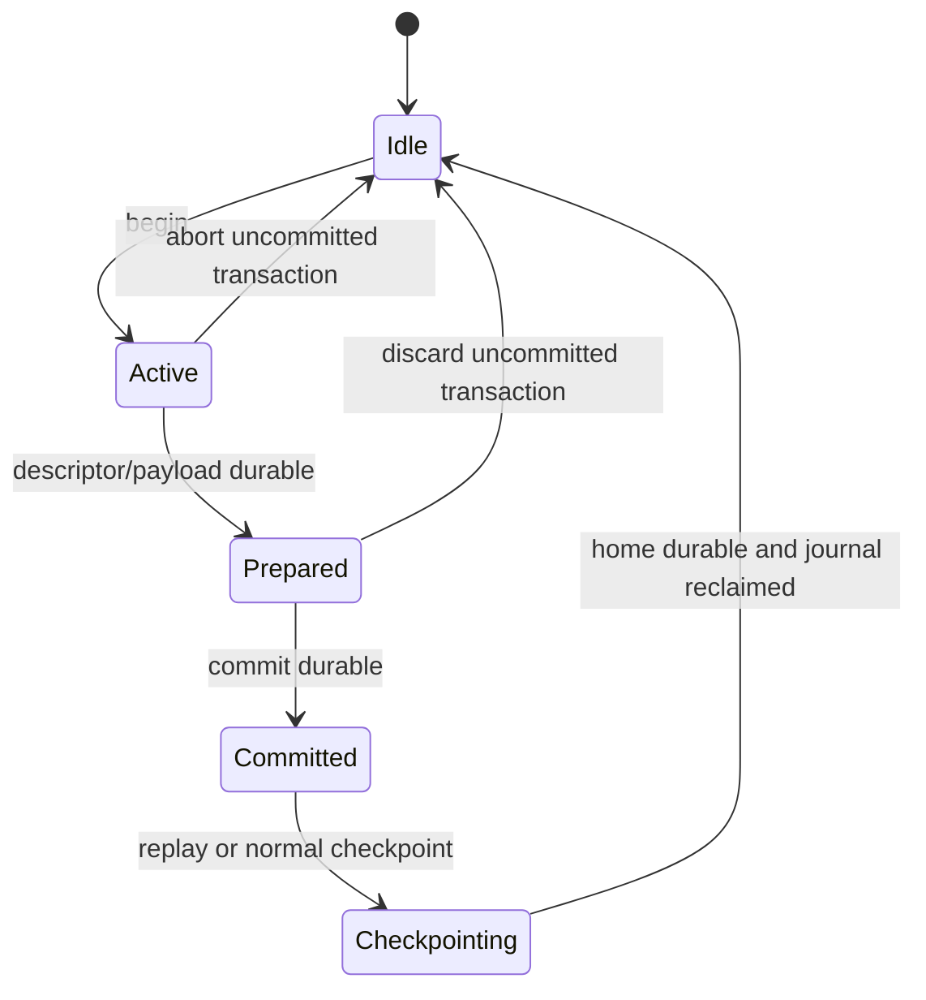

# CRYEXTS Version 11 需求设计

## 1. 版本定位

到 `v10.5` 为止，CRYEXTS 已完成 regular file 的 page cache、buffered write、writeback 和加密协同，普通文件 I/O 已进入 Linux 通用缓存框架。

Version 11 不继续横向增加文件系统功能，而是优先修正当前最高风险的基础能力：崩溃一致性。

```text
Version 11 = CRYEXTS metadata redo journal + data=ordered 主线
```

本阶段的最终目标是：

```text
一次包含 data 和 metadata 的文件操作在任意写盘阶段中断后，
重新挂载只能看到事务提交前或提交后的完整状态，
不能看到一半新、一半旧的 metadata，
也不能让已提交 metadata 指向尚未持久化的新数据块。
```

Version 11 完成后，CRYEXTS 应从“具有单事务 journal 的教学型文件系统”推进为“提交语义明确、可重复注入崩溃、可验证恢复结果的文件系统原型”。

## 2. 为什么 v11 先处理 journal

当前 journal v2 使用固定区域和单事务锁，结构简单、容易检查，但其 payload 保存的是 home metadata 的旧副本，且 `record_block()` 阶段已经写入带 committed 标志的 commit block。

当前简化流程近似为：


如果在 home metadata 已部分写入、journal 尚未清空时断电，挂载恢复可能把旧 payload 写回 home block，从而回滚已经提交的 metadata。这个窗口比继续做批量加密、并发 writeback 更需要优先处理。

因此 v11 的顺序必须是：

```text
先保证事务提交正确
-> 再保证 replay 幂等
-> 再保证 data/metadata 顺序
-> 最后才评估事务合并带来的性能收益
```

## 3. 核心设计原则

### 3.1 使用 redo，而不是继续扩展 undo

journal v3 保存事务提交后的 metadata 新副本，也就是 after-image。

```text
descriptor: home block 地址和事务描述
payload:    home metadata 的新内容
commit:     事务已经完整写入 journal 的持久化标志
```

只有完整、校验通过且已经 commit 的事务才允许 replay。未提交事务直接丢弃，不能写入 home blocks。

### 3.2 commit block 是唯一提交点

正确顺序必须固定为：



任何阶段都不能提前把 commit 标志当成有效事务。

### 3.3 保持单事务模型

v11 MVP 继续使用现有 `journal_lock`，同一时间只允许一个 metadata transaction。单事务已经足以验证正确的 redo、replay 和 checkpoint 语义。

循环 journal、多事务并发和 revoke 会显著扩大状态空间，不属于本阶段。

### 3.4 metadata redo + `data=ordered`

普通文件数据继续通过 page cache/writeback 写盘，不复制到 journal。journal v3 只记录会影响文件系统结构一致性的 metadata，例如：

- superblock 和 GDT
- block/inode bitmap
- inode table
- extent metadata
- directory data 和 directory index
- xattr metadata
- policy table

`data=ordered` 不代表把普通文件内容复制到 journal。它表达的是强制写盘顺序：



事务必须记录“哪些新数据块是本次 metadata 更新的依赖”。只有这些数据块全部持久化后，才允许提交包含 inode size、extent、bitmap 等新引用的 metadata。

三类写入语义分别是：

| 写入类型 | `data=ordered` 要求 |
|---|---|
| 新分配 block / 文件扩展 | data 必须先于引用它的 metadata commit |
| 已分配 block 原地覆盖 | writeback 可独立进行；`fsync` 必须等待 data I/O 完成 |
| truncate / block free | 先阻止旧 dirty page 再写回被释放 block，再提交释放 metadata |

加密文件中的“data durable”指密文已经写入块设备并完成等待，不是仅在 page cache 中保留明文。

## 4. journal v3 状态机

建议把事务状态收敛为下面五种：



恢复规则只有三条：

| 磁盘状态 | mount-time 行为 |
|---|---|
| 没有有效 commit | 丢弃未提交 journal，home 不变 |
| commit 有效但 checkpoint 未完成 | 把 redo payload 重放到 home |
| checkpoint 已完成 | 不重复修改语义，回收 journal |

replay 必须幂等：同一事务重放一次、两次或多次，最终 metadata 内容相同。

## 5. 核心功能需求

### 5.1 journal v3 磁盘格式

新增独立 journal v3 incompat feature，不复用 v2 标志。v3 至少需要表达：

- journal layout version
- transaction sequence
- transaction state
- descriptor entry count
- 每个 home block 地址
- 每个 payload checksum
- descriptor checksum
- commit checksum
- checkpoint sequence

继续复用现有固定 journal 区域，保持 `control + descriptor + payload + commit` 的整体布局，不在本阶段引入循环空间管理。

### 5.2 内存事务与 after-image

现有 `record_block()` 是“修改前保存旧副本”的语义，不能直接承担 redo。

v11 必须把事务接口收敛为：

```text
begin
-> 注册将被修改的 metadata buffer
-> 修改 buffer
-> 捕获最终 after-image
-> commit
```

事务提交前，相关 home metadata 不得绕过 journal 提前落盘。实现时应集中到共享 metadata dirty/record 入口，不能要求每个调用点各自维护写盘顺序。

### 5.3 持久化顺序与错误传播

每一步写盘或 flush 失败都必须返回到原始 VFS 操作，不能只打印日志后继续成功返回。

至少覆盖：

- payload 写失败
- descriptor 写失败
- commit 写失败
- home checkpoint 写失败
- journal reset 写失败
- 块设备断开后重新出现

commit 未持久化时失败，事务必须按未提交处理；commit 已持久化后 checkpoint 失败，文件系统必须保留 recovery 状态，等待下次 mount replay。

### 5.4 mount-time replay

挂载阶段必须严格验证：

- magic、layout version 和 feature
- sequence 是否一致
- entry count 是否越界
- home block 是否在合法数据范围且不指向 journal 自身
- descriptor、payload、commit checksum
- 未使用 descriptor 项是否为零

只有全部验证通过的 committed transaction 才能 replay。结构损坏时返回 `-EUCLEAN`，不能猜测或部分重放。

### 5.5 `data=ordered` 事务依赖

内存事务除 metadata block 列表外，还必须维护最小的 ordered-data 依赖范围。提交路径必须做到：

1. 提交事务依赖的数据页写回。
2. 等待数据 I/O 完成并检查错误。
3. 数据成功后生成 metadata after-image。
4. 写入并 flush descriptor/payload。
5. 最后写入并 flush commit block。

禁止在持有目标 page lock 的 writeback 回调中递归等待同一 page，否则会形成自等待。实现应让 data I/O 完成事件唤醒事务提交，或者由上层 `fsync`/transaction commit 在 page 解锁后统一等待。

如果任一依赖数据页写回失败：

```text
不写 commit block
+ 返回原始 I/O error
+ 保持文件系统 recovery/error 状态可观察
```

### 5.6 `fsync` 语义

对包含新分配数据块的普通文件，`fsync` 成功返回前必须保证：

```text
file data durable
-> metadata transaction committed
-> 必要的 inode metadata durable or replayable
```

对于只覆盖已有数据块的写入，`fsync` 也必须等待对应 data writeback；不能因为没有新的 extent metadata 就提前成功返回。

本阶段不承诺完整 POSIX 崩溃语义矩阵，但至少验证文件扩展、覆盖写、truncate、rename 和 unlink 的明确结果。

### 5.7 工具链同步支持

以下工具必须识别 v3，不能只改内核模块：

- `mkfs.cryexts`：可创建 journal v3 image
- `cryextsck`：识别 clean、uncommitted、replay pending 和 corrupt
- `cryexts_journal_inspect`：打印状态、sequence、entries 和 checksum
- fault injector：在指定持久化阶段生成崩溃镜像

`cryextsck --repair` 在 v11 MVP 中只允许清理明确未提交的事务或完成可验证的 redo replay，不做推测性修复。

## 6. 兼容策略

项目版本 `v11.x` 不等于 superblock format version 必须从 V6 升级。journal v3 通过新的 incompat feature 表达格式边界：

- 新代码继续识别历史 journal v1/v2 image。
- 新建 v11 测试 image 默认使用 journal v3。
- 不认识 journal v3 的旧内核必须拒绝挂载。
- v2 不做原地自动升级，避免升级中断损坏唯一副本。
- v2 到 v3 的迁移留给离线、可备份、可回退的后续工具。

只要 incompat feature 能让旧实现安全拒绝挂载，当前主线可继续使用 filesystem format V6；若后续修改 superblock/GDT/inode 的基础解释方式，再单独评估 format V7。

## 7. 故障注入与验收矩阵

每个事务至少在以下持久化边界生成一份 image：

| 注入点 | 预期恢复结果 |
|---|---|
| begin 后 | 丢弃事务，保持旧状态 |
| payload 写到一半 | checksum/完整性不成立，不 replay |
| descriptor durable、commit 前 | 丢弃事务，保持旧状态 |
| commit durable、checkpoint 前 | replay 全部新 metadata |
| checkpoint 写到一半 | replay 覆盖全部 home blocks |
| home durable、journal reset 前 | replay 可重复执行，结果不变 |
| reset 完成后 | clean mount，不需要 replay |

测试对象至少包括：

- create
- mkdir
- 文件扩展并分配新 block
- truncate
- unlink
- 同目录 rename
- 跨目录 rename
- xattr set/remove
- extent leaf 更新
- directory index 更新

每个场景都必须满足：

```text
mount 不出现 Oops/panic
-> replay 后目录与 inode 引用一致
-> bitmap/GDT free count 一致
-> cryextsck clean
```

## 8. 敏捷版本拆分

### v11.0：崩溃模型与注入基线

交付：

- 固定事务不变量和持久化边界
- 实现最小 fault injector
- 为 journal v2 复现已知提交窗口
- 建立 image-based crash matrix 脚本

这一版不改 journal 格式，先让问题可稳定复现。

### v11.1：journal v3 格式与工具

交付：

- v3 feature、control、descriptor、commit 定义
- `mkfs` 创建 clean v3 journal
- `cryextsck` 和 inspect 识别 v3 clean 状态
- 旧实现拒绝未知 incompat feature

### v11.2：单事务 redo commit

交付：

- metadata after-image 收集
- descriptor/payload/commit 正确写盘顺序
- commit 后 checkpoint
- I/O error 完整传播

### v11.3：redo replay 与幂等恢复

交付：

- committed transaction replay
- uncommitted transaction discard
- partial checkpoint 重放
- 重复 replay 幂等测试

### v11.4：`data=ordered` 与 `fsync`

交付：

- transaction 跟踪 ordered-data 依赖
- 新分配数据先于引用它的 metadata commit
- data I/O 失败时禁止 journal commit
- 原地覆盖写的 `fsync` 等待 data writeback
- truncate 阻止已释放 block 的旧 dirty page 回写
- 文件扩展、truncate、rename、unlink 崩溃语义
- page cache/writeback 与 journal v3 协同

### v11.5：回归收口与 MVP

交付：

- plain/encrypted image 全量回归
- v1/v2 兼容挂载与 fsck 回归
- v3 故障注入矩阵全部通过
- soak 中循环执行 replay/fsck
- Version 11 MVP 总结和统一 smoke 入口

## 9. Version 11 MVP 验收标准

Version 11 只有同时满足以下条件才算完成：

1. journal v3 不再提前写 committed 标志。
2. payload 保存 metadata after-image，committed transaction 使用 redo replay。
3. 任一注入点生成的 image 都得到旧状态或新状态，不出现混合状态。
4. replay 可重复执行且最终 `cryextsck clean`。
5. metadata I/O 错误能返回到调用者，不能静默成功。
6. 新数据块在引用它的 metadata commit 前已经持久化，完整满足本项目定义的 `data=ordered` 顺序。
7. v10.5 page cache、writeback、加密与性能基线不回退。
8. 历史 v1/v2 image 仍能按兼容策略识别。

统一验收入口建议为：

```bash
./scripts/smoke_version11_mvp.sh
```

## 10. 非目标

Version 11 明确不做：

- 完整复制 ext4/JBD2
- 循环 journal 和动态 head/tail 空间复用
- 多事务并发
- revoke record
- `data=journal` 模式
- snapshot、reflink、quota、RAID
- 在线 v2 到 v3 格式迁移
- 为追求 benchmark 数字放松 flush 或 checksum

这些能力只有在单事务 redo 和故障矩阵稳定后才有讨论价值。

## 11. 阶段完成后的能力边界

Version 11 MVP 完成后，可以明确表述为：

```text
CRYEXTS 已具备单事务 metadata redo journal 和 data=ordered 模式，
能够在可控断电点恢复 committed transaction，
不会让已提交 metadata 指向未持久化的新数据，
并通过 fsck、inspect 和故障注入证明恢复结果一致。
```

但仍不能表述为“生产级 NAS journal”。生产化还需要循环日志、多事务并发、barrier/FUA 的设备矩阵验证、更长时间 soak，以及更完整的 fsync/rename 崩溃语义测试。

## 12. 一句话总结

```text
Version 10 解决“读写进入 Linux page cache 后怎样更快”，
Version 11 解决“写得更快以后，如何先持久化 data、再提交 metadata，断电后仍保持一致”。
```
