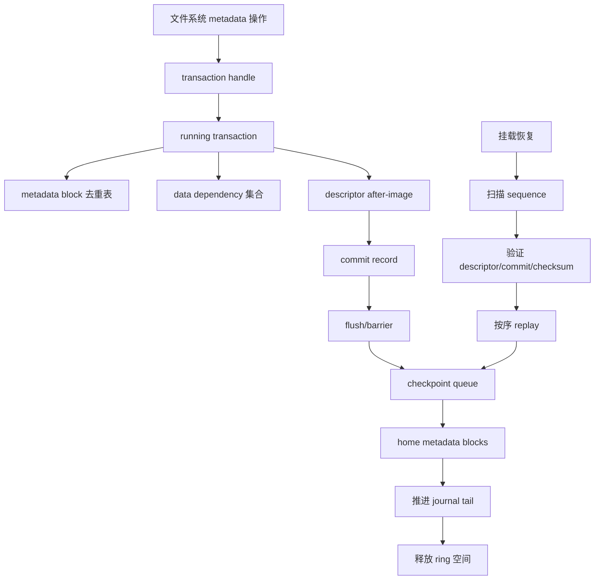
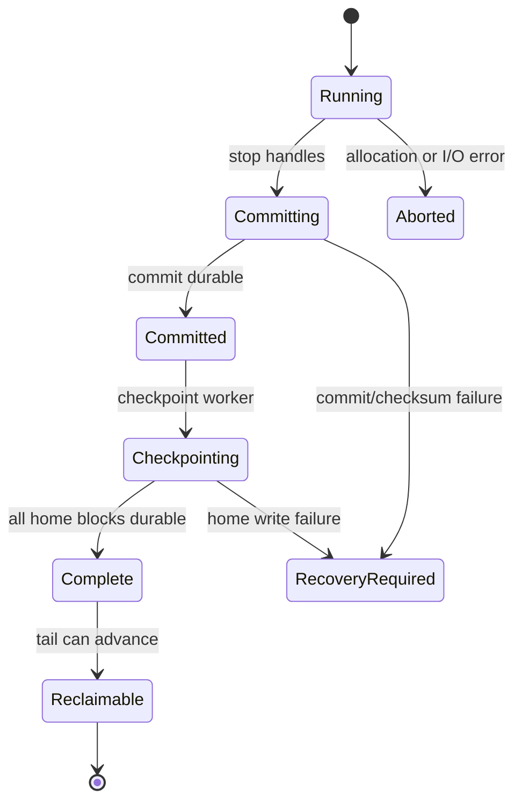

# CRYEXTS Version 12 需求文档

## 1. 版本定位

Version 11 已经完成了单事务 metadata redo journal、journal v3 replay、checkpoint 以及当前项目定义的 data=ordered 语义。Version 12 的目标是把这个“可验证的 MVP”推进为“可以持续运行和承受并发操作的 journal 基线”。

核心主题：

```text
固定 journal + 单事务
        -> 循环 journal + 明确事务生命周期
        -> 多事务并发提交 + 可恢复 checkpoint
```

Version 12 仍然是自研文件系统原型，不宣称已经达到 ext4/JBD2 或生产级 NAS 的完整可靠性标准。

## 2. 当前问题

Version 11 的 journal 存在明确上限：

1. journal 使用固定区域，事务完成后整体清空，空间不能连续循环复用；
2. 全局 journal lock 使所有 metadata 更新串行化；
3. 一个 page writeback 通常对应一次 metadata transaction，写入量大时提交开销高；
4. journal commit、checkpoint、空间回收没有独立的生命周期队列；
5. data=ordered 依赖当前同步式 data buffer 写回，尚无 transaction 级数据依赖集合；
6. 设备 flush、barrier、FUA 语义没有形成统一的抽象和测试矩阵；
7. recovery 主要验证单个活动事务，不能覆盖多个连续事务同时存在的场景。

## 3. 目标与非目标

### 3.1 目标

- 将 journal 改为可循环分配的 ring layout；
- 支持 running、committing、checkpointing、complete 等事务状态；
- 允许多个事务并存，至少支持新事务运行与旧事务 checkpoint 并行；
- 为 metadata block 建立事务归属和去重记录，减少重复写入；
- 保持 journal v3 redo after-image 的恢复原则；
- 保持 v11 data=ordered：相关 data block durable 之前不能提交引用它的 metadata；
- 把 block flush、journal commit 和 checkpoint 的顺序写成可测试的接口；
- 在异常注入后得到旧状态或新状态，不产生混合 metadata 状态；
- 保持历史 image 的只读识别、fsck 和兼容挂载策略。

### 3.2 非目标

- 不在 v12 中实现完整 ext4/JBD2 的全部功能；
- 不实现任意数量的 journal、跨设备 journal 或远程 journal；
- 不改变 extent tree、HTree、GDT、xattr 和 encryption policy 的逻辑格式；
- 不把普通文件数据复制进 journal；
- 不把教学型 FNV1a KDF 和 AES-CTR 直接宣称为生产级加密方案；
- 不在没有 benchmark 证据时增加复杂的预读、异步加密线程或自定义缓存层。

## 4. Version 12 总体架构



写入顺序必须满足：

```text
data dependency 完成
    -> descriptor durable
    -> commit durable
    -> checkpoint home metadata
    -> tail 回收
```

## 5. 磁盘格式需求

### 5.1 journal ring

保留 superblock 中的 journal 起始 block 和总 block 数，同时新增或明确以下状态：

| 字段 | 含义 |
|---|---|
| head block/sequence | 下一个事务可写入的位置 |
| tail block/sequence | 最早尚未回收事务的位置 |
| last sequence | 最近创建的事务序号 |
| checkpoint sequence | 已完整写回 home metadata 的序号 |
| active transaction | 当前仍在运行或提交的事务 |
| feature flags | ring、barrier、data-ordered、multi-transaction 能力 |

ring 空间必须使用逻辑位置和 sequence 双重校验，不能只依赖 block offset。sequence 回绕时必须采用无符号序号比较规则，并拒绝超出可判断窗口的旧记录。

### 5.2 transaction records

v12 继续使用 control、descriptor、payload、commit 的基本语义，但允许一个 journal 中连续存在多个 transaction：

```text
control/header
transaction 100: descriptor -> payload -> commit
transaction 101: descriptor -> payload -> commit
transaction 102: descriptor -> payload -> commit
tail ........................................ head
```

每笔事务必须包含：

- sequence；
- descriptor 的起止位置和 entry 数量；
- payload 的起止位置和 block 数量；
- commit record 位置；
- descriptor checksum、payload checksum、commit checksum；
- checkpoint 状态或可推导的 checkpoint 边界。

不完整记录只能被识别为未提交事务，不能被部分 replay。

### 5.3 兼容策略

- v1/v2 journal image：按历史识别规则只读检查或兼容挂载；
- v3 fixed-journal image：保持现有 replay 路径；
- v12 ring journal：通过 feature flag 进入新路径；
- 未识别 feature 或损坏的 layout：挂载失败并返回 `-EUCLEAN`，不能静默降级写入。

## 6. 事务生命周期

### 6.1 状态机



要求：

1. 只有 `Committed` 事务可以 replay；
2. `Running` 和未完成 `Committing` 事务必须丢弃；
3. `Checkpointing` 失败必须保留 recovery 状态；
4. checkpoint 必须幂等，重复执行不会改变最终 metadata；
5. tail 只能越过已完成且已持久化的事务。

### 6.2 transaction handle

文件系统内部需要提供最小事务接口：

```c
struct cryexts_transaction;

struct cryexts_transaction *cryexts_trans_begin(struct super_block *sb,

		unsigned int credits);
int cryexts_trans_record_bh(struct cryexts_transaction *tx,
		struct buffer_head *bh);
int cryexts_trans_add_data(struct cryexts_transaction *tx,
		u64 physical_block);
int cryexts_trans_commit(struct cryexts_transaction *tx);
void cryexts_trans_abort(struct cryexts_transaction *tx);
```

v12.0 可以先让旧的 `cryexts_journal_begin/commit` 作为兼容包装，逐步迁移 inode、directory、xattr 和 allocator 调用者。

## 7. metadata 去重与提交

同一事务中同一个 home block 被修改多次时，只保留一份最终 after-image：

```text
第一次修改 bitmap block  -> 建立 entry
第二次修改同一 bitmap    -> 更新已有 payload
commit                   -> 只写一份最终 after-image
```

验收要求：

- entry 的 home block 不重复；
- entry 数量不超过 payload 数量；
- payload block 与 home block 不得重叠 journal 区域；
- commit 中记录的 checksum 必须覆盖最终 after-image；
- 事务失败时不能把中间 after-image 写入 home。

## 8. data=ordered 与 flush

v12 保留 v11.4 的行为，并把顺序提升到事务层：

```text
transaction data dependencies
    -> wait data writeback
    -> issue device flush/barrier when required
    -> commit journal
```

至少区分三种场景：

| 场景 | 要求 |
|---|---|
| 新分配 data block | data 写回成功后才允许提交 extent/inode |
| 原地覆盖 | writeback 可独立执行，fsync 等待对应 data I/O |
| truncate/free | 旧 dirty page 完成后才允许释放 block |

不得在目标 page 的 writeback 回调中递归等待同一 page。事务层只能等待独立的 data buffer 或由上层 fsync 在 page 解锁后等待。

## 9. 并发模型

Version 12 不要求一开始就实现完全无锁并发，采用分阶段模型：

### v12.0

- journal ring layout；
- 一个 running transaction；
- checkpoint worker 与新事务不能并行；
- 验证 head/tail/recovery 状态。

### v12.1

- running transaction 与旧事务 checkpoint 并行；
- transaction handle 和 metadata 去重；
- journal 空间不足时阻塞新事务，不能覆盖未回收事务。

### v12.2

- 多个 running/committing transaction；
- commit sequence 有序；
- checkpoint 按 sequence 有序推进；
- inode、directory、xattr、allocator 逐模块迁移。

### v12.3

- data dependency tracking；
- flush/barrier/FUA 抽象；
- 错误传播和 I/O retry 规则收口。

### v12.4

- 并发压力、长时间 soak、异常注入和性能回归；
- Version 12 MVP 发布门槛总结。

## 10. 错误处理

所有 journal 和 data I/O 错误必须有明确结果：

| 错误位置 | 处理 |
|---|---|
| data writeback | page redirty、设置 mapping error、fsync 返回错误 |
| descriptor/payload 写入 | 中止事务，保留旧 home metadata |
| commit 写入 | 事务不可视为 committed，保留 recovery 信息 |
| checkpoint home 写入 | 保留已提交事务，下一次 mount replay |
| journal 空间不足 | 阻塞或返回 `-ENOSPC`，不能覆盖 tail 前未完成事务 |
| checksum/layout 错误 | mount/fsck 返回 `-EUCLEAN` |

禁止只打印错误后继续返回成功。

## 11. 测试矩阵

### 11.1 正常路径

- 单文件创建、扩展写入、覆盖写、truncate、fsync；
- mkdir、rename、unlink、hard link、xattr；
- 多 group bitmap/GDT 更新；
- journal ring wrap-around；
- journal 空间不足后 checkpoint 再继续写入；
- plain/encrypted image 对照。

### 11.2 崩溃注入

在以下边界停止或损坏 image：

1. control 写入后；
2. descriptor 写入中间；
3. payload 部分写入；
4. commit 前；
5. commit durable 后；
6. checkpoint 写回一部分；
7. tail 更新前后；
8. ring wrap-around 前后。

每个场景都必须满足：挂载结果是旧状态或新状态，`cryextsck` 最终 clean，不能出现半笔事务的混合 metadata。

### 11.3 性能回归

固定记录：

- metadata 小文件创建吞吐；
- 大量小写入的 fsync 延迟；
- 顺序写和顺序读；
- plain/encrypted 差异；
- 单事务与批量事务的 journal commit 次数；
- ring checkpoint 对可用吞吐的影响。

性能测试必须同时记录数据量、耗时、内核版本、块设备类型和是否命中 page cache。

## 12. 工具与文档

新增或扩展：

- `cryexts_journal_inspect`：显示 head、tail、sequence、事务状态和 ring 使用率；
- `cryextsck`：检查多个 transaction、sequence 顺序、tail/head 合法性；
- `cryexts_journal_inject`：覆盖 ring 各阶段故障注入；
- `scripts/smoke_version12_mvp.sh`：统一回归入口；
- `doc/cryexts-v12.x-change-notes.md`：逐版本记录格式和语义变化。

## 13. Version 12 MVP 验收标准

Version 12 MVP 只有同时满足以下条件才算完成：

1. journal 可以在固定区域内循环分配和回收；
2. head、tail、sequence 和 checkpoint 状态经过 checksum 校验；
3. 至少支持一个提交事务和一个待 checkpoint 事务的连续存在；
4. metadata entry 在事务内去重，replay 只应用完整 after-image；
5. journal 空间不足时不会覆盖未完成事务；
6. v11.4 data=ordered 和 fsync 回归全部通过；
7. v1/v2/v3 历史 image 按兼容策略识别；
8. 所有故障注入场景最终为旧状态或新状态，并且 `cryextsck clean`；
9. plain/encrypted、page cache、writeback 和性能基线没有回归；
10. 统一 smoke 入口可重复执行并输出明确的 pass/fail。

## 14. 实施原则

Version 12 采用敏捷迭代，每个小版本只引入一个可验证的 journal 能力：

```text
先稳定 on-disk ring
    -> 再迁移 transaction API
    -> 再增加 checkpoint 并行
    -> 再增加 data dependency 和 flush
    -> 最后做并发与 soak
```

任何阶段如果破坏 v11 的 recovery、fsync 或加密读写，应暂停新功能，先恢复已有 smoke 全部通过。
