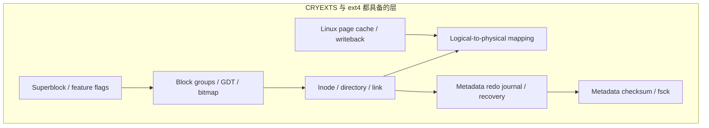
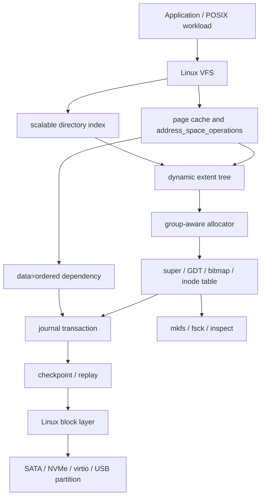
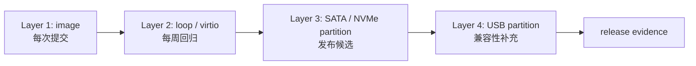

# CRYEXTS Version 13 需求文档：面向磁盘部署的文件系统核心化

## 1. 重新定义 v13

CRYEXTS 的最终使用方式应是：

```text
Linux block device partition
    -> mkfs.cryexts
    -> mount -t cryexts
    -> 作为本地磁盘文件系统持续读写
```

这里的 block device 可以是 SATA SSD/HDD、NVMe namespace、虚拟磁盘或 U 盘分区。U 盘只是验证真实块设备 I/O、拔插和低成本现场演示的一个介质，不是产品目标本身。

因此，Version 13 的定位改为：

```text
CRYEXTS 从功能 MVP
    -> 面向通用 Linux 磁盘分区的核心文件系统基线
```

它的目标不是在一个大版本内复制 ext4 的全部历史包袱，而是先达到一条可商业化继续投入的主线：

```text
可扩展容量与目录
+ 可恢复的一致性
+ 面向磁盘的性能基线
+ 可重复的部署、回归和故障支持
```

## 2. 当前与 ext4 的关系

CRYEXTS 已经具备和 ext4 **同层次**的很多核心概念：



但“有同类模块”不等于“接近 ext4 的生产成熟度”。当前差距如下：

| 领域 | CRYEXTS 当前状态 | ext4 参考能力 | v13 的处理 |
| --- | --- | --- | --- |
| 磁盘格式 | 已有 super/GDT/group/journal，多 GDT | 长期兼容、丰富 feature 治理 | 冻结 v13 format profile，严格版本兼容 |
| inode 密度 | 默认每 group 56 inode，偏教学参数 | 可按容量/用途配置 | 让 mkfs 按目标容量配置 inode density |
| 文件映射 | direct/single indirect + 固定深度 extent tree | 多级 extent tree、split/merge | 改为可增长的 extent tree |
| 目录 | 数据最多 12 logical blocks；64 bucket/16-bit mask 索引 | 可扩展 HTree，多级索引 | 移除 12-block 限制，重做可扩展目录索引 |
| allocator | group bitmap、locality、预分配；全局锁 | 多策略、多 CPU 并发分配 | 先正确可扩展，再减少全局串行 |
| journal | metadata redo、ring、replay、checkpoint、ordered barrier | JBD2 多事务、精细 barrier/commit | 保持 redo 模型，补事务并发与错误边界 |
| I/O | page cache/writeback；无 DIO/readahead/iomap | readahead、DIO、multi-block I/O 等 | 先完成 buffered I/O 性能和正确性；DIO 后置 |
| 安全 | AES-CTR + 教学型 KDF；元数据明文 | fscrypt 等成熟密钥与认证模型 | 不把当前加密宣称为商用安全；单列安全版本 |
| 运维 | mkfs/fsck/inspect/smoke | e2fsprogs、在线管理、长期兼容 | 补 format/upgrade/support 工具和诊断证据 |

结论：**现在是具备 ext4 基本设计语言的自研 Linux 文件系统原型，不是 ext4 级可替换实现。** v13 的任务是先清除会阻止“真实磁盘长期使用”的结构上限。

## 3. v13 产品目标与非目标

### 3.1 目标

1. 支持在专用 Linux 磁盘分区上格式化、挂载、持续读写和卸载恢复。
2. 消除目录 12-block 上限、16-bit `block_mask` 上限、固定 extent 深度和固定 inode 密度等规模瓶颈。
3. 对大容量分区提供一致的 GDT、bitmap、inode table、journal 和 `fsck` 行为。
4. 把 journal、writeback、allocator 的错误传播收敛为“失败不伪造成功”的规则。
5. 建立 image、loop、虚拟磁盘、SATA/NVMe 和 USB 的分层测试矩阵。
6. 固定一个可维护的 on-disk format profile、内核支持范围和发布/回退流程。

### 3.2 非目标

- 不承诺 ext4 on-disk 格式兼容，也不让 ext4 工具直接修复 CRYEXTS；
- 不在 v13 实现 DAX、Direct I/O、reflink、snapshot、RAID、在线 resize、quota、ACL、casefold、compression 或 discard；
- 不用当前 AES-CTR/FNV1a KDF 宣称生产级加密；
- 不承诺支持任意 Linux 内核、任意页大小、任意块设备；
- 不将 U 盘、消费级闪存或突然断电当作可被软件完全兜底的介质；
- 不为“优化 descriptor/commit 占用一个 block”而破坏现有 journal 的提交边界。

## 4. 目标架构



v13 的关键原则：

```text
磁盘几何和持久化由 Linux block layer 负责
文件系统语义、一致性、空间映射和格式校验由 CRYEXTS 负责
```

不要在文件系统里自行区分“这是 U 盘还是 SSD”。CRYEXTS 应按 block-device 能力和 I/O errno 工作；硬件类别只用于测试与发布认证。

## 5. v13 格式策略

当前 on-disk 版本仍显示为 `6`，但项目已新增多 GDT、extent tree、journal v3 ring、policy/xattr 等能力。v13 不应继续只依赖“项目版本号”解释磁盘内容。

v13.0 要冻结一个新的 **format profile**：

```text
format version
+ incompat / ro-compat feature bits
+ block size = 4096
+ group geometry
+ inode density
+ extent tree version
+ directory index version
+ journal version and features
```

规则：

- 只读不认识的 `ro_compat` feature 可以拒绝写入；
- 不认识的 `incompat` feature 必须拒绝挂载；
- 格式语义变更必须同时更新 `mkfs`、mount 校验、`cryextsck`、inspect 和升级文档；
- 历史 v6 image 保持识别和只读检查能力；写入迁移必须显式执行，不能自动改盘；
- v13.0 之后，任何新功能先判断能否由 feature bit 表达，再决定是否 bump format version。

## 6. 版本拆分

### v13.0：格式冻结与磁盘几何

解决的问题：当前默认 inode table 每组只有 4 blocks、56 inode，无法作为通用磁盘格式的合理默认值。

交付：

- v13 format profile 和 feature 兼容规则；
- `mkfs.cryexts` 支持按容量计算/显式指定 inode density 与 inode table blocks；
- mount、allocator、`fsck`、GDT inspect 对非 56 inode/group 的完整支持；
- 128 MiB、1 GiB、8 GiB image 的格式/挂载/多 GDT 回归；
- 磁盘分区部署手册，明确只使用 partition，不默认使用整盘。

验收：大镜像不因 inode 耗尽或 GDT 边界失败；同一 format profile 的 `mkfs -> mount -> write -> remount -> fsck` 可重复通过。

### v13.1：可扩展目录与真实 HTree

解决的问题：当前目录只能有 12 个 logical data blocks；`bucket[64] -> uint16_t block_mask` 只能表示低 16 个候选 block。这是最先阻止真实磁盘使用的结构上限。

交付：

- 目录数据改用通用 logical-to-physical 映射，不再使用 `direct[12]` 作为目录容量上限；
- 把固定 64 bucket/16-bit mask 替换为磁盘上的可扩展 hash index node；
- 叶子数据块满时 split，根节点满时增加下一层；名称最终仍需在叶子 directory entry 中完整比对；
- `mkdir/create/unlink/rename/readdir/fsck/inspect` 全部维护同一索引事实；
- 至少验证 10,000 个目录项、跨多个目录 data block 和重挂载。

验收：目录项数量只受空间与 inode 限制，不再受 12-block 或 16-bit mask 限制；碰撞、删除、rename 和 crash replay 后索引可重建/校验。

### v13.2：动态 extent tree 与大文件

解决的问题：当前 extent tree v2 固定为一层 leaf，inode 内最多 4 个 root reference；碎片化大文件会达到格式上限。

交付：

- 定义 extent leaf 和 index node 的统一磁盘格式；
- 支持任意合理深度的 root/index/leaf 查找；
- 支持 leaf split、index 插入、truncate/hole punch 后回收或合并；
- 写入、预分配、truncate、punch-hole、fsck 与 extent inspect 统一使用新树；
- 迁移策略：历史 extent 格式按旧路径读取，v13 profile 用新格式写入。

验收：在受控碎片化负载下写入超过原有 4 leaf 限制，逻辑块映射、重挂载和 `fsck` 一致。

### v13.3：事务并发与磁盘错误模型

解决的问题：当前 allocator/journal 仍有全局串行点，且 journal 的数据依赖为保守 transaction-wide flush。

交付：

- running、committing、checkpointing transaction 的明确生命周期与锁边界；
- 允许新 running transaction 与旧 committed transaction 的 checkpoint 并行；
- 事务级 data dependency 集合，替代不必要的全设备写入等待；
- 首个持久化错误记录、writeback/journal/checkpoint 的统一 fail-stop 规则；
- commit、flush、checkpoint 和尾指针更新的故障注入矩阵。

验收：并发 create/write/rename 压力下无死锁、无错误成功返回；故障后只得到旧状态或完整已提交状态，不能产生混合 metadata。

### v13.4：磁盘性能与设备适配

解决的问题：当前 buffered I/O 已接入 Linux page cache，但缺少磁盘负载下的性能观测和设备准入策略。

交付：

- block size、read-only、容量、feature 与 flush 错误的挂载前校验；
- 顺序读写、4 KiB `fsync`、小文件创建、目录扫描、fragmented-file 的基线工具；
- buffered read readahead 评估和最小实现，只在 benchmark 显示必要时接入；
- image、loop、virtio、SATA/NVMe、USB 分区的相同测试入口；
- dmesg/inspect/fsck 证据包与性能记录。

验收：认证设备上连续 10 轮 mount/write/fsync/remount/fsck 无未解释错误；性能结果可复现并能定位到 page cache 命中或真实介质 I/O。

### v13.5：发布候选与运维交付

交付：

- 支持的 Linux 内核、format profile、设备类别和已知限制清单；
- `mkfs`、mount、upgrade、rollback、只读救援、`fsck` 的标准操作手册；
- 完整回归入口与硬件测试报告模板；
- release candidate 的 Git commit、工具版本、测试环境可追溯记录。

验收：v13.0-v13.4 通过，且所有发布声明都有对应 smoke、硬件记录和已知限制支撑。

## 7. 测试分层



| 层级 | 目的 | 通过标准 |
| --- | --- | --- |
| image | 快速发现格式、journal、inode、目录回归 | 每次改动必须通过 |
| loop/virtio | 验证真实 block layer 调度路径 | 每周/版本候选通过 |
| SATA/NVMe 分区 | 验证主产品落地场景 | 发布候选必须通过 |
| USB 分区 | 验证可移动介质与不同控制器 | 作为兼容性证据，不替代磁盘验证 |

各层共同核心场景：

- `mkfs -> mount -> create/write/fsync -> remount -> fsck`；
- 多 group 分配、inode 密度、目录扩展、extent 扩展；
- rename/unlink/truncate/hole-punch/xattr；
- encrypted 与 plain 对照；
- journal committed-before-checkpoint、partial checkpoint、I/O/flush error；
- 并发小文件和长时间 mount/unmount soak。

## 8. 商业化门槛

v13 完成后才能定义为“受限场景下可试点的 Linux 本地文件系统”，要求：

1. v13 format profile 已冻结，有明确的升级、回退和 feature 规则；
2. 目录、extent、inode 数量不再存在当前教学型硬上限；
3. metadata journal、ordered data、orphan 与错误传播在异常注入后有确定结果；
4. 目标 Linux 内核版本上的 image、virtio、SATA/NVMe 分区测试通过；
5. 至少一轮长期 soak 和多轮重挂载/`fsck` 证据完整；
6. `mkfs/fsck/inspect` 可以说明格式和故障，而不是依赖人工猜测；
7. 加密能力的安全限制、性能限制和不支持特性如实写入发布说明。

即使满足 v13，这也应称为：

```text
面向受控 Linux 环境和认证磁盘设备的试点版本
```

而不是“全面替代 ext4”。真正的生产替代还需要更长周期的跨内核验证、故障恢复验证、安全评审、性能调优和工具生态建设。

## 9. v13 MVP 总结

```text
v13.0 先让格式和 inode 密度适合真实磁盘
v13.1 再解除目录规模上限
v13.2 再解除 extent/大文件规模上限
v13.3 收口事务并发与错误语义
v13.4 用真实磁盘负载建立性能与适配证据
v13.5 冻结发布、运维与兼容承诺
```

这一顺序的原因是：目录、extent、inode 上限是“能否把文件系统刷到磁盘持续使用”的前提；性能和硬件认证必须建立在这些结构上限已被消除之后。U 盘验证被保留在最后一层，作为对块设备兼容性的补充证据。
