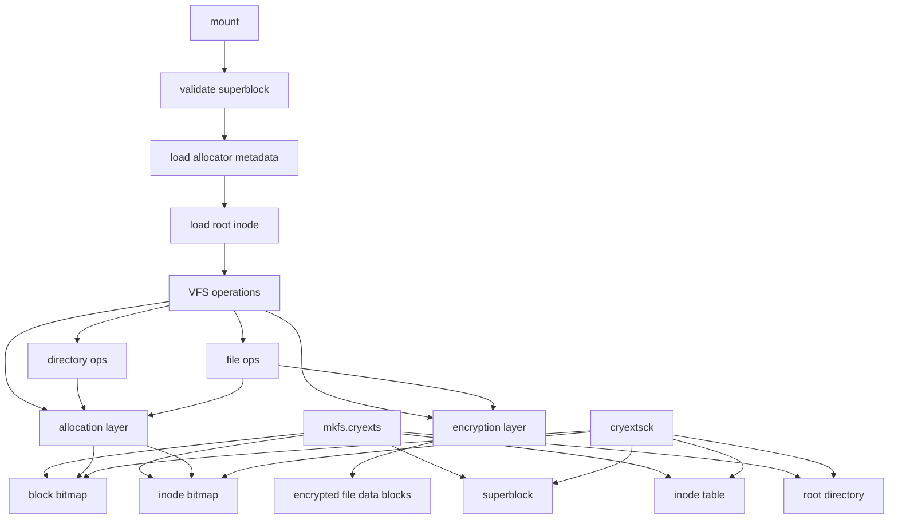

# CRYEXTS Version 2 需求分析

## 1. Version 2 目标

CRYEXTS Version 1 已经完成最小闭环：

```text
mkfs -> insmod -> mount -> ls -> mkdir -> touch -> write/read -> fsck check -> transparent encryption MVP
```

Version 2 的目标不是马上追求完整 ext2/ext4 级能力，而是把当前“能跑的实验骨架”增强成“更像真实文件系统的可持续演进版本”。

Version 2 的核心目标：

- 引入 inode/block bitmap，替换当前 append-only 分配。
- 支持删除后空间复用。
- 支持普通文件多 block 读写。
- 支持目录多 entry 扩展，避免一个目录 block 很快写满。
- 改进 `cryextsck`，从“只检查”逐步走向“可报告、可定位、可选修复”。
- 把 Phase 4 的透明加密 MVP 升级为可演进的加密层设计。
- 保持 Linux `5.15.0-139-generic` 作为当前固定目标内核。

## 2. Version 1 当前基线

当前已具备：

- out-of-tree kernel module。
- `mkfs.cryexts` 格式化镜像。
- `mount -t cryexts` 挂载。
- root directory 遍历。
- `mkdir/rmdir`。
- `touch/unlink`。
- 小文件 read/write。
- 卸载后重新挂载数据仍存在。
- mount-time superblock/inode/dirent 校验。
- `cryextsck` 只检查工具。
- corrupt image 拒绝测试。
- `mkfs.cryexts -E <key>` 加密卷标记。
- `mount -o key=<key>` key 校验。
- 普通文件 data block 透明加密 MVP。

当前主要限制：

- 没有 inode bitmap。
- 没有 block bitmap。
- inode 和 data block 删除后不复用。
- 普通文件只支持单个 4KB data block。
- 目录只支持单个 4KB data block。
- 没有 indirect block。
- 没有 rename。
- 没有 hard link。
- 没有 symlink。
- 没有 fsync/sync 完整语义。
- 加密算法仍是实验 XOR stream，不具备真实安全性。
- `cryextsck` 只能检查，不能修复。

## 3. Version 2 总体架构



Version 2 建议明确拆出四个逻辑层：

- VFS 接口层：对接 Linux VFS，例如 create、mkdir、read、write、lookup。
- 磁盘布局层：管理 superblock、inode、dirent、bitmap、data block。
- 分配器层：统一 inode/block 分配、释放和计数更新。
- 加密层：只处理普通文件数据 block 的加密和解密，避免污染目录和 inode 逻辑。

## 4. 磁盘布局需求

Version 2 建议把磁盘布局升级为更清晰的 ext2-like 单组布局：

```text
+-----------------------------+
| block 0 reserved/superblock |
+-----------------------------+
| block bitmap                |
+-----------------------------+
| inode bitmap                |
+-----------------------------+
| inode table                 |
+-----------------------------+
| data blocks                 |
+-----------------------------+
```

### 4.1 Superblock

superblock 需要新增或明确以下字段：

- `magic`
- `version`
- `block_size`
- `inode_size`
- `blocks_count`
- `inodes_count`
- `free_blocks_count`
- `free_inodes_count`
- `block_bitmap_block`
- `inode_bitmap_block`
- `inode_table_start`
- `inode_table_blocks`
- `first_data_block`
- `features_compat`
- `features_incompat`
- `features_ro_compat`
- `flags`
- `encryption_flags`
- `encryption_kdf`
- `encryption_alg`
- `salt`

Version 2 应避免继续只靠 `next_ino` 和 `next_data_block` 做分配。`next_ino` 和 `next_data_block` 可以保留为 hint，但不能作为唯一真相。

### 4.2 Block Bitmap

block bitmap 需求：

- bit 为 1 表示 block 已使用。
- bit 为 0 表示 block 空闲。
- `mkfs.cryexts` 必须标记 superblock、bitmap、inode table、root directory 等元数据 block 为已使用。
- 分配 block 时必须扫描 bitmap。
- 释放文件或目录时必须清理 bitmap。
- superblock 的 `free_blocks_count` 必须和 bitmap 一致。

### 4.3 Inode Bitmap

inode bitmap 需求：

- bit 为 1 表示 inode 已使用。
- bit 为 0 表示 inode 空闲。
- root inode 必须标记为已使用。
- 创建文件/目录时从 inode bitmap 分配 inode。
- 删除文件/目录时释放 inode。
- superblock 的 `free_inodes_count` 必须和 bitmap 一致。

### 4.4 Inode

Version 2 inode 建议支持：

- mode
- uid/gid
- size
- links_count
- blocks
- atime/ctime/mtime
- direct block pointers
- single indirect block pointer
- flags
- encryption context id 或 encryption flags

Version 2 最小目标：

- direct blocks 至少支持 12 个。
- 文件大小至少支持 `12 * 4096 = 48KB`。
- 如果时间允许，再加入 single indirect block。

### 4.5 Directory Entry

目录项继续保持 ext2-like 结构：

- inode number
- record length
- name length
- file type
- file name

Version 2 需要增强：

- 支持目录扩展到多个 data block。
- 删除目录项后能复用空洞。
- `lookup` 能遍历目录的多个 block。
- `readdir` 能跨 block 正确维护 `ctx->pos`。
- `mkdir/rmdir/unlink` 必须正确更新 parent inode 的 mtime/ctime。

## 5. 分配器需求

Version 2 应新增统一分配器接口，避免分配逻辑散在 VFS 操作中。

建议接口：

```c
int cryexts_alloc_inode(struct super_block *sb, u64 *ino);
int cryexts_free_inode(struct super_block *sb, u64 ino);
int cryexts_alloc_block(struct super_block *sb, u64 *block);
int cryexts_free_block(struct super_block *sb, u64 block);
```

分配器必须满足：

- 分配前校验 bitmap block 可读。
- 分配成功后更新 bitmap。
- 分配成功后更新 superblock 计数。
- 出错路径不能留下半更新状态。
- 释放时校验 inode/block 范围。
- 重复释放应返回错误或被 `cryextsck` 发现。

## 6. 普通文件需求

Version 2 普通文件能力目标：

- 支持超过 4KB 的文件。
- 支持多 direct block 顺序读写。
- 支持覆盖写。
- 支持 append 写。
- 支持 truncate 缩小文件并释放多余 block。
- 支持 truncate 扩大文件，读 hole 返回 0。
- `cat`、`cp`、`dd` 基本命令可以正常工作。

建议先实现 direct block 文件：

```text
file offset -> direct block index -> disk block -> optional decrypt -> user buffer
```

验收命令：

```bash
dd if=/dev/urandom of=/tmp/src.bin bs=1K count=32
sudo cp /tmp/src.bin /tmp/cryexts-mnt/file.bin
sudo cp /tmp/cryexts-mnt/file.bin /tmp/out.bin
cmp /tmp/src.bin /tmp/out.bin
```

## 7. 目录需求

Version 2 目录能力目标：

- 一个目录内能创建超过单 block 容量的文件。
- 删除目录项后新文件可以复用目录空洞。
- 空目录判断支持多 block。
- `rmdir` 只允许删除真正空目录。
- `ls -la` 对大目录不报错。

验收命令：

```bash
sudo mkdir /tmp/cryexts-mnt/bigdir
for i in $(seq 1 100); do sudo touch /tmp/cryexts-mnt/bigdir/file_$i; done
ls /tmp/cryexts-mnt/bigdir | wc -l
for i in $(seq 1 100); do sudo rm /tmp/cryexts-mnt/bigdir/file_$i; done
sudo rmdir /tmp/cryexts-mnt/bigdir
```

## 8. 一致性检查需求

Version 2 的 `cryextsck` 应从只检查升级为更有诊断价值的工具。

### 8.1 检查项

必须检查：

- superblock magic/version/block size。
- feature flags 是否支持。
- bitmap 范围是否合法。
- inode table 范围是否合法。
- root inode 是否存在且为目录。
- inode bitmap 和 inode table 是否一致。
- block bitmap 和 inode block 指针是否一致。
- free block/inode count 是否一致。
- directory entry 的 `rec_len`、`name_len`、`file_type` 是否合法。
- directory entry 指向的 inode 是否存在。
- `.` 和 `..` 是否正确。

### 8.2 修复策略

Version 2 可以先不默认修复，但建议预留：

```bash
./cryextsck cryexts.img
./cryextsck --repair cryexts.img
```

第一版 repair 只允许修复低风险问题：

- superblock free count 重新计算。
- bitmap 中明显缺失的已引用 block 标记。
- bitmap 中明显缺失的已使用 inode 标记。

暂不自动修复：

- 目录树断链。
- 多 inode 指向同一 data block。
- 加密元数据损坏。
- 文件内容损坏。

## 9. 透明加密 Version 2 需求

Version 1 的 XOR stream 只证明链路可行。Version 2 需要把透明加密设计成可演进结构。

### 9.1 加密范围

Version 2 推荐继续只加密普通文件数据 block：

- 不加密 superblock。
- 不加密 inode table。
- 不加密 directory entry。
- 不加密文件名。

原因：

- 保持目录调试简单。
- 方便 `cryextsck` 检查元数据。
- 降低 V2 复杂度。

### 9.2 加密算法

目标方向：

- 使用 Linux Crypto API。
- 优先考虑 AES-CTR 或 AES-XTS。
- 每个 block 使用不同 IV/nonce。
- IV 可以由 inode number、logical block index、filesystem salt 派生。

Version 2 可分两步：

- V2.1：保留 XOR，但整理加密接口和元数据格式。
- V2.2：替换为 Linux Crypto API。

### 9.3 Key 管理

Version 2 仍可使用 mount option 传 key：

```bash
sudo mount -o loop,key=test-key -t cryexts cryexts.img /tmp/cryexts-mnt
```

但需要改进：

- superblock 保存 salt。
- key hash 不直接作为安全认证依据。
- 使用 KDF 派生 data encryption key。
- 内存中 key 材料卸载时清零。
- 错误 key 必须拒绝挂载。

## 10. VFS 接口需求

Version 2 应补齐或增强：

- `lookup`
- `create`
- `mkdir`
- `rmdir`
- `unlink`
- `rename`
- `getattr`
- `setattr`
- `read_iter`
- `write_iter`
- `llseek`
- `fsync`
- `statfs`

优先级：

- 第一优先级：多 block read/write、truncate、bitmap 分配释放。
- 第二优先级：大目录、rename、fsync。
- 第三优先级：hard link、symlink、xattr。

## 11. 错误处理需求

Version 2 必须继续坚持：

- 不允许 `panic()`。
- 不允许 BUG_ON 处理普通磁盘错误。
- 不允许因为坏镜像导致 kernel oops。
- 所有磁盘结构读取后先校验再使用。
- 所有边界条件返回明确错误码。
- `dmesg` 中错误信息要能定位到 superblock/inode/dirent/block。

常见错误码建议：

- `-EINVAL`：格式不支持或参数错误。
- `-EUCLEAN`：文件系统结构损坏。
- `-EIO`：底层块设备读写失败。
- `-ENOSPC`：空间不足。
- `-ENOENT`：对象不存在。
- `-ENAMETOOLONG`：文件名过长。
- `-EFBIG`：文件超过当前版本限制。

## 12. 自动化测试需求

Version 2 应新增以下脚本：

- `scripts/smoke_v2_bitmap.sh`
- `scripts/smoke_v2_multiblock_file.sh`
- `scripts/smoke_v2_large_dir.sh`
- `scripts/smoke_v2_delete_reuse.sh`
- `scripts/smoke_v2_encryption.sh`
- `scripts/corrupt_v2_bitmap.sh`

测试至少覆盖：

- 编译。
- 格式化。
- 挂载/卸载。
- inode 复用。
- block 复用。
- 多 block 文件读写。
- 大目录创建/删除。
- `cryextsck` clean 检查。
- 错误镜像拒绝挂载。
- 加密卷正确 key/错误 key。
- 镜像中无普通文件明文。

## 13. Version 2 分阶段路线图

### V2.0：磁盘格式整理

目标：

- 定义 Version 2 superblock。
- 明确 block bitmap 和 inode bitmap 位置。
- 更新 `mkfs.cryexts` 初始化完整布局。
- 保留 Version 1 代码作为参考，但 Version 2 格式建议 bump version。

验收：

- `mkfs.cryexts` 能创建 V2 镜像。
- `cryextsck` 能识别 V2 镜像。
- V1/V2 格式不混淆。

### V2.1：bitmap 分配器

目标：

- 实现 inode bitmap 分配/释放。
- 实现 block bitmap 分配/释放。
- 删除文件和目录后释放资源。
- `statfs` 使用真实 free count。

验收：

- 创建文件后 free inode/block 减少。
- 删除文件后 free inode/block 增加。
- 删除后新文件能复用空间。

### V2.2：多 block 普通文件

目标：

- direct block 多块读写。
- append/overwrite/truncate。
- 加密路径支持多个 file data block。

验收：

- 32KB 文件 `cp/cmp` 成功。
- 重新挂载后 `cmp` 仍成功。
- 加密镜像中搜不到测试文件明文。

### V2.3：大目录

目标：

- 目录支持多个 data block。
- `lookup/readdir/add_entry/delete_entry` 跨 block。
- 空目录判断跨 block。

验收：

- 单目录创建 100 个文件成功。
- 删除后 `rmdir` 成功。
- `cryextsck` 检查通过。

### V2.4：cryextsck 增强

目标：

- 检查 bitmap 与 inode/block 引用一致性。
- 报告更具体的错误位置。
- 可选支持低风险 repair。

验收：

- 人工破坏 bitmap 能被发现。
- 人工破坏 dirent 能被发现。
- clean 镜像检查通过。

### V2.5：加密层整理

目标：

- 抽象加密接口。
- 增加 salt/KDF/algorithm metadata。
- 为 Linux Crypto API 替换做好结构准备。

验收：

- 旧的 Phase 4 smoke test 继续通过。
- 新增多 block 加密测试通过。
- 错误 key 仍拒绝挂载。

## 14. Version 2 MVP 验收标准

Version 2 MVP 完成时，应至少通过：

```bash
make
chmod +x scripts/smoke_v2_bitmap.sh
chmod +x scripts/smoke_v2_multiblock_file.sh
chmod +x scripts/smoke_v2_large_dir.sh
chmod +x scripts/smoke_v2_encryption.sh

./scripts/smoke_v2_bitmap.sh
./scripts/smoke_v2_multiblock_file.sh
./scripts/smoke_v2_large_dir.sh
./scripts/smoke_v2_encryption.sh
```

预期：

- 所有脚本成功。
- `dmesg` 中没有 oops、panic、BUG、use-after-free、NULL pointer dereference。
- `cryextsck` 对 clean image 返回成功。
- corrupted image 被拒绝或被 `cryextsck` 明确报告。
- 加密卷的普通文件数据在镜像中不可直接搜到明文。

## 15. Version 2 非目标

Version 2 暂不追求：

- journal。
- extents。
- online resize。
- quota。
- POSIX ACL。
- xattr。
- DAX。
- page cache/address_space_operations 完整优化。
- 高性能目录索引。
- 多 block group。
- 真正生产可用安全级别。

这些能力可以作为 Version 3 或更后续版本规划。

## 16. 推荐下一步执行顺序

建议下一步从 V2.0/V2.1 开始：

1. 先升级磁盘格式，加入 block bitmap 和 inode bitmap。
2. 更新 `mkfs.cryexts`，初始化完整 bitmap。
3. 更新内核挂载校验，加载 bitmap metadata。
4. 实现 inode/block 分配和释放。
5. 写 `smoke_v2_bitmap.sh`，验证删除后空间复用。
6. 再进入多 block 文件读写。

原因：

- bitmap 是 Version 2 的地基。
- 没有 bitmap，多 block 文件和大目录都会继续堆在 append-only 分配上。
- 先把分配器做稳，后面目录、文件、加密都能复用同一套能力。
