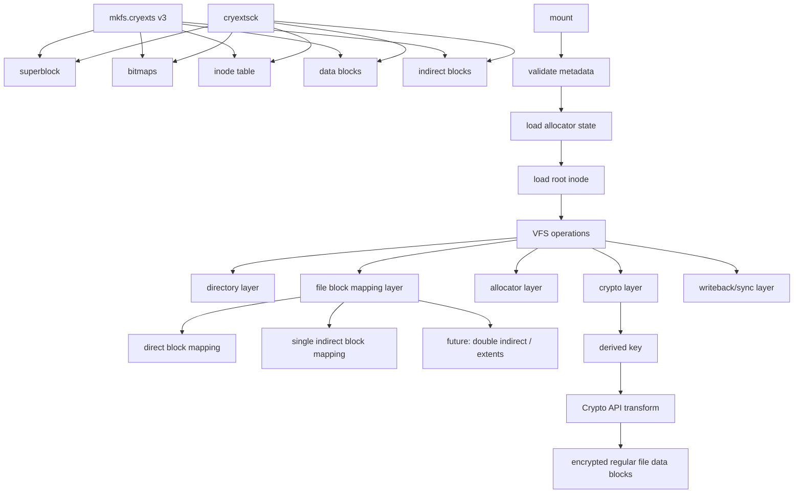

# CRYEXTS Version 3 需求分析

## 1. Version 3 目标

CRYEXTS Version 2 已经完成当前 MVP：

```text
mkfs -> insmod -> mount -> ls -> mkdir -> touch -> write/read -> multi-block file
-> large directory -> cryextsck repair -> transparent encryption skeleton
```

Version 3 的目标，不再只是把“基础链路跑通”，而是把系统从“教学型最小原型”推进到“更接近真实 ext2/ext3/ext4 风格的可扩展文件系统原型”。

Version 3 的核心目标：

- 支持比 12 个 direct block 更大的普通文件。
- 引入 indirect block 机制。
- 引入 `rename`，补齐更完整的目录操作。
- 支持 `fsync` / `sync_fs` 这类更接近真实落盘语义的路径。
- 提升 `cryextsck` 的诊断与修复能力。
- 把 V2.5 的加密层骨架升级为更真实的 Crypto API 版本。
- 为后续的崩溃恢复、日志、extent、block group 打好结构基础。

Version 3 的定位可以概括为：

```text
ext2-like filesystem skeleton
    ->
larger-file + stronger-metadata-ops + real-crypto-ready filesystem prototype
```

## 2. Version 2 当前基线

当前已经具备：

- Version 2 磁盘格式
- block bitmap / inode bitmap
- inode/block 分配与释放
- 删除后资源复用
- 普通文件 12 个 direct block 读写
- 目录 12 个 direct block 扩展
- `truncate`
- `statfs`
- `cryextsck` 一致性检查与低风险修复
- 透明加密 skeleton
  - `salt`
  - `encryption_kdf`
  - `encryption_alg`
  - derived-key verifier
- 错误 key 拒绝挂载

当前仍然明显缺少：

- indirect block
- 大文件支持
- `rename`
- `link`
- `symlink`
- page cache / writeback 语义优化
- 更完整的 `fsync`
- 真正生产级密码学算法
- per-block IV/nonce 设计
- directory index
- journal / crash recovery
- 多 block group

## 3. Version 3 总体架构方向



Version 3 建议从五个逻辑方向继续拆：

- 磁盘布局层
- block mapping 层
- VFS 操作层
- 加密层
- 一致性检查与修复层

## 4. 磁盘布局需求

Version 3 不一定马上重做整个磁盘布局，但必须为更大文件和更复杂元数据做好空间与字段设计。

### 4.1 Superblock

Version 3 建议继续保留 Version 2 superblock 结构主干，并新增或明确：

- `version = 3`
- `features_compat`
- `features_incompat`
- `features_ro_compat`
- `flags`
- `state`
- `last_check`
- `mount_count`
- `max_mount_count`
- `uuid`
- `volume_name`
- `default_kdf`
- `default_encryption_alg`

建议重点：

- 正式开始使用 feature flags，而不是全部为 0。
- 用 feature flags 区分是否支持 indirect block、Crypto API、repair 能力等。

### 4.2 Inode

Version 3 inode 至少建议扩展到：

- direct blocks
- single indirect block pointer
- optional double indirect block pointer 预留
- inode flags
- encryption flags / policy id

建议思路：

- V3.0 先加 single indirect
- double indirect 可以预留，但不一定本阶段实现

## 5. 普通文件需求

Version 3 普通文件的核心目标是跨过“12 个 direct block 上限”。

### 5.1 文件映射目标

Version 3 至少支持：

- direct block
- single indirect block

逻辑示意：

```text
logical block
  0..11     -> inode.direct[0..11]
  12..N     -> single indirect block table
```

### 5.2 能力目标

- 支持明显大于 48KB 的普通文件
- 读写跨 direct 和 indirect 边界
- `truncate` 时正确释放 indirect tree
- 稀疏区域读取返回 0
- encrypted regular file 支持 indirect block 路径

### 5.3 验收命令

```bash
dd if=/dev/urandom of=/tmp/src-1m.bin bs=1K count=1024
sudo cp /tmp/src-1m.bin /tmp/cryexts-mnt/large.bin
sudo cp /tmp/cryexts-mnt/large.bin /tmp/out-1m.bin
cmp /tmp/src-1m.bin /tmp/out-1m.bin
```

## 6. 目录需求

Version 3 目录层重点不再只是“能放更多 entry”，而是要补齐更真实的命名空间操作。

### 6.1 必须增强

- `rename`
- 跨 block 的目录项移动
- 同目录 rename
- 跨目录 rename
- 覆盖目标文件的边界行为

### 6.2 可选增强

- hard link
- symlink
- 目录索引预留

### 6.3 验收命令

```bash
sudo touch /tmp/cryexts-mnt/a
sudo mv /tmp/cryexts-mnt/a /tmp/cryexts-mnt/b
test -f /tmp/cryexts-mnt/b
sudo mkdir /tmp/cryexts-mnt/d1 /tmp/cryexts-mnt/d2
sudo mv /tmp/cryexts-mnt/b /tmp/cryexts-mnt/d2/c
test -f /tmp/cryexts-mnt/d2/c
```

## 7. 写回与同步需求

Version 2 更多依赖 buffer cache 与最小 dirty path。
Version 3 应开始明确同步语义。

### 7.1 目标

- `fsync(file)` 至少保证文件数据和必要 inode 落盘
- `sync_fs` 或卸载前尽可能做完整刷盘
- `mkfs` 后和 `repair` 后显式 `fsync`

### 7.2 要求

- 不追求 journaling
- 但至少要减少“写了一半电源断掉后元数据明显不一致”的概率

这一步可以视为：

```text
从 purely educational write path
升级到
minimum durable write path
```

## 8. 加密层需求

Version 3 是真正把 V2.5 的加密 skeleton 推进一步的阶段。

### 8.1 目标

- 从 XOR 迁移到 Linux Crypto API
- 优先考虑 AES-CTR 或 AES-XTS
- 设计 per-block IV/nonce
- 保持 mount key -> KDF -> derived key -> verifier 这条控制链不变

### 8.2 建议方案

推荐拆成两步：

#### V3.0

- 保留现有 metadata format
- 替换数据面 XOR 为 Crypto API
- 仍然只加密 regular file data blocks

#### V3.1

- 增加更正式的 IV/nonce 派生规则
- 可考虑按 inode number + logical block index + salt 派生 tweak/iv

### 8.3 当前不做

- 文件名加密
- inode / dirent 加密
- authenticated encryption
- anti-tamper metadata MAC

## 9. cryextsck 需求

Version 3 的 `cryextsck` 应该比 V2.4 更进一步。

### 9.1 必须检查

- indirect block 表是否合法
- indirect block 是否越界
- inode 的 block tree 是否重复引用同一 block
- `rename` 后目录引用是否一致
- 大文件 block count 是否正确
- 加密 metadata 与 feature flags 是否一致

### 9.2 可选修复

- free count 重算
- bitmap 修正
- orphan-like inode 报告
- indirect table 中明显非法的空洞或越界引用报告

### 9.3 暂不自动修复

- 文件内容损坏
- 加密数据损坏
- 复杂目录树断链
- rename 冲突后的语义修复

## 10. VFS 接口需求

Version 3 建议明确补齐或增强：

- `rename`
- `fsync`
- `link`
- `symlink`
- `readlink`
- `permission` / `setattr` 边界
- 更稳健的 `getattr`

优先级建议：

- 第一优先级：single indirect + 大文件
- 第二优先级：rename + fsync
- 第三优先级：hard link + symlink

## 11. 错误处理需求

Version 3 继续坚持：

- 不允许坏镜像触发 kernel oops
- 所有 indirect block 读取后先校验再使用
- 所有 block pointer 使用前检查范围
- 错误路径保持可回滚或至少可诊断

新增要求：

- indirect block 分配失败时，不能留下悬挂 metadata
- rename 中途失败时，目录结构不能被轻易破坏
- 加密 transform 初始化失败时必须拒绝挂载

## 12. 自动化测试需求

Version 3 建议新增：

- `scripts/smoke_v3_0_indirect_file.sh`
- `scripts/smoke_v3_1_rename.sh`
- `scripts/smoke_v3_2_fsync.sh`
- `scripts/smoke_v3_3_crypto_api.sh`
- `scripts/corrupt_v3_indirect.sh`

测试至少覆盖：

- 编译
- 大文件写入与读取
- direct / indirect 边界跨越
- truncate 大文件
- rename
- 加密大文件
- 错误 key 拒绝
- `cryextsck` 对 indirect metadata 的检查
- corrupted indirect table 的发现

## 13. Version 3 分阶段路线图

### V3.0：single indirect block

目标：

- 实现 single indirect block
- 支持明显大于 48KB 的普通文件
- `truncate` 正确释放 indirect block 及其引用

验收：

- 1MB 文件 `cp/cmp` 成功
- direct/indirect 边界读写正确
- 重挂载后数据仍正确

### V3.1：rename 与目录一致性

目标：

- 实现 `rename`
- 支持同目录与跨目录 rename
- 加强目录项更新一致性

验收：

- `mv` 正常工作
- 覆盖、替换、跨目录路径符合预期
- `cryextsck` 检查通过

### V3.2：fsync 与最小持久化语义

目标：

- 实现最小 `fsync`
- 提升元数据写回语义
- 减少未同步状态下的不一致风险

验收：

- `fsync` 路径可调用
- 正常写入后卸载重挂载仍一致

### V3.3：Crypto API 替换

目标：

- 把 XOR 数据路径替换为 Linux Crypto API
- 保持现有加密 metadata 流程不变

验收：

- 正确 key 可挂载
- 错误 key 被拒绝
- 多 block 大文件加密读写成功
- raw image 中无明文

### V3.4：hard link / symlink

目标：

- 实现 hard link
- 实现 symlink
- 正确维护 `links_count`

验收：

- `ln`
- `ln -s`
- unlink 后 link count 正确变化

## 14. Version 3 MVP 验收标准

Version 3 MVP 完成时，建议至少通过：

```bash
make
chmod +x scripts/smoke_v3_0_indirect_file.sh
chmod +x scripts/smoke_v3_1_rename.sh
chmod +x scripts/smoke_v3_2_fsync.sh
chmod +x scripts/smoke_v3_3_crypto_api.sh

./scripts/smoke_v3_0_indirect_file.sh
./scripts/smoke_v3_1_rename.sh
./scripts/smoke_v3_2_fsync.sh
./scripts/smoke_v3_3_crypto_api.sh
```

预期：

- 所有脚本成功
- `dmesg` 中无 oops / panic / BUG
- 大文件 direct/indirect 读写正确
- `rename` 工作正常
- `cryextsck` 对 clean image 返回成功
- Crypto API 加密卷可正确读写

## 15. Version 3 非目标

Version 3 暂不追求：

- journal
- extents
- delayed allocation
- online resize
- quota
- POSIX ACL
- xattr
- 多 block group
- directory hash index
- 生产级安全保证

这些能力更适合作为 Version 4 规划。

## 16. 推荐下一步执行顺序

建议从 V3.0 开始，顺序如下：

1. 先做 single indirect block
2. 再做大文件 smoke test
3. 再补 `rename`
4. 再补最小 `fsync`
5. 最后替换 XOR 为 Crypto API

原因：

- single indirect 是 Version 3 的地基
- 没有它，大文件与后续更复杂映射都没法自然演进
- `rename` 和 `fsync` 是让文件系统更像真实系统的关键一步
- Crypto API 放在 indirect 之后做，更容易一次验证“大文件 + 加密”组合路径
