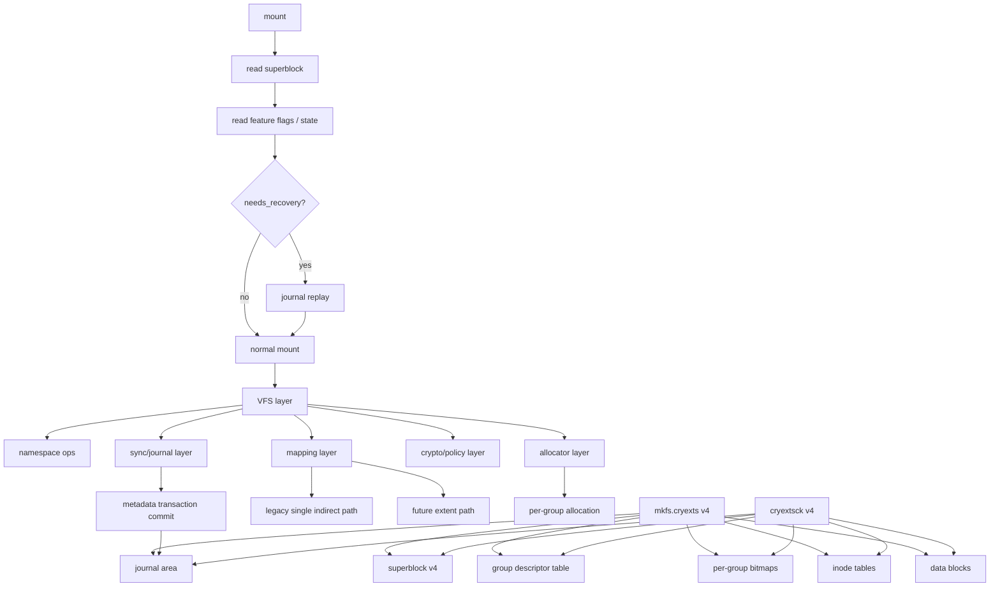

# CRYEXTS Version 4 Requirements

## 1. Goal

After Version 3, CRYEXTS already has:

```text
mkfs -> mount -> ls -> mkdir -> touch -> write/read
-> multi-block regular file
-> large directory
-> rename
-> fsync
-> Crypto API data encryption
-> hard link / symlink
-> cryextsck consistency check
```

Version 4 is no longer about filling isolated VFS interfaces. Its goal is to
push CRYEXTS toward three stronger directions:

- recoverable
- scalable
- policy-aware

Recommended positioning:

```text
recoverable + scalable + policy-aware filesystem prototype
```

## 2. Version 3 Baseline

Current Version 3 already includes:

- Version 3 superblock / feature-flag skeleton
- bitmap-driven inode / block allocation and release
- regular file direct blocks
- regular file single indirect block
- large multi-block directories
- rename
- hard link
- symlink
- minimal `fsync` / `sync_fs`
- Linux Crypto API `AES-CTR` data encryption
- `cryextsck` for superblock / inode / directory / bitmap / indirect-block checks

Current obvious gaps:

- journal / crash recovery
- block groups
- more scalable mapping structure
- xattr / inode policy
- directory indexing
- stronger superblock state lifecycle
- mount replay / recovery state machine

## 3. Version 4 Architecture Direction



Version 4 can be推进 in five layers:

- on-disk format
- allocator
- recovery
- file mapping
- policy and checking

## 4. On-Disk Format Requirements

Version 4 should first make the disk format evolvable.

### 4.1 Superblock

Important fields:

- `state`
- `last_mount_time`
- `last_write_time`
- `last_check_time`
- `mount_count`
- `max_mount_count`
- `uuid`
- `volume_name`
- `journal_block`
- `journal_blocks`
- `group_count`
- `blocks_per_group`
- `inodes_per_group`
- `default_encryption_policy`

Recommended state bits:

- `clean`
- `dirty`
- `needs_recovery`
- `errors_detected`

### 4.2 Feature Flags

Version 4 should formally depend on:

- `features_compat`
- `features_incompat`
- `features_ro_compat`

Recommended flags introduced gradually across V4:

- `HAS_JOURNAL`
- `NEEDS_RECOVERY`
- `BLOCK_GROUPS`
- `EXTENTS`
- `XATTR`
- `DIR_INDEX`
- `ENCRYPTION_POLICY`

### 4.3 Group Descriptor

Introduce a group descriptor table. Each group should record:

- block bitmap block
- inode bitmap block
- inode table start
- free blocks count
- free inodes count
- used directories count

This is the transition from one global bitmap region to a more real
ext2/ext4-like grouped layout.

## 5. Allocator Requirements

Version 4 should upgrade allocation from whole-disk sequential bitmap scan to
group-aware allocation.

### 5.1 Goals

- prefer allocating data blocks near the inode's group
- prefer allocating inodes near the parent directory's group
- keep file blocks locally clustered when possible
- prepare for extents and larger-directory layout

### 5.2 Capabilities

- per-group free count
- group-aware inode allocation
- group-aware block allocation
- new directory updates `used_dirs_count`
- `cryextsck` can recompute per-group free counts

### 5.3 Out of Scope for Now

- buddy allocator
- delayed allocation
- online defrag

## 6. Recovery / Journal Requirements

This is the most important Version 4 area.

### 6.1 Goal

Start with:

```text
metadata journaling
```

Not full data journaling.

### 6.2 Operations to Cover

At minimum, journal should cover:

- create
- mkdir
- unlink
- rmdir
- rename
- link
- symlink
- truncate
- inode/block alloc/free
- bitmap update
- inode update
- superblock state update

### 6.3 Mount / Recovery Semantics

Recommended mount flow:

1. read superblock
2. check `needs_recovery`
3. if needed, replay journal
4. if replay succeeds, clear `needs_recovery`
5. mark filesystem `dirty`
6. after clean unmount or successful sync, mark it `clean`

### 6.4 Boundaries

- journal does not need ext4-level complexity yet
- replay must not make metadata corruption worse
- replay failure should reject mount or force a safer mode
- `cryextsck` should recognize journal-dirty / journal-broken states

## 7. File Mapping Requirements

Version 3's `12 direct + 1 single indirect` is enough for MVP, but not enough
for longer-term growth.

### 7.1 Early V4

- keep compatibility with current single indirect
- stabilize allocator and journal first

### 7.2 Mid V4

- introduce extents
- start with a minimal extent tuple:
  - `logical_start`
  - `physical_start`
  - `length`
- store a small extent header / entries in inode
- postpone extent tree until later

### 7.3 Goals

- better for large files
- better for contiguous allocation
- better for sparse-file evolution
- easier for journal to describe contiguous block changes

## 8. Namespace / Policy Requirements

Version 3 already covers the basic namespace operations relatively well.
Version 4 shifts focus toward attributes and policy.

### 8.1 xattr

Start with minimal xattr:

- `user.*`
- reserve `trusted.*`

Uses:

- file tagging
- policy tagging
- debugging support

### 8.2 inode policy

Future per-inode capabilities:

- encryption policy id
- inode flags
- reserved bits for immutable / append-only

### 8.3 directory policy inheritance

Reserve a future direction for directory-default policy inheritance:

- files created under a directory inherit that directory's default policy

This matters for moving from one global key/algorithm to per-directory or
per-policy encryption later.

## 9. Encryption-Layer Requirements

Version 3 already supports one filesystem-wide encryption policy:

- one key verifier
- one KDF
- one algorithm
- transparent data-block encryption

Version 4 should prepare for policy-aware encryption:

- default filesystem encryption policy
- future inode-level policy id
- future directory policy inheritance
- compatibility between mount-time key validation and per-policy layout

Version 4 does not need to fully implement multi-policy encryption yet, but it
should avoid blocking that evolution in the on-disk format.

## 10. `cryextsck` Requirements

Version 4 `cryextsck` should gradually understand:

- Version 4 superblock fields
- feature flags
- group descriptor consistency
- per-group free counts
- journal area reservation
- `needs_recovery` state
- future extent metadata
- future xattr metadata

The important rule is:

```text
kernel mount path and cryextsck must agree on the disk format
```

## 11. Recommended Version 4 Milestones

### V4.0

- Version 4 superblock format
- state / uuid / volume metadata
- feature-flag baseline

### V4.1

- block-group layout
- per-group bitmap / inode table / descriptor metadata

### V4.2

- minimal metadata journal
- `needs_recovery`
- mount-time replay

### V4.3

- extent-capable mapping skeleton
- keep legacy single-indirect compatibility for older inodes
- extent-aware `mkfs`, kernel read/write path, and `cryextsck`

### V4.4

- minimal xattr
- inode policy fields
- encryption-policy-ready metadata hooks

### V4.5

- stronger journal structure
- better sync semantics
- repair and recovery hardening

## 12. Design Principle

Version 4 should not try to become ext4 in one jump.

The better path is:

```text
first correct
then recoverable
then scalable
then policy-aware
```

That keeps CRYEXTS understandable while still moving toward a real filesystem
prototype.
