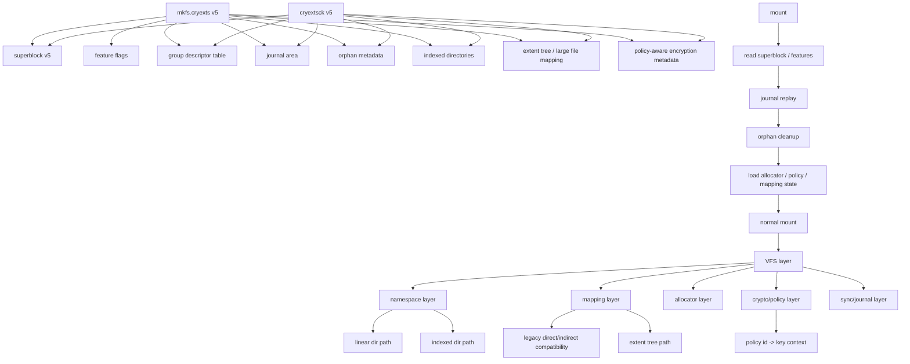

# CRYEXTS Version 5 需求分析

## 1. Version 5 目标

到 Version 4 为止，CRYEXTS 已经完成了第四阶段 MVP：

```text
mkfs -> mount -> ls -> mkdir -> touch -> write/read
-> multi-block regular file
-> large directory
-> rename / link / symlink
-> fsync
-> transparent encryption
-> block groups
-> minimal metadata journal / replay
-> inline extents
-> xattr / inode policy
-> cryextsck repair / recovery hardening
```

Version 5 的重点，不再是“把基础 VFS 接口补齐”，而是把当前系统从：

```text
recoverable + scalable + policy-aware filesystem prototype
```

继续推进到：

```text
more production-shaped filesystem prototype
```

Version 5 建议聚焦四条主线：

- 更强的可扩展性
- 更强的一致性与恢复语义
- 真正生效的策略化加密
- 更像真实文件系统的目录与大文件能力

一句话概括：

```text
Version 5 = 把当前 v4 MVP 推进成“更像真实 ext4/f2fs 风格”的中期原型
```

## 2. Version 4 基线

当前 Version 4 已具备：

- v4 superblock / feature flags
- block groups
- per-group bitmaps / inode tables
- group-aware allocator
- metadata journal + mount-time replay
- journal checksum / replay hardening
- direct + single indirect legacy path
- inline extents regular file MVP
- user xattr
- inode policy id
- directory policy inheritance
- filesystem-wide transparent encryption
- cryextsck 对 superblock / bitmap / inode / dir / journal 的检查

当前仍明显缺少：

- 真正可扩展的 extent tree
- 大目录索引
- orphan list / crash-safe truncate-unlink
- 真正“按 policy 生效”的加密层
- 更完整的 journal transaction 语义
- metadata checksum / generation 一致性
- 预分配 / locality 优化
- 更强的 fsck 修复能力

## 3. Version 5 架构方向



Version 5 建议分成六个逻辑层继续推进：

- on-disk format 演进
- mapping / large-file 能力
- namespace / directory scaling
- recovery / orphan / journal 语义
- policy-aware encryption
- fsck / repair / observability

## 4. Version 5 总体设计原则

Version 5 不建议一口气追求“功能很多”，而应继续坚持：

```text
先保证格式清晰
再保证恢复正确
再提升规模能力
最后再补性能和策略
```

更具体地说：

- 任何新磁盘格式都要通过 feature flags 显式声明
- kernel mount path 和 `cryextsck` 必须同步理解新格式
- 所有 crash-sensitive 元数据，必须先定义恢复语义再写代码
- 能兼容旧 inode/旧 image 的地方，尽量保留兼容路径

## 5. On-Disk Format 需求

Version 5 的第一件事，不是直接加功能，而是先把磁盘格式演进能力继续做强。

### 5.1 superblock 扩展方向

建议新增或正式启用：

- `features_compat`
- `features_incompat`
- `features_ro_compat`
- `orphan_head`
- `dir_index_seed`
- `policy_table_block`
- `metadata_csum_type`
- `journal_sequence`
- `fs_generation`

建议新增状态位或语义：

- `clean`
- `needs_recovery`
- `has_orphans`
- `errors_detected`

### 5.2 feature flags 方向

Version 5 建议引入以下能力标记：

- `DIR_INDEX`
- `EXTENT_TREE`
- `ORPHAN_LIST`
- `POLICY_TABLE`
- `METADATA_CSUM`
- `PREALLOC`
- `LARGE_XATTR`

其中建议分类：

- `compat`
  例如某些旧内核可忽略但新内核可利用的能力
- `incompat`
  例如 extent tree、directory index、orphan list
- `ro_compat`
  例如 metadata checksum 但可只读挂载

### 5.3 group descriptor 演进

建议 group descriptor 后续具备：

- free block count
- free inode count
- used dirs count
- optional checksum
- optional group generation

Version 5 不一定一步做完 checksum，但格式上应提前为此预留。

## 6. Large File / Mapping 需求

Version 4 的 inline extents 只适合“小而连续”的 regular file。
Version 5 应开始支持“真正的大文件映射结构”。

### 6.1 目标

- 支持远大于 inline extent 能力上限的大文件
- 支持更多碎片情况下的 extent 组织
- 为 sparse file / fallocate / truncate 优化做准备

### 6.2 建议能力

- extent tree 或 extent block
- inode 内保留 root extent header
- 当 inline extents 放不下时，挂接 extent node block
- extent entry 支持：
  - `logical_start`
  - `physical_start`
  - `length`
  - flags

### 6.3 建议优先级

Version 5 优先做：

- extent block overflow
- extent-aware read/write/truncate
- `cryextsck` extent tree 校验

先不急着做：

- 多级 extent tree 平衡算法
- reflink
- dedupe

## 7. Directory / Namespace 需求

Version 4 的大目录仍然是“线性扫描目录块”。
Version 5 应把大目录能力从“能放很多 entry”推进到“查找更像真实文件系统”。

### 7.1 目标

- 大目录 lookup 不再完全依赖线性遍历
- 为 rename / create / unlink 保持较稳定的复杂度

### 7.2 建议实现方向

优先考虑简化版 directory index：

- hash directory
- index root 放在目录 inode 首块或专用 index block
- leaf block 仍复用现有 dirent block 格式

可以理解为：

```text
目录索引层
    -> 决定去哪个目录数据块找名字
目录数据块
    -> 继续保存真实 dirent
```

### 7.3 最小可行能力

Version 5 不需要一开始就做完整 HTree，但建议至少做到：

- `lookup` 优先走 hash/index
- `readdir` 仍可顺序扫描
- `cryextsck` 能校验 index -> leaf 引用

## 8. Recovery / Journal 需求

Version 4 已经有最小 metadata journal。
Version 5 的重点是让恢复语义更接近真实文件系统。

### 8.1 orphan list

这是 Version 5 非常值得优先实现的一项。

场景：

- 文件正在 truncate
- 文件 link count 已变为 0，但 inode 还没完全清理完
- 系统突然掉电

如果没有 orphan list，恢复时就很难知道哪些 inode 需要继续清理。

建议能力：

- superblock 挂 `orphan_head`
- inode 挂 `next_orphan`
- mount replay 后跑 orphan cleanup

### 8.2 journal transaction 语义增强

建议新增：

- transaction sequence 更清晰
- revoke / skip obsolete entry 的能力预留
- commit 与 replay 语义更明确
- 对 orphan cleanup 的 journal 保护

Version 5 仍然可以不做 full data journaling，但 metadata transaction 应更完整。

### 8.3 crash-safe truncate / unlink

Version 5 应重点保证：

- regular file truncate
- unlink last reference
- extent tree shrink

在中途中断后，恢复路径有明确定义。

## 9. Policy-Aware Encryption 需求

Version 4 的 policy 还主要是“元数据钩子”，不是“真实策略生效”。
Version 5 应开始把 policy 和实际加密路径接起来。

### 9.1 目标

- 不同 inode policy id 可以映射到不同 key context
- 目录默认 policy 真实影响新建文件
- mount 时不仅校验一个全局 key，还要理解 policy 体系

### 9.2 建议能力

- `policy_table`
- `policy_id -> key derivation context`
- inode policy 与 superblock default policy 协同
- `mkfs.cryexts` 支持初始化默认 policy table

### 9.3 Version 5 建议边界

先做：

- 多 policy metadata layout
- policy 选择真实进入数据加密路径
- key verifier 按 policy 扩展

后做：

- 文件名加密
- authenticated encryption metadata MAC
- 用户态 keyring 深度集成

## 10. xattr / Inode Policy 需求

Version 4 的 xattr 仍是单块模型。
Version 5 建议继续增强，但不要一下做太满。

### 10.1 建议增强

- large xattr block
- xattr block overflow / chaining
- xattr 校验
- `trusted.*` 预留

### 10.2 inode flags 方向

建议继续推进：

- immutable
- append-only
- no-dump 预留
- encrypted/no-encrypted policy state

### 10.3 `cryextsck` 要求

Version 5 的 `cryextsck` 应能检查：

- xattr block 结构
- xattr 引用唯一性
- policy id 是否存在于 policy table

## 11. Allocator / Locality 需求

Version 4 的 group-aware allocator 已经是正确方向。
Version 5 可以进一步增强“局部性”。

### 11.1 目标

- extent-aware allocation
- 同一文件尽量拿连续块
- 同目录新文件尽量落在邻近 group

### 11.2 建议能力

- block preallocation
- contiguous run preference
- per-file allocation hint
- directory locality hint

### 11.3 暂不追求

- buddy allocator 全实现
- delayed allocation
- online defrag

这些更适合 V6 以后。

## 12. `cryextsck` Version 5 需求

Version 5 的 `cryextsck` 要从“能发现问题”继续提升到“能理解更复杂结构”。

### 12.1 必须理解

- directory index
- extent block / extent tree
- orphan list
- policy table
- metadata checksum

### 12.2 建议检查项

- index block 是否越界
- leaf block 是否重复引用
- extent tree 是否有重叠 logical range
- extent tree 是否有重复 physical block
- orphan inode 是否真的需要清理
- policy id 是否引用到有效 policy
- metadata checksum 是否匹配

### 12.3 建议 repair 范围

仍建议坚持低风险 repair 原则：

- 清理空 orphan head
- 修 superblock/group free count
- 修明显空洞的 bitmap mismatch
- 修无效但空的 recovery state

先不要自动修：

- extent tree 拓扑损坏
- directory index 复杂错链
- 多 policy key 数据不一致

## 13. Version 5 推荐分阶段路线

### V5.0

- Version 5 superblock / feature flag baseline
- policy table / orphan / dir index / extent tree 的格式预留

### V5.1

- orphan list
- crash-safe truncate / unlink / mount orphan cleanup

### V5.2

- extent block / extent tree MVP
- 大文件超出 inline extents 的真实支持

### V5.3

- directory index MVP
- hash-based lookup
- index-aware `cryextsck`

### V5.4

- multi-policy encryption metadata
- policy id 真实进入加密路径
- 目录 policy 真实继承生效

### V5.5

- metadata checksum
- superblock / group / journal / extent / index 的一致性校验增强

### V5.6

- preallocation / locality hint
- 更好的大文件连续分配策略

## 14. Version 5 MVP 建议定义

如果你想给 Version 5 设一个清晰的 MVP，我建议是：

```text
orphan list
+ extent tree MVP
+ directory index MVP
+ policy-aware encryption 生效
+ cryextsck 能理解这些新结构
```

也就是说，Version 5 的 MVP 不一定要求“特别快”，但必须要求：

```text
结构更真实
恢复更完整
策略真正生效
```

## 15. Version 5 非目标

Version 5 不建议一上来追求：

- snapshot
- reflink
- dedupe
- online resize
- quota
- POSIX ACL 全实现
- full data journaling
- distributed / network filesystem 能力
- 用户空间 FUSE 兼容层

这些都容易把项目复杂度一下拉爆。

## 16. 推荐下一步

如果按“最稳的推进顺序”，我建议你 Version 5 从这里开始：

1. 先做 `V5.0`，把 superblock / feature flags / orphan / policy table / dir index / extent tree 的磁盘格式预留好。
2. 再做 `V5.1 orphan list`，因为它直接提升 crash recovery 质量，而且和当前 journal 主线最贴近。
3. 然后做 `V5.2 extent tree`，把大文件能力从 MVP 走向真正可扩展。
4. 再做 `V5.3 directory index`，解决大目录 lookup 的线性瓶颈。
5. 最后再做 `V5.4 policy-aware encryption`，让 policy 不再只是 metadata。

这个顺序的核心原因是：

```text
先把恢复语义做稳
再把映射结构做大
再把目录做快
最后把策略真正接入数据路径
```

这样 Version 5 会非常扎实，也最符合你现在这个项目的演进节奏。
