# CRYEXTS `address_space_operations` 架构设计

## 1. `address_space_operations` 是什么

`address_space_operations`，简称 `a_ops`，是 Linux page cache 与具体文件系统之间的适配接口。

Linux 知道如何：

- 创建和查找缓存页。
- 把用户数据复制到缓存页。
- 标记 dirty page。
- 调度 writeback。
- 回收和失效缓存页。

但 Linux 不知道：

- CRYEXTS logical block 如何映射到 physical block。
- sparse hole 如何解释。
- extent tree 如何查找和扩展。
- 数据块如何按 policy 加密。
- block allocation 和 inode 更新如何进入 journal。

因此 Linux 通过 `a_ops` 向 CRYEXTS 提出请求：

```text
Linux 管理 page；
CRYEXTS 负责把 page 与自己的磁盘 block 连接起来。
```

当前实现位置：

- [file.c](../file.c)
- [inode.c](../inode.c)
- [cryexts.h](../cryexts.h)

## 2. 对象关系

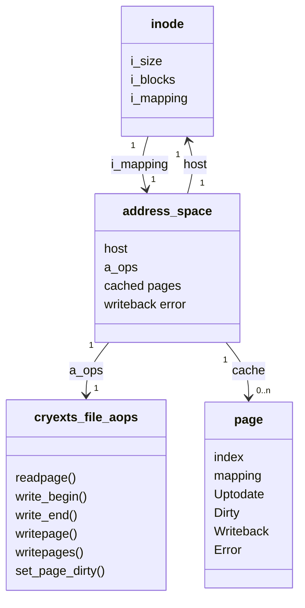

每个 regular-file inode 都有一个 `address_space`：

```text
inode->i_mapping
```

CRYEXTS 在装载已有 regular file 和创建新 regular file 时都设置：

```c
inode->i_mapping->a_ops = &cryexts_file_aops;
```

`mapping->host` 反向指向所属 inode，所以回调拿到 `page` 或 `mapping` 后都能找到文件。

## 3. Page 与 CRYEXTS Block 的关系

当前固定：

```text
PAGE_SIZE          = 4096 bytes
CRYEXTS_BLOCK_SIZE = 4096 bytes
```

所以当前模型是：


也就是：

```text
一个 page = 一个 CRYEXTS logical block = 4096 bytes
```

例如：

| `page->index` | 文件字节范围 | Logical block |
| ---: | --- | ---: |
| 0 | 0～4095 | 0 |
| 1 | 4096～8191 | 1 |
| 2 | 8192～12287 | 2 |

logical block 还要经过 direct/indirect/extent mapping，才能得到 physical block。

## 4. 当前回调表

```c
const struct address_space_operations cryexts_file_aops = {
	.readpage = cryexts_readpage,
	.writepage = cryexts_writepage,
	.writepages = cryexts_writepages,
	.write_begin = cryexts_write_begin,
	.write_end = cryexts_write_end,
	.set_page_dirty = __set_page_dirty_nobuffers,
};
```

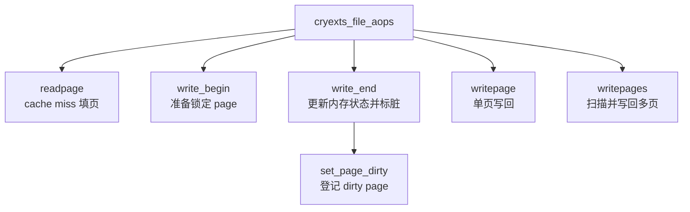

| 回调 | 调用者 | CRYEXTS 职责 |
| --- | --- | --- |
| `readpage` | Linux cached-read | 从磁盘装载一个缺失 page |
| `write_begin` | `generic_file_write_iter` | 获得并准备一个锁定 page |
| `write_end` | `generic_file_write_iter` | 结束用户复制、更新 size/time、标脏 |
| `set_page_dirty` | Linux page-cache helper | 把无 buffer-head page 加入 dirty tracking |
| `writepage` | Linux 单页回写 | 把一个 dirty page 持久化 |
| `writepages` | Linux 批量回写 | 扫描指定 mapping/range 的 dirty pages |

## 5. Page 状态机

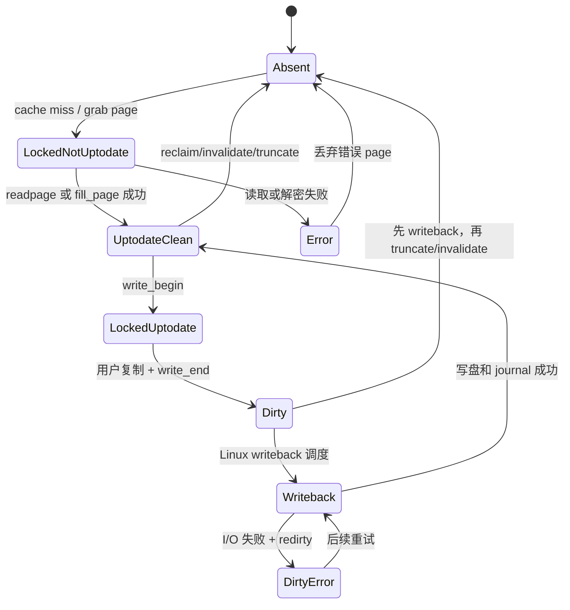

关键状态：

- `PageUptodate`：page 内容对应文件当前逻辑数据，可以交给用户读取。
- `PageDirty`：page cache 比磁盘更新，需要 writeback。
- `PageWriteback`：该 page 正在执行持久化。
- `PageError`：最近一次读取或写回失败。

## 6. 读取架构

### 6.1 Linux 主流程

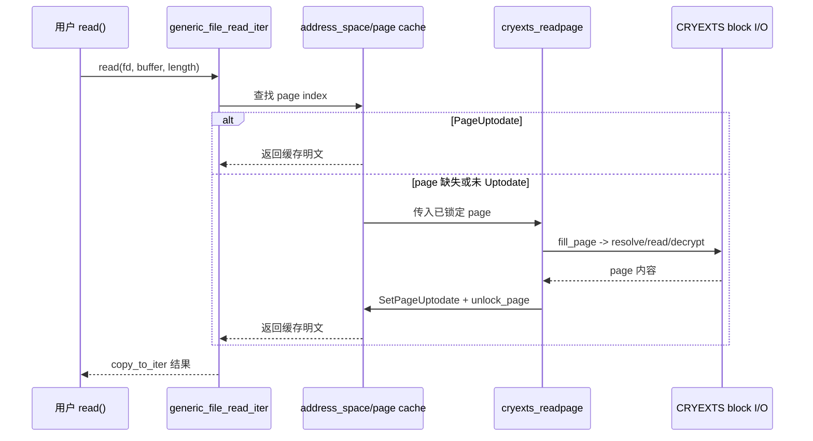

### 6.2 `cryexts_readpage()` 契约

Linux 传入：

- 已加入 `mapping` 的 page。
- 已锁定 page。
- page 尚不能直接交给用户。

CRYEXTS 必须：

1. 调用 `cryexts_fill_page()` 填充内容。
2. 成功时设置 PageUptodate。
3. 失败时清 Uptodate、设置 PageError。
4. 无论成功失败都解锁 page。
5. 返回 0 或负 errno。

### 6.3 `cryexts_fill_page()`

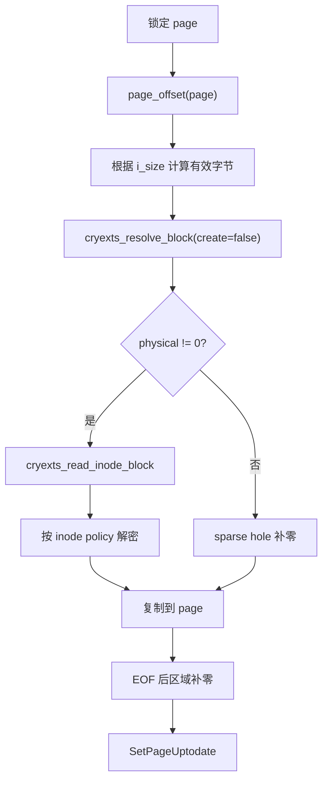

`cryexts_fill_page()` 只负责内容，不解锁 page。这样 `readpage` 和 `write_begin` 都可以复用它，同时保持各自的 page 锁契约。

## 7. Buffered Write 架构

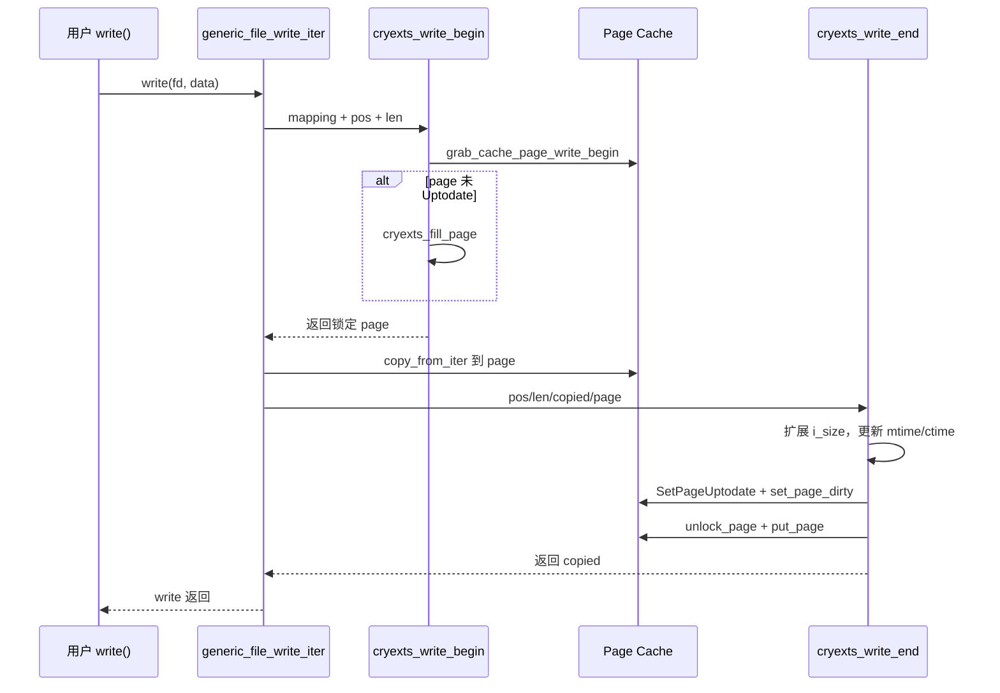

### 7.1 `cryexts_write_begin()` 契约

输入：

- `mapping`：目标 inode 的 address space。
- `pos/len`：本次写入范围。
- `flags`：page-cache 获取标志。

成功输出：

- `*pagep` 指向已锁定 page。
- page 内容是 Uptodate。
- page 引用由后续 `write_end` 接管。

失败责任：

- 已取得 page 时必须 unlock + put。
- 不得把失败 page 留给 generic write 路径。

### 7.2 为什么先读旧 page

假设 page 原内容为：

```text
[0........................4095]
```

用户只覆盖 `[1024..1535]` 共 512 bytes。其余 3584 bytes 必须保留，所以未 Uptodate page 要先从磁盘加载完整旧内容，再覆盖局部范围。

### 7.3 `cryexts_write_end()` 契约

`write_end` 不执行磁盘 I/O，只完成内存状态转换：

```text
Locked + Uptodate
-> 更新 page 内容已完成
-> 更新 inode size/time
-> Dirty + Uptodate
-> unlock + put
```

`copied == 0` 时不扩展文件、不标脏，但仍释放 page。

## 8. 为什么需要 `set_page_dirty`

当前使用：

```c
.set_page_dirty = __set_page_dirty_nobuffers
```

CRYEXTS 的 page cache page 没有维护每页 `buffer_head` 链，因此使用 Linux 提供的 no-buffer dirty helper。


如果这个回调为空：

- `set_page_dirty()` 无法完成 CRYEXTS page 的标准标脏。
- Linux 5.15 上可能通过空函数指针触发 kernel Oops。
- writeback 也无法可靠发现新数据。

## 9. Writeback 架构

### 9.1 触发来源

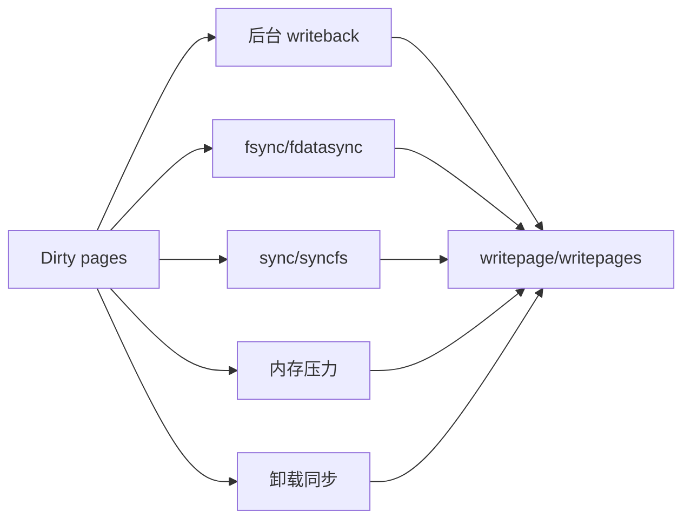

CRYEXTS 不需要自己建立后台线程；Linux 已有 writeback worker。

### 9.2 `writepage` 与 `writepages`

```text
writepage  = 写回一个由 Linux 选中的 page
writepages = 写回 mapping 中某个范围/数量的 dirty pages
```

当前 `writepages` 直接复用：

```c
write_cache_pages(mapping, wbc, cryexts_writepages_callback, NULL);
```

Linux 负责扫描、锁页和 writeback_control；CRYEXTS callback 复用 `cryexts_writepage_locked()` 完成每一页的实际持久化。

### 9.3 单页写回流程

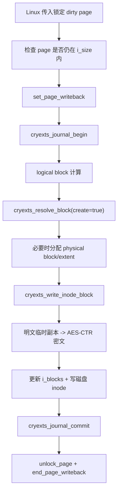

writeback 阶段才执行 physical block allocation，因此当前具有基础 delayed-allocation 语义：用户 write 返回时 page 可以是 dirty，但 logical block 尚未分配 physical block。

## 10. Writeback 错误路径

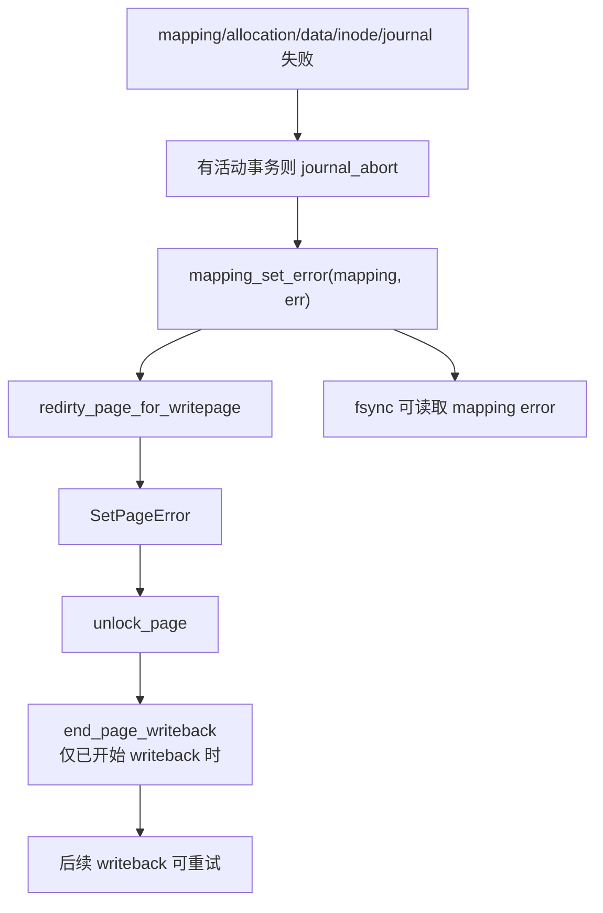

错误处理有两个目标：

1. 不把失败 page 错误地变成 clean。
2. 让同步调用者最终能看到失败。

## 11. `fsync()` 如何与 a_ops 配合

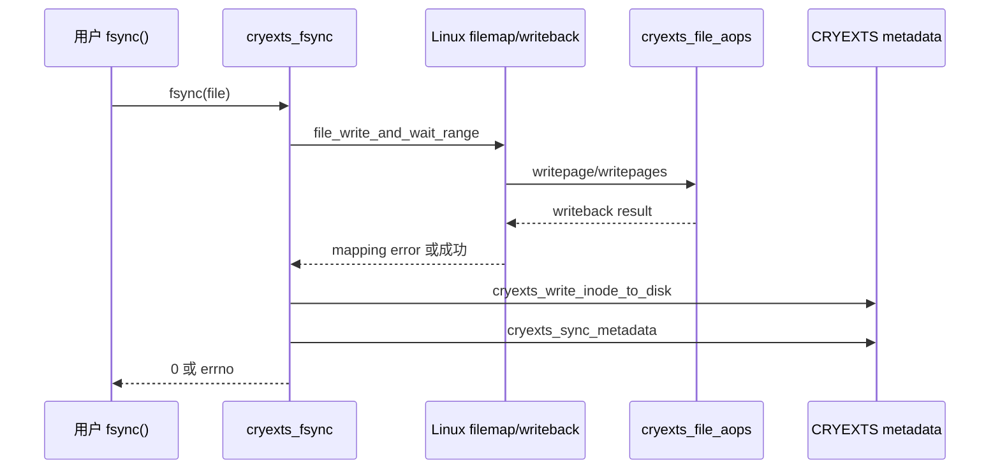

顺序不能反过来。必须先把 dirty data pages 写回，再完成 inode 和全局 metadata 同步。

## 12. Truncate 与 Page Cache

直接释放 block 前必须先处理 dirty pages：

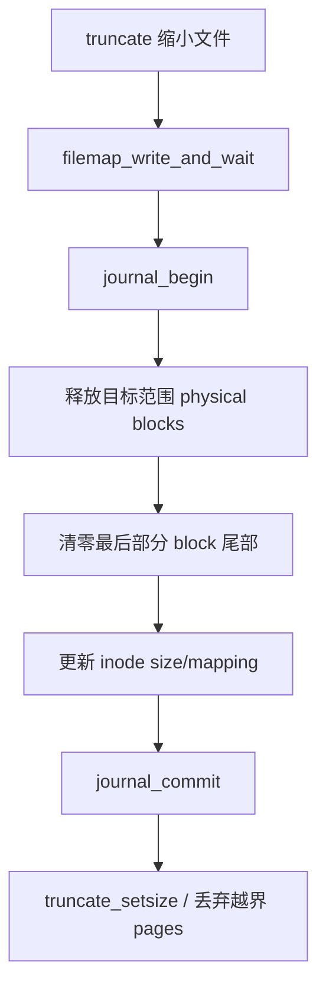

否则可能发生：

```text
block 已释放给其他 inode
-> 原文件旧 dirty page 后续写回
-> 覆盖其他文件数据
```

同样的等待规则还用于 punch hole、删除最后链接和 rename 覆盖。

## 13. 加密与 a_ops 的边界

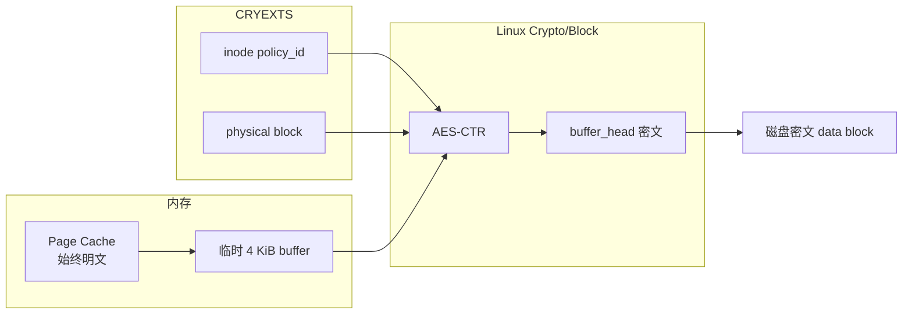

`write_end` 不加密，因为 page cache 必须保持明文。加密发生在 `writepage` 调用的 `cryexts_write_inode_block()` 中，而且只修改临时副本。

读取时，磁盘密文先在 block buffer 中读出并解密，之后才填入 page cache。

## 14. Journal 与 a_ops 的边界

Page cache 只管理文件数据页，不知道一次首次写入还会修改：

- block bitmap。
- group/super free counter。
- extent root/leaf。
- inode size 和 `i_blocks`。
- metadata checksum。

因此当前每个 dirty page writeback 包含一个 CRYEXTS transaction：

```text
journal_begin
-> resolve/allocate/update extent
-> 写 data block
-> 写 inode metadata
-> journal_commit
```

数据 block 本身不进入 metadata journal；journal 保护的是映射和分配等元数据更新。

当前优点是边界明确，限制是多页顺序写会产生多个 transaction。

## 15. 没有实现的 a_ops

当前没有实现：

| 回调/机制 | 当前状态 |
| --- | --- |
| `read_folio` | Linux 5.15 主线仍使用 `readpage` |
| `readahead` | 没有专门预读回调 |
| `direct_IO` | 不支持绕过 page cache 的 DIO |
| `bmap` | 不向用户暴露传统 block mapping 接口 |
| `invalidatepage/releasepage` | 没有 CRYEXTS 私有 page metadata 需要释放 |
| `migratepage` | 未提供文件系统专用页面迁移逻辑 |
| iomap | 当前继续使用自有 `cryexts_resolve_block` |

这些接口只有在明确功能或性能需求出现时才需要增加。

## 16. 当前设计限制

- 只给 regular file 设置 `cryexts_file_aops`。
- 强制一页等于一个文件系统 block。
- `cryexts_fill_page()` 每次分配一个 4 KiB 临时 block buffer。
- `write_cache_pages()` 扫描多页，但实际 callback 逐页提交。
- 每页 writeback 单独 journal commit。
- 加密每个 data block 分配临时副本和 skcipher request。
- 没有 readahead、folio 批处理和跨页事务。

## 17. 最终设计理解

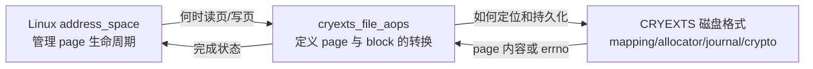

一句话总结：

```text
address_space_operations 是 Linux 缓存页世界与 CRYEXTS 磁盘块世界之间的翻译层。
```
