# CRYEXTS `address_space`、XArray 与 Page Cache 设计原理

## 1. 文档目标

本文说明 Linux 如何通过 `address_space` 和 XArray 维护 page cache，以及当前 CRYEXTS 如何接入这套机制。

核心结论：

```text
XArray 由 Linux page cache 维护；
CRYEXTS 不直接维护 XArray，
只通过 address_space_operations 提供 page 与磁盘 block 的转换逻辑。
```

相关源码：

- [file.c](../file.c)
- [inode.c](../inode.c)
- [cryexts.h](../cryexts.h)

## 2. `address_space` 的定位

每个 regular-file inode 都有：

```c
inode->i_mapping
```

它指向一个 `struct address_space`。这个对象不是磁盘 address space，而是：

```text
某个 inode 的文件偏移空间在内存中的缓存管理对象。
```

简化后的结构关系：

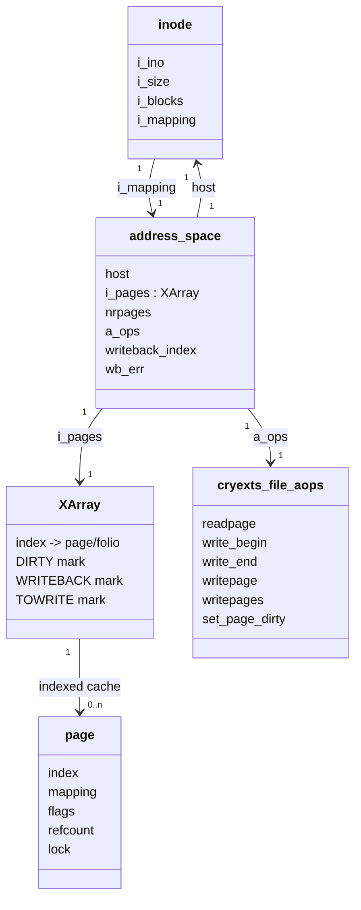

关键字段的设计含义：

| 字段 | 作用 |
| --- | --- |
| `host` | 指向所属 inode |
| `i_pages` | 按文件 page index 保存缓存 page/folio 的 XArray |
| `nrpages` | 当前 mapping 中缓存页数量 |
| `a_ops` | 文件系统提供的 page I/O 回调表 |
| `writeback_index` | 后台 writeback 的扫描起点提示 |
| `wb_err` | address space 上累积的 writeback 错误状态 |

## 3. XArray 为什么适合 Page Cache

文件可以很大，但实际缓存的 page 通常是稀疏的。例如一个 1 GiB 文件，内存里可能只缓存 page 0、page 100 和 page 10000。

如果使用连续数组：

```text
必须为所有 page index 预留槽位，浪费内存。
```

XArray 支持按整数 index 稀疏保存对象：

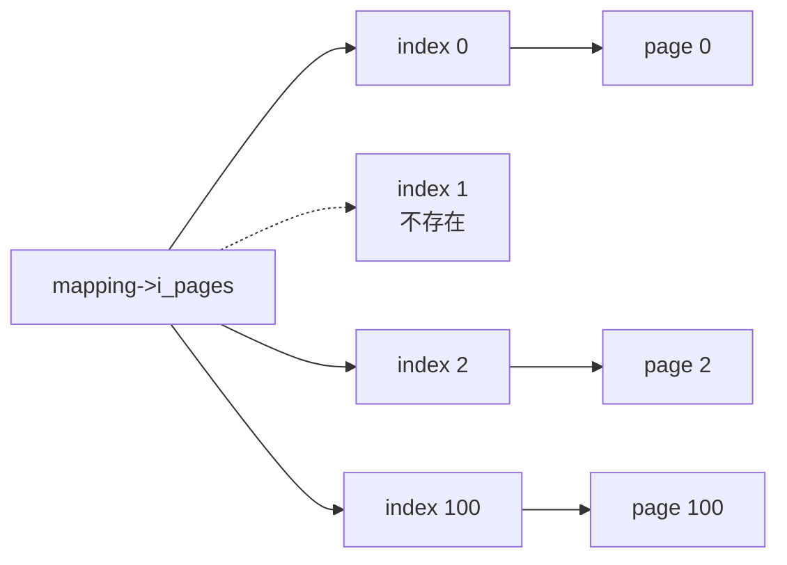

XArray 提供：

- 按整数 index 快速查找。
- 稀疏存储。
- 有序范围遍历。
- 并发安全更新机制。
- marks，用于快速筛选 dirty/writeback pages。

Page cache 不需要扫描整个文件，只需要遍历 XArray 中实际存在的缓存项。

## 4. XArray 的 Key 是什么

XArray key 是文件 page index：

```text
page_index = file_offset / PAGE_SIZE
```

当前：

```text
PAGE_SIZE = 4096
```

所以：

| 文件偏移 | Page index |
| ---: | ---: |
| 0～4095 | 0 |
| 4096～8191 | 1 |
| 8192～12287 | 2 |
| 40960～45055 | 10 |

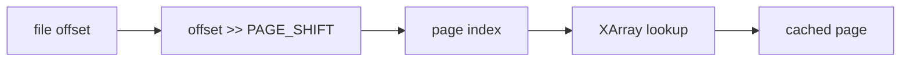

这个 index 是文件逻辑页编号，不是 physical block number。

## 5. XArray Index 与 Extent Mapping 的区别

这是最重要的边界之一：

```text
XArray：文件页在内存中的缓存索引
Extent：文件 logical block 到磁盘 physical block 的映射
```

例如 page index 10：


可能的 extent：

```text
logical_start  = 8
physical_start = 898
length         = 8
```

于是：

```text
logical block 10
-> physical block 898 + (10 - 8)
-> physical block 900
```

XArray 不保存 physical block 900。它只保存“文件 page 10 当前是否在内存中”。

## 6. 三种“缺失”不能混淆

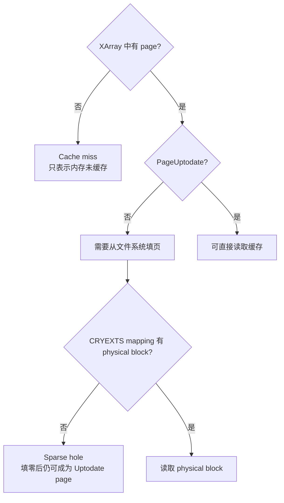

### 6.1 XArray 中没有 page

含义：

```text
该文件范围当前没有缓存在内存中。
```

它不表示文件没有数据。

### 6.2 XArray 中有 page，但未 Uptodate

含义：

```text
page 对象已经存在，但内容还不能交给用户。
```

需要调用 `readpage`/`cryexts_fill_page()`。

### 6.3 CRYEXTS mapping 返回 physical block 0

含义：

```text
文件 logical block 是 sparse hole。
```

CRYEXTS 会把 page 对应区域填零，再设置 PageUptodate。此后 XArray 中存在一个内容全零的有效缓存页。

## 7. Page Cache 查找流程

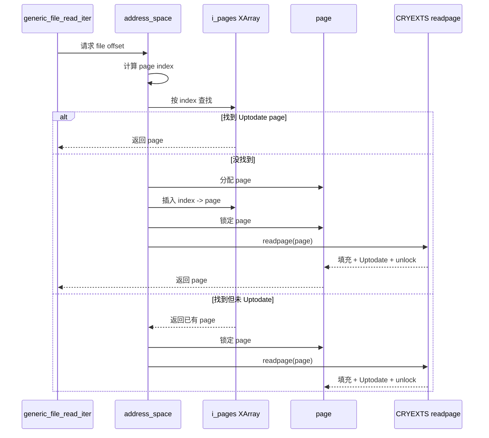

实际 XArray 插入、查找、引用计数和并发重试都由 Linux page-cache helper 完成。CRYEXTS 不直接调用 `xa_store()` 或 `xa_load()`。

## 8. 写入时如何进入 XArray

当前 write 主路径：

```text
generic_file_write_iter
-> generic_perform_write
-> cryexts_write_begin
-> grab_cache_page_write_begin
```

`grab_cache_page_write_begin()` 会通过 page-cache 通用 helper：

1. 计算 `pos >> PAGE_SHIFT`。
2. 查找 `mapping->i_pages`。
3. 已存在则增加引用并锁定。
4. 不存在则分配 page、插入 XArray、增加 `nrpages` 并锁定。
5. 返回锁定 page。

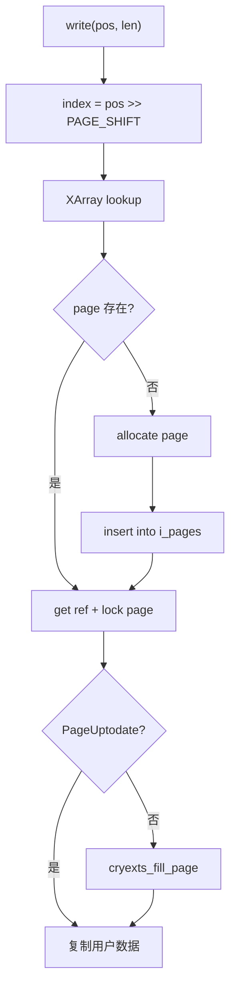

## 9. Page Flags 与 XArray Marks

Page flags 描述单个 page 当前状态；XArray marks 用于快速找到一类 page。

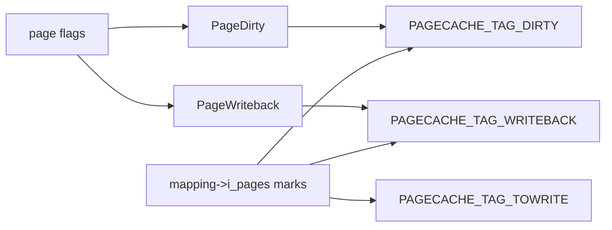

Linux 5.15 page cache 主要使用：

| Mark | 含义 |
| --- | --- |
| `PAGECACHE_TAG_DIRTY` | 对应 index 的 page 需要写回 |
| `PAGECACHE_TAG_WRITEBACK` | 对应 page 正在写回 |
| `PAGECACHE_TAG_TOWRITE` | 同步写回时选中的待写 page 集合 |

为什么同时需要 flag 和 mark：

```text
Page flag：检查一个已知 page 的状态。
XArray mark：不用检查所有 page，就能找到某类 page。
```

例如 mapping 缓存了 10000 个 page，但只有 20 个 dirty。writeback 可以按 DIRTY mark 找到这 20 个，而不是逐个检查 10000 个。

## 10. Dirty Page 如何维护

当前 CRYEXTS：

```c
.set_page_dirty = __set_page_dirty_nobuffers
```

调用链：

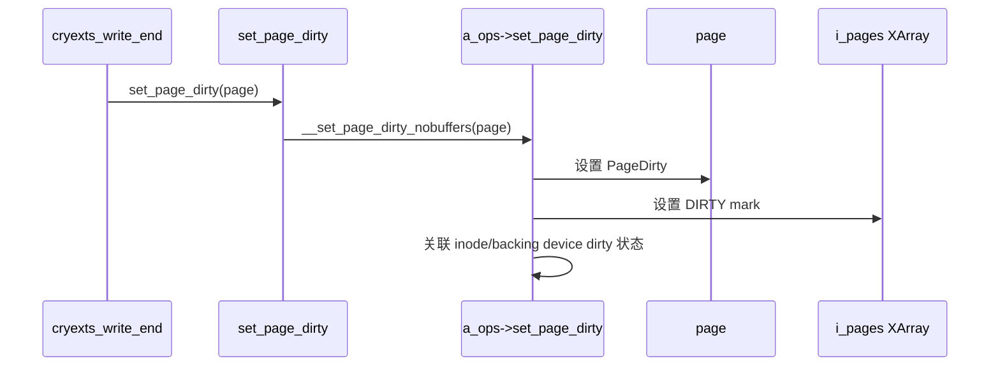

CRYEXTS page 没有附加每页 `buffer_head` 链，因此使用 Linux 已有的 no-buffer helper，而不是自己修改 XArray marks。

## 11. Writeback 如何扫描 XArray

当前 `cryexts_writepages()` 调用：

```c
write_cache_pages(mapping, wbc, cryexts_writepages_callback, NULL);
```

概念流程：

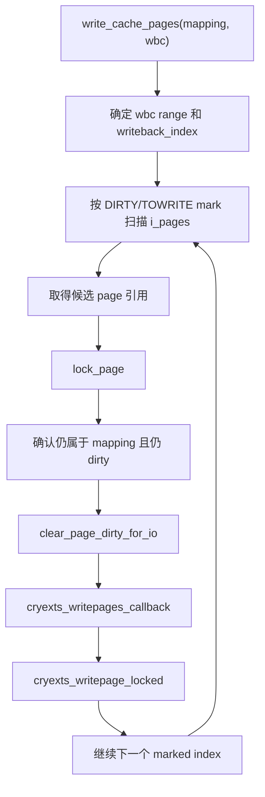

Linux 负责：

- XArray 范围遍历。
- 按 mark 筛选 dirty pages。
- page 引用和锁。
- writeback_control 的范围、数量和同步模式。

CRYEXTS callback 负责：

- logical-to-physical mapping。
- delayed block allocation。
- 数据加密和写盘。
- inode/extent 更新。
- journal transaction。

## 12. Writeback 状态与 Marks 变化

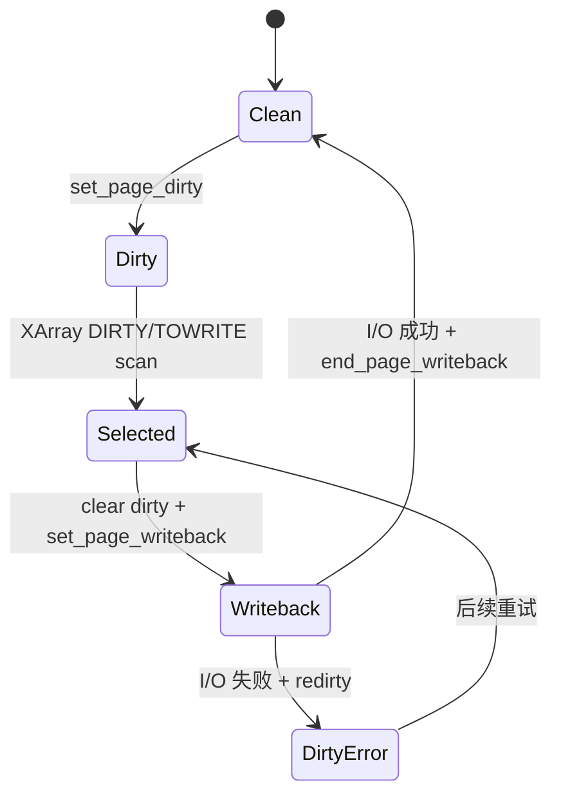

概念上的 mark 变化：

```text
标脏：       设置 DIRTY mark
开始写回：   清 DIRTY，设置 WRITEBACK mark
成功结束：   清 WRITEBACK mark
失败重试：   重新设置 DIRTY mark，清 WRITEBACK mark
```

这些同步由 Linux helper 完成。CRYEXTS 通过：

```c
set_page_writeback(page);
redirty_page_for_writepage(wbc, page);
end_page_writeback(page);
```

参与状态转换。

## 13. XArray 并发与 Page Lock

XArray lock 和 page lock 解决不同问题：

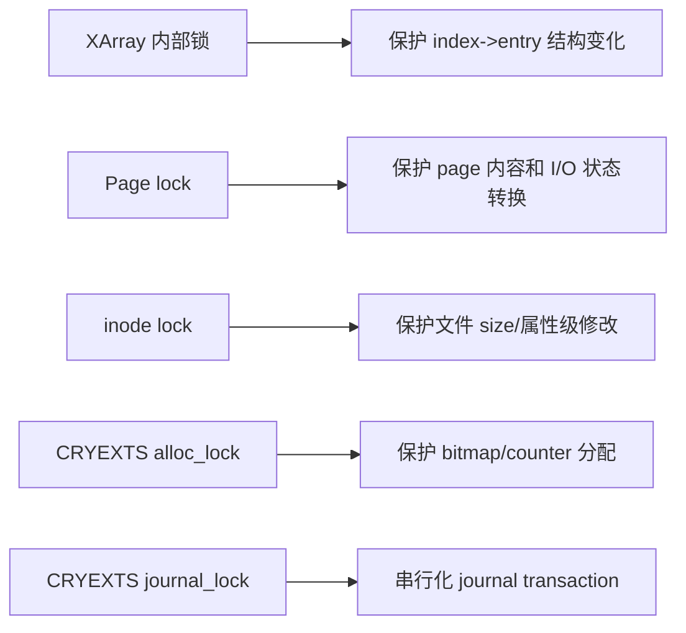

### XArray 内部锁

保护：

- 插入或移除 page。
- index 对应 entry 变化。
- marks 更新。

这些锁由 page-cache/XArray API 管理，CRYEXTS 不应绕过 helper 直接长期持锁。

### Page lock

保护：

- page 填充期间不被并发读取。
- partial write 读取旧内容和覆盖新内容。
- writeback 期间内容保持稳定。

### CRYEXTS 锁

保护磁盘格式级状态，而不是 page-cache 容器结构。

## 14. Page 引用计数与生命周期

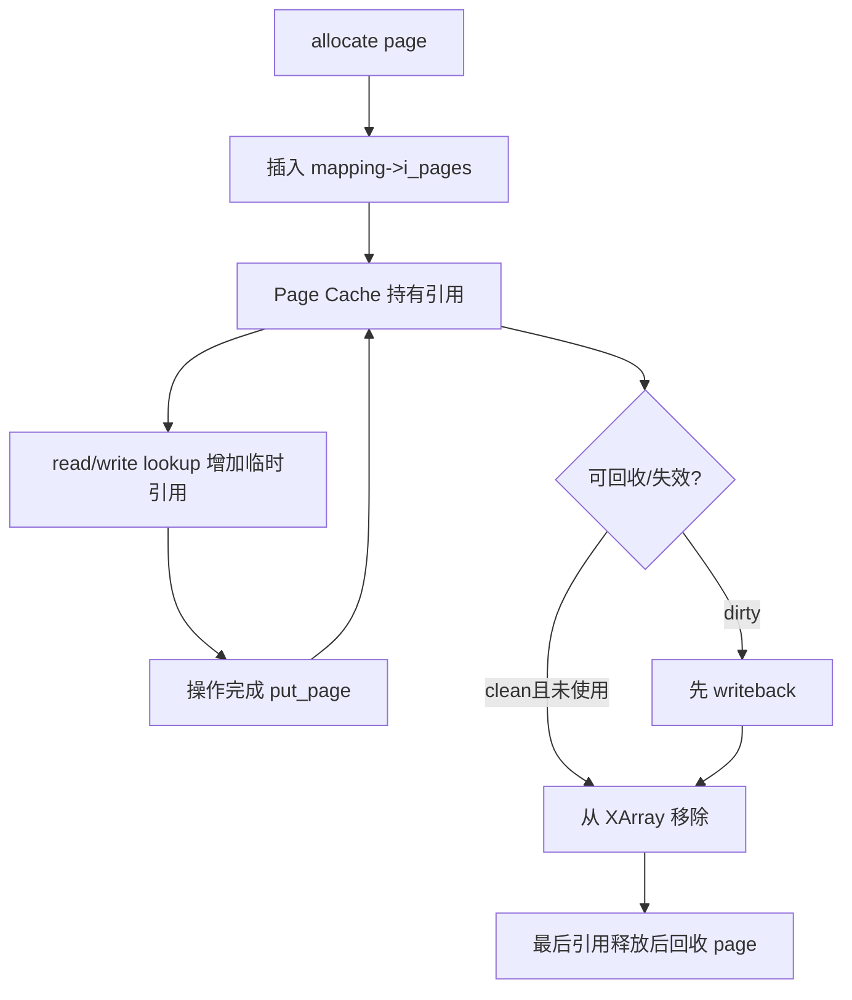

`write_begin()` 成功返回的 page 引用和锁必须由 `write_end()` 释放。错误路径也必须 unlock + put，否则会造成 page 永久锁定或引用泄漏。

## 15. Invalidate、Truncate 与 XArray

### 15.1 Invalidate

`invalidate_inode_pages2_range()` 会从指定 address space 范围移除可失效 page。CRYEXTS 不直接执行 `xa_erase()`。

### 15.2 Truncate

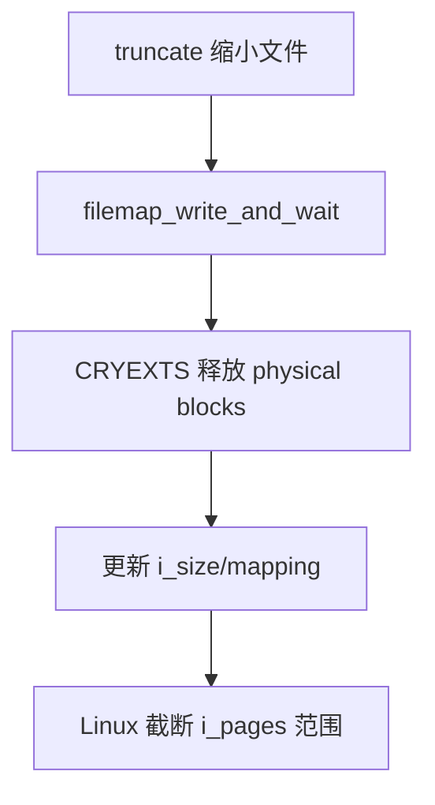

必须先处理 dirty page，再释放磁盘 block。否则已经从 extent 中删除的 page 仍可能从 XArray 被 writeback 找到并写回。

### 15.3 Evict inode

当前 inode 回收使用 `truncate_inode_pages_final()` 清理 `inode->i_data` 中的缓存页，然后释放 CRYEXTS 私有 inode 状态。

## 16. XArray、Page Cache 与加密

XArray 中保存的是 page/folio 对象，当前 CRYEXTS page 内容始终是明文：

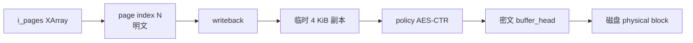

不能把密文 page 放进 XArray，否则：

- generic read 会把密文复制给用户。
- generic write 会在密文上执行 partial overwrite。
- 同一 page 的明文/密文状态难以维护。

所以加密属于 page cache 与磁盘之间的 I/O 转换，不属于 XArray 索引逻辑。

## 17. XArray 不负责 Journal

XArray marks 只能表达：

```text
这个 page 是否 dirty/正在 writeback/等待 writeback。
```

它不能表达：

- 分配了哪个 CRYEXTS block。
- 修改了哪个 block bitmap。
- extent leaf 是否改变。
- 哪些 metadata home blocks 要进入 journal。
- journal sequence 是否 commit。

因此 writeback 找到 dirty page 后，CRYEXTS 仍需要独立执行 metadata transaction。

## 18. 当前 CRYEXTS 为什么不直接操作 XArray

当前没有自定义 page-cache 容器需求。直接复用：

- `grab_cache_page_write_begin()`。
- `generic_file_read_iter()`。
- `generic_file_write_iter()`。
- `set_page_dirty()`。
- `write_cache_pages()`。
- `invalidate_inode_pages2_range()`。
- `truncate_inode_pages()`。

已经覆盖当前需求。

如果 CRYEXTS 自己调用 `xa_store/xa_erase/xa_set_mark`，就必须同时正确处理：

- page 引用计数。
- XArray lock。
- mapping 归属。
- LRU。
- dirty/writeback accounting。
- reclaim 和 truncate 并发。

当前没有必要承担这些风险。

## 19. Page 与 Folio 的演进

较新的 Linux 内核逐步使用 folio 表示一个或多个连续 base pages。XArray entry 也可以指向 folio。

当前 CRYEXTS 针对 Linux 5.15 实现：

```text
readpage + struct page + 4 KiB block
```

未来迁移到 `read_folio` 时，主要需要重新处理：

- folio 可能覆盖多个 4 KiB CRYEXTS blocks。
- logical block 循环范围。
- 一次 I/O 的加密和错误处理。
- folio dirty/writeback 状态。

不需要重写 XArray；Linux 仍负责 folio 在 `i_pages` 中的存储。

## 20. 完整架构总结

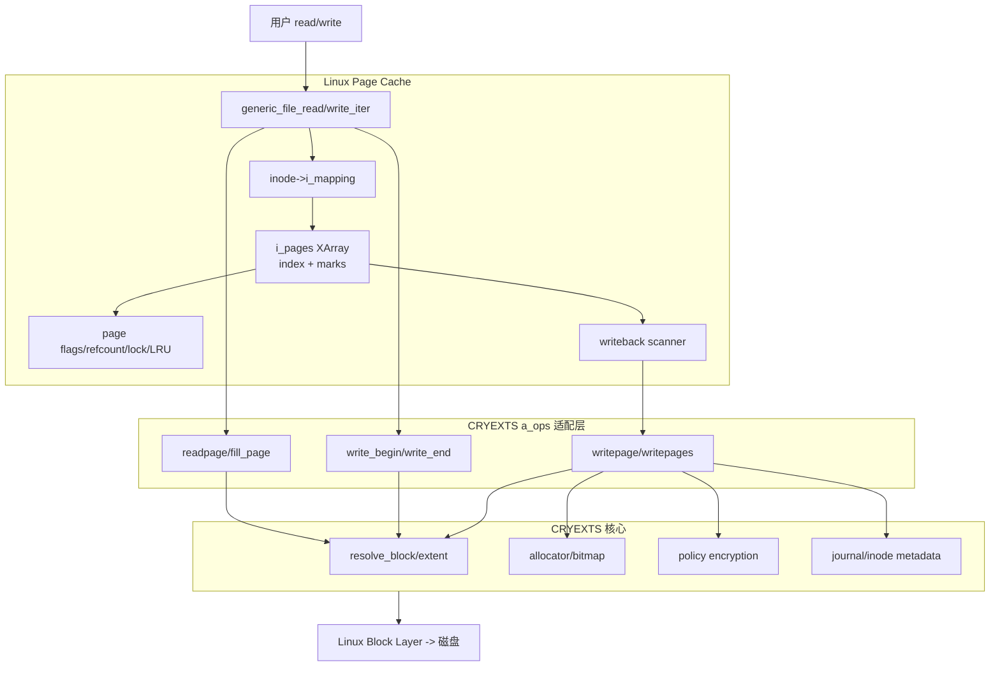

最终可以这样理解：

```text
address_space 是一个 inode 的缓存管理中心；
XArray 是按文件 page index 组织缓存页的稀疏索引；
page flags 表示单页状态，XArray marks 用于批量检索；
Linux 维护这些结构，CRYEXTS 只实现 page 与磁盘格式之间的转换。
```
