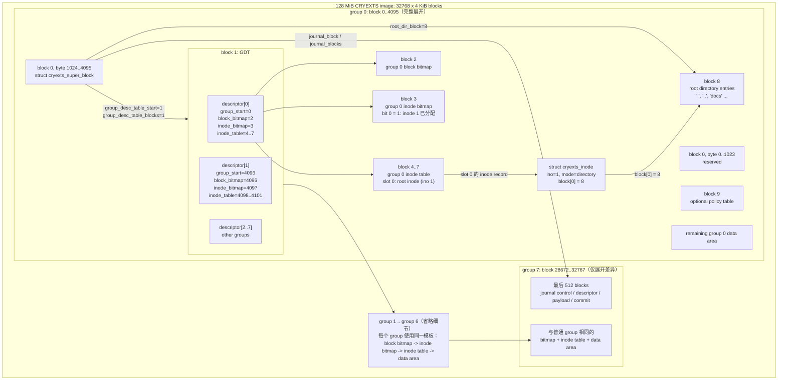

# CRYEXTS Block Layout：从 Superblock 到 Inode 的一张图

> 本项目后续 UML、架构图、流程图默认使用 **Mermaid**。图采用横向 `flowchart LR`，优先适配完整文档页面宽度；不要把同一条存储链路拆成彼此孤立的小图。

## 1. 贯穿案例

下面使用一个典型的功能完整镜像说明布局和查找过程：

```text
镜像大小              128 MiB
block size             4096 bytes
blocks_count           32768
blocks_per_group       4096
group_count            8: group 0 .. group 7
GDT blocks             1
inode table/group      4 blocks
inodes/group           56
journal                group 7 尾部 512 blocks
案例文件               /docs/report.bin
案例 inode             59（因此位于 group 1）
案例逻辑块 0           映射到 physical block 4110
案例逻辑块 1..3        映射到 physical block 4111..4113
```

`inode = 59` 只是便于说明的例子。真实 inode 与物理 block 应由 `cryextsck`、inspect 工具或实际镜像内容读取，不能写死。

物理范围上，`group 0 = block 0..4095`，所以 superblock 和 GDT 都占用 group 0 的前部空间；GDT 的职责虽然是描述所有 group，但它不是 group 0 之外的独立区域。

## 2. 主图：只展开 group 0



## 3. 按图理解 `/docs/report.bin`

主图只展开了 group 0。`/docs/report.bin` 落在 group 1 时，直接套用图中 `group 1 .. group 6` 的同一组内模板；不再重复绘制 group 1 的 bitmap、inode table 和 data area。

### 第一步：Superblock 找到 GDT

内核先从 `block 0 + 1024` 读取 `struct cryexts_super_block`。本案例中：

```text
group_desc_table_start  = 1
group_desc_table_blocks = 1
blocks_per_group        = 4096
inodes_per_group        = 56
```

因此 GDT 位于 block 1，且 inode 59 的归属可计算为：

```text
group = (59 - 1) / 56 = 1
slot  = (59 - 1) % 56 = 2
```

### 第二步：GDT[1] 找到 group 1 元数据

`GDT[1]` 是 `struct cryexts_group_desc`，其关键字段给出：

```text
group_start        = 4096
block_bitmap_block = 4096
inode_bitmap_block = 4097
inode_table_start  = 4098
inode_table_blocks = 4
```

所以先检查 block 4097 的 inode bitmap 第 2 bit，确认 inode slot 2 已分配；再从 block 4098..4101 的 inode table 读取 slot 2 对应的 `struct cryexts_inode`。

### 第三步：inode 解决逻辑块到物理块

案例 inode 使用 extent：

```text
extent = { logical_start=0, physical_start=4110, length=4 }
```

这一个 extent 表示：

```text
file logical block 0 -> physical block 4110
file logical block 1 -> physical block 4111
file logical block 2 -> physical block 4112
file logical block 3 -> physical block 4113
```

block 4096 的 group 1 block bitmap 中，对应 4110..4113 的组内 bit `14..17` 必须置位。这就是 inode 映射和 allocator 元数据的一致性关系。

## 4. 结构体职责对照

| 结构体 | 磁盘位置 | 解决的问题 |
| --- | --- | --- |
| `cryexts_super_block` | block 0 的 offset 1024 | 全局容量、GDT、root、journal 的入口 |
| `cryexts_group_desc` | GDT 连续区域 | 单个 group 的范围、bitmap、inode table 和计数 |
| block bitmap | 每个 group 一个 block | 某个物理 block 是否已分配 |
| inode bitmap | 每个 group 一个 block | 某个 inode slot 是否已分配 |
| `cryexts_inode` | group 的 inode table | 文件大小、类型、映射入口、时间和 flags |
| `cryexts_extent` | inode inline root 或 extent leaf | 一段连续 logical block 到 physical block 的映射 |
| `cryexts_dir_entry` | 目录 inode 指向的 directory data block | 文件名到 inode number 的权威映射 |

## 5. 根目录为什么在 group 0

`root inode` 不是 superblock 内嵌的数据，也没有 root 专属 bitmap。

```text
root inode = inode 1
inode 1 -> group 0 inode bitmap 的 bit 0
inode 1 -> group 0 inode table 的 slot 0
root_dir_block -> inode 1 的第一个目录数据块
```

superblock 中的 `root_inode_block`、`root_dir_block` 只保存快速定位信息。真正的“是否分配”和“inode 内容”仍由 group 0 的 inode bitmap 与 inode table 维护。

## 6. 边界说明

- 图中的 `block 2..9` 仅适用于本案例 `GDT blocks=1`。multi-GDT 时，group 0 的 bitmap、inode table、root directory 会整体后移。
- group 1 及后续普通 group 默认采用：`group_start + 0` block bitmap、`+1` inode bitmap、`+2..+5` inode table。
- 最后一个 group 的 journal 尾部是预留区，不属于普通文件的可分配 data area。
- 目录查找先通过 `cryexts_dir_entry` 获取 inode number；若启用 directory index，HTree 风格的 `block_masks[bucket]` 只缩小候选目录逻辑块，权威数据仍是 directory data block 内的 dir entry。
