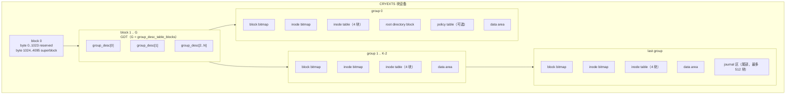

# CRYEXTS Block Layout 总结（截至 v12.1）

> 本文档是我对当前工作区 `cryexts` 主线代码的 block layer 落盘布局的独立总结。
> 它只描述"磁盘上实际是什么布局"，不展开运行时分配算法细节；凡与源码冲突，以 `cryexts_fs.h` 和 `tools/mkfs.cryexts.c` 为准。

## 0. 一句话结论

当前 CRYEXTS 是一个 **4 KiB block、group 化元数据、尾部 journal** 的自研 Linux 文件系统：

```text
superblock(block 0 @1024)
  -> GDT(block 1 起，可多块)
  -> 每个 group 的 block bitmap / inode bitmap / inode table / data area
  -> 最后一个 group 尾部预留 journal 区域
```

journal 已演进到 **v3 + ring（v12.1）**：单 writer 在 journal 尾部区域做真正的环形分配与回收；
文件数据映射已演进到 **direct/indirect 兼容路径 + inline extent + extent tree v2（稀疏文件）**。

## 1. 固定常量（来自 `cryexts_fs.h`）

| 常量 | 值 | 说明 |
| --- | --- | --- |
| `CRYEXTS_MAGIC` | `0x43525853` | "CRXS" |
| `CRYEXTS_BLOCK_SIZE` | `4096` | 固定 4 KiB block |
| `CRYEXTS_SUPER_OFFSET` | `1024` | superblock 在 block 0 内的字节偏移 |
| `CRYEXTS_ROOT_INO` | `1` | root inode 编号 |
| `CRYEXTS_GDT_START_BLOCK` | `1` | GDT 起始 block |
| `CRYEXTS_DIRECT_BLOCKS` | `12` | inode 内 direct block 数 |
| `CRYEXTS_INDIRECT_BLOCKS` | `512` | 单层 indirect 每块可存 `4096/8` 个指针 |
| `CRYEXTS_DEFAULT_BLOCKS_PER_GROUP` | `4096` | 默认每 group blocks 数 |
| `CRYEXTS_DEFAULT_INODE_TABLE_BLOCKS_PER_GROUP` | `4` | 每 group inode table 块数 |
| `CRYEXTS_DEFAULT_INODES_PER_GROUP` | `56` | `4 * floor(4096/276) = 56` |
| `CRYEXTS_DEFAULT_JOURNAL_BLOCKS` | `512` | journal 默认最大预留 |
| `CRYEXTS_JOURNAL_V3_MIN_BLOCKS` | `4` | v3 journal 最小需求 |

## 2. 磁盘版本与 feature flag 决定布局

布局不是单一份，而是由 superblock 的 `version` 和三个 feature 集合共同决定：

```text
version                 CRYEXTS_VERSION_V5（默认编译基线，宏 CRYEXTS_VERSION）
                        CRYEXTS_VERSION_V6（启用 journal v2/v3 时 mkfs 自动切到 V6）
features_compat         HAS_JOURNAL / PREALLOC
features_incompat       SINGLE_INDIRECT / BLOCK_GROUPS / NEEDS_RECOVERY /
                        EXTENTS / XATTR / ENCRYPTION_POLICY / DIR_INDEX /
                        ORPHAN_LIST / POLICY_TABLE / EXTENT_TREE /
                        JOURNAL_V2 / JOURNAL_V3 / JOURNAL_RING
features_ro_compat      METADATA_CSUM / LARGE_XATTR
```

最需要记住的三条分支：

1. **无 `BLOCK_GROUPS`**：走历史单组布局（block bitmap@1、inode bitmap@2、inode table@3..18、root dir@19）。
2. **有 `BLOCK_GROUPS`**：走 GDT + per-group 布局，所有元数据块号由 superblock/GDT 动态给出。
3. **journal 格式**：`JOURNAL_V2` 走 v2 固定区；`JOURNAL_V3` 走 v3 redo 固定区；再加 `JOURNAL_RING` 走 v3 ring（当前主线 v12.1）。

`mkfs.cryexts` 的关键选项对应关系：

| 选项 | 布局效果 |
| --- | --- |
| 默认 `-f` | V5 单组、single-indirect、无 journal |
| `-G` | block groups |
| `-X` | extents + extent tree |
| `-A` | xattr（并置 `XATTR`/`ENCRYPTION_POLICY` incompat） |
| `-I` | directory hash index |
| `-O` | orphan list |
| `-T` | policy table（隐含 xattr） |
| `-M` | metadata checksum（FNV1a32） |
| `-J` | journal v2（强制 `-G`、`version=V6`） |
| `-R` | journal v3 fixed（强制 `-G`、`version=V6`） |
| `-Q` | journal v3 + ring（当前 v12 主线，强制 `-G`、`version=V6`） |
| `-E <key>` | 卷加密标记 + salt/KDF/verifier |

## 3. 总布局图



一句话理解：

```text
superblock 给全局入口，GDT 描述每个 group，每个 group 自管 bitmap/inode table，
journal 放在最后一个 group 尾部，data blocks 是其余一切（目录/文件/extent/xattr）的物理承载。
```

## 4. superblock（`struct cryexts_super_block`）

- 位置：**block 0，字节偏移 1024**；结构体打包后约 **456 字节**，远小于块内剩余 3072 字节。
- 职责：全局入口，不做逐块细节，主要给出：

| 字段组 | 作用 |
| --- | --- |
| `magic / version / block_size / inode_size` | 识别与格式校验 |
| `blocks_count / inodes_count / free_*` | 全局容量与统计 |
| `block_bitmap_block / inode_bitmap_block / inode_table_start / inode_table_blocks` | root group 元数据快速定位 |
| `root_inode_block / root_dir_block / first_data_block` | root 定位 |
| `journal_block / journal_blocks` | journal 区位置与大小 |
| `group_count / blocks_per_group / inodes_per_group` | group 化布局参数 |
| `group_desc_table_start / group_desc_table_blocks` | GDT 位置（multi-GDT 关键） |
| `features_compat / features_incompat / features_ro_compat` | feature 门控 |
| `flags / key_hash / encryption_* / salt / default_encryption_policy` | 加密元数据 |
| `state / mount_count / *_time / journal_sequence / fs_generation` | 挂载与恢复状态 |
| `orphan_head / policy_table_block / dir_index_seed / metadata_csum_type` | 可选特性入口 |

`root_inode_block`、`root_dir_block` 只是快速定位字段；root inode 的"是否分配"和内容仍由 group 0 的 inode bitmap 与 inode table 维护。

## 5. GDT 与 block groups

- GDT 从 **block 1** 开始，连续占用 `group_desc_table_blocks` 块。
- `struct cryexts_group_desc` 打包后 **76 字节**，每块约放 `floor(4096/76) = 53` 个 descriptor。
- group 数超过 53 时 GDT 自动变为多块（multi-GDT）：

```text
group_desc_table_blocks = ceil(group_count * 76 / 4096)
```

每个 descriptor 描述一个 group 的：

```text
group_start / blocks_count
block_bitmap_block / inode_bitmap_block
inode_table_start / inode_table_blocks
free_blocks_count / free_inodes_count / used_dirs_count / flags
```

## 6. group 0 的特殊布局

启用 block groups 时，mkfs 的实际公式（源码 `tools/mkfs.cryexts.c`）：

```text
block 0                          superblock（@1024）
block 1 .. 1+gdt_blocks-1        GDT
1+gdt_blocks                    group 0 block bitmap
1+gdt_blocks+1                  group 0 inode bitmap
1+gdt_blocks+2 .. +5            group 0 inode table（4 块）
... +6                           root directory block
... +7                           policy table（若启用）
其余                             group 0 data area
```

要点：**GDT 变多块时，group 0 的 bitmap/inode table/root dir 会整体后移**，因此这些位置不是固定常量，必须读 superblock/GDT。

## 7. 普通 group 的标准模板

`group > 0` 的普通组统一为：

```text
group_start + 0    block bitmap
group_start + 1    inode bitmap
group_start + 2..5 inode table（4 块）
group_start + 6..  本组可分配 data area
```

因此每个完整 group 的元数据固定占 6 块，可分配初始空间约 `4096 - 6 = 4090` 块。

## 8. inode table 与 inode 大小

- `struct cryexts_inode` 打包后 **276 字节**（`mode/links/uid/gid/size/blocks/atime/ctime/mtime/block[12]/indirect_block/inode_flags/reserved[116]`）。
- 每块放 `floor(4096/276) = 14` 个 inode；每组 inode table 4 块 → **每组 56 个 inode**。
- inode 编号到 group/slot 的换算：

```text
group = (ino - 1) / inodes_per_group
slot  = (ino - 1) % inodes_per_group
```

## 9. 数据区与文件逻辑块映射

block layer 只回答"逻辑块 -> 物理块"，当前主线有三条并存路径：

```text
direct/indirect（历史兼容）   12 direct + 1 层 indirect
inline extent                 4 个 inline extent
extent tree v2                固定深度 1，inode 内最多 4 个 root ref，
                              每个 ref 指向一个 extent leaf，支持稀疏文件/hole
```

- `struct cryexts_extent` 打包后 **24 字节**：`logical_start + physical_start + length + flags`。
- extent leaf：8 字节 header + 最多 `floor((4096-8)/24) = 170` 个 extent。
- `struct cryexts_extent_root_ref` 打包后 **22 字节**：`logical_start + leaf_block + entries + checksum`。
- 目录是例外：目录数据使用 inode 的 direct block 表，目录 logical block 上限 12；dir index 只缩小候选 logical block，不做 logical->physical 映射。

## 10. 目录数据块与目录索引

- `struct cryexts_dir_entry` 头部 **12 字节**：`inode(8) + rec_len(2) + name_len(1) + file_type(1)`。
- 目录项长度按 4 字节对齐：`rec_len = align4(12 + name_len)`。
- 目录索引 `struct cryexts_dir_index_block`：magic + buckets + dir_blocks + entries + `block_masks[64]`（每个 16 位）。
- 查找流程：`hash(filename, dir_index_seed) -> bucket = hash % 64 -> mask -> 候选 logical block -> 逐项比较 dir_entry`。

## 11. xattr 与 policy table

- inode 的 extra 字段指向 xattr root block；空间不足时可链到一个 overflow block（`RO_COMPAT_LARGE_XATTR`）。
- `struct cryexts_xattr_block_header` 16 字节：`magic + entries + used_bytes + overflow_block`。
- policy table 位于 root group 的 `policy_table_block = root_dir_block + 1`：

```text
struct cryexts_policy_table_block
  magic(4) + entry_count(2) + reserved(26)  -> 32 字节 header
  entries[]: policy_id(4) + flags(4) + context[8]  -> 每个 16 字节
```

policy table 不存文件数据，只维护 policy id / flags / context，供 inode 的 `encryption_policy_id` 引用。

## 12. journal 区域（重点：v1 / v2 / v3 / ring）

journal 始终放在 **最后一个 group 的尾部**：

```text
journal_room  = tail_group_blocks - (2 + 4)          # 2 个 bitmap + 4 块 inode table
journal_blocks = min(journal_room, 512)
journal_block  = tail_group_start + tail_group_blocks - journal_blocks
```

### 12.1 journal v1（历史）

```text
journal_block+0   header（"JNL1" + home_blocks[]）
journal_block+1.. payload（home metadata 镜像副本）
```

### 12.2 journal v2（固定区）

```text
journal_block+0                        control（"JNL2"）
journal_block+1                        descriptor（home_blocks[]）
journal_block+2 .. journal_block+N-2   payload area（after-image 块镜像）
journal_block+N-1                      commit（"JNL2"）
```

payload 存的是 home metadata block 的 after-image 副本，replay 即"把 payload 拷回 home block"。

### 12.3 journal v3（固定 redo 区）

v3 把 entry 升级为带单块 checksum 的记录，并引入独立 state 机与提交点：

```text
journal_block+0                        control（"JNL3"）
journal_block+1                        descriptor（entries[]: home_block + payload_checksum + flags）
journal_block+2 .. journal_block+N-2   redo payload area（after-image）
journal_block+N-1                      commit（"JNL3"，含 descriptor/payload 汇总 checksum）
```

`struct cryexts_journal_v3_control` 打包后 **128 字节**，含 state、feature、各区域位置、last/active/checkpoint sequence；
`struct cryexts_journal_v3_entry` **16 字节**；v3 descriptor 头部 72 字节，单块最多 `floor((4096-72)/16) = 251` 个 entry。

### 12.4 journal v3 + ring（当前 v12.0/v12.1）

v12.0 先在 v3 control 里落盘 ring 状态，v12.1 实现单 writer 真实环形分配：

```text
journal_block+0          control（固定，含 ring_start/ring_end/ring_head/ring_tail）
ring_start .. ring_end-1 环形可用区（ring_start = journal_block+1，
                         ring_end = journal_block+journal_blocks，排他）
```

单笔事务在 ring 内分配一段连续区域：

```text
[ descriptor ][ payload x entry_count ][ commit ]   = entry_count + 2 块
```

指针语义：

```text
空闲：      head == tail
提交中：    tail = 当前 descriptor，head = 下一次分配位置
checkpoint：保留 descriptor/payload/commit 指针
完成：      tail = head，control.state = IDLE
```

ring 尾部放不下完整事务时回绕到 `ring_start`；存在未回收事务时禁止覆盖并返回 `-ENOSPC`。
checkpoint 成功后不清除旧 descriptor/payload/commit（已不再被 tail 指向，下一笔直接覆盖）。

## 13. 一个 128 MiB 镜像的例子

```text
blocks_count        32768（128 MiB / 4096）
blocks_per_group    4096
group_count         8（group 0 .. 7）
GDT blocks          1（8 个 descriptor，远小于 53）
inode table/group   4 块
inodes/group        56
journal             group 7 尾部 512 块
```

```text
block 0    : superblock（@1024）
block 1    : GDT（group_desc[0..7]）
block 2    : group 0 block bitmap
block 3    : group 0 inode bitmap
block 4..7 : group 0 inode table
block 8    : root directory
block 9    : policy table（若启用）
...
group 7 tail（block 32256..32767）: journal v3 ring
```

物理范围上 group 0 = block 0..4095，因此 superblock 与 GDT 都占用 group 0 前部空间；GDT 虽然描述所有 group，但不是 group 0 之外的独立区域。

## 14. 结构体 / 源码对照表

| on-disk 结构 | 源码位置 | 磁盘位置 | 解决的问题 |
| --- | --- | --- | --- |
| `cryexts_super_block` | `cryexts_fs.h` | block 0 @1024 | 全局入口 |
| `cryexts_group_desc` | `cryexts_fs.h` | GDT 连续区 | 每组范围/bitmap/inode table/计数 |
| block bitmap | `balloc.c` | 每组 1 块 | 物理块是否已分配 |
| inode bitmap | `balloc.c` | 每组 1 块 | inode slot 是否已分配 |
| `cryexts_inode` | `inode.c` | 每组 inode table | 文件属性 + 映射入口 |
| `cryexts_dir_entry` | `dir.c` | 目录 data block | 文件名 -> inode number |
| `cryexts_dir_index_block` | `dir.c` | inode 指向的 index block | 大目录查找加速 |
| `cryexts_extent` / leaf | `inode.c` | inode inline 或 extent leaf | 连续 logical->physical 映射 |
| `cryexts_xattr_block_header` | `xattr.c` | inode 指向或 overflow | 扩展属性存储 |
| `cryexts_policy_table_block` | `crypto.c` | root group 特殊块 | 加密策略表 |
| journal v2/v3 控制块 | `journal.c` | 尾部 journal 区 | 事务状态/位置/校验 |

## 15. 当前实现位置（v12.1）

block layer 当前已覆盖：

- superblock + multi-GDT + per-group bitmap/inode table；
- direct/indirect + inline extent + extent tree v2 + 稀疏文件；
- 目录 data block + 目录 hash index；
- xattr root/overflow + policy table + 块级加密元数据；
- metadata checksum（FNV1a32）；
- journal v1/v2 历史格式 + journal v3 redo + **journal v3 ring（单 writer 环形分配）**。

尚未做（对应需求文档 v12.2+）：

- 多事务并发（running transaction 与 checkpoint 并行）；
- transaction 级 data dependency tracking 与 flush/barrier/FUA 抽象；
- 多事务并发压力与长时间 soak。
