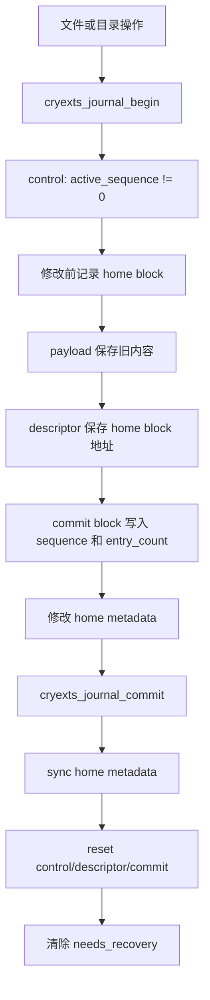
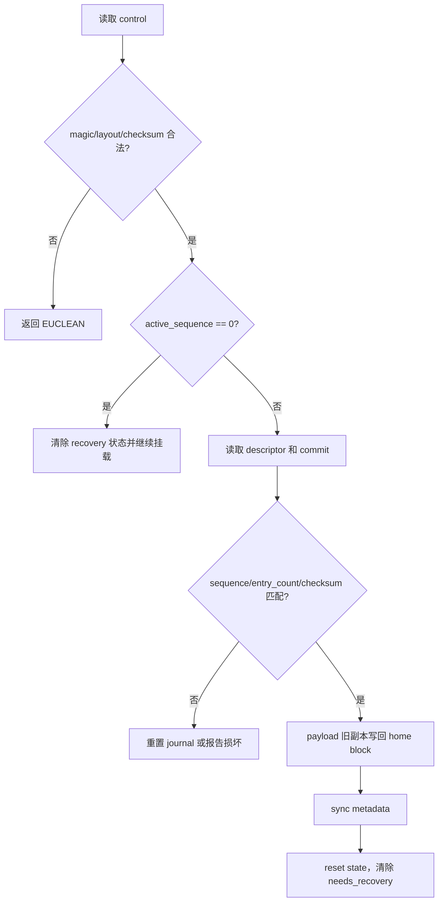
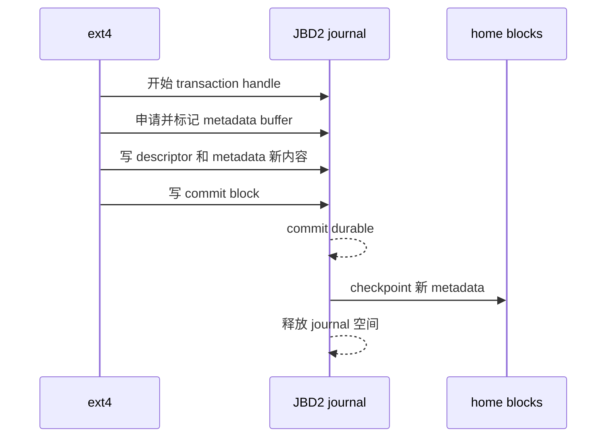

# CRYEXTS 与 ext4 Journal 设计对比

本文基于当前源码说明两件事：

1. CRYEXTS 的 journal 实际记录什么、怎样提交、怎样恢复。
2. ext4 使用 JBD2 的方式与 CRYEXTS 有什么本质差异。

这里的 journal 指崩溃一致性机制，不是 page cache，也不是文件内容备份，更不是加密层。

## 1. Journal 要解决什么问题

一次创建文件通常同时修改多个磁盘对象：

```text
目录数据块       加入文件名和 inode 号
inode            更新大小、时间和数据映射
inode bitmap     标记 inode 已使用
block bitmap     标记数据块已使用
GDT              更新 free_blocks/free_inodes
superblock       更新计数、状态和 journal sequence
```

如果系统在这些写入中间掉电，可能出现：

```text
目录已经指向 inode，但 inode bitmap 仍显示空闲
inode 已分配数据块，但 block bitmap 没有标记
文件大小已经变大，但 extent 尚未完整写入
```

Journal 的核心理念是：

```text
先记录足够的恢复信息
再修改 home block
发生崩溃时，依据完整的 journal 状态恢复
```

它保证的是元数据之间的可恢复关系，不能保证 USB 设备本身不会断开，也不能替代 fsck、备份或硬件错误处理。

## 2. CRYEXTS 当前设计

### 2.1 磁盘布局

当前默认 journal 为 512 个 block，布局由 `journal_block` 和 `journal_blocks` 描述：

```text
journal_block + 0       control block
journal_block + 1       descriptor block
journal_block + 2..510  payload area，最多 509 个旧 home block 副本
journal_block + 511     commit block
```

在源码中，这些布局计算位于 [journal.c](/D:/Carl/cryptext4/cryexts/journal.c:43)，磁盘结构体位于 [cryexts_fs.h](/D:/Carl/cryptext4/cryexts/cryexts_fs.h:209)。

v2 的三种 block 不是三个独立 journal，而是一笔事务的三类控制信息：

| Block | 作用 |
|---|---|
| control | 描述 journal 是否 active、sequence 窗口以及 payload/commit 的位置 |
| descriptor | 记录本次事务涉及的 home block 列表 |
| payload | 保存对应 home block 的旧内容 |
| commit | 表示 descriptor 已经完整写入，并携带 sequence 和 entry_count |

### 2.2 一次事务的源码流程



当前代码的主要入口是：

```text
cryexts_journal_begin()
cryexts_journal_record_bh()
cryexts_journal_record_block()
cryexts_journal_commit()
cryexts_journal_abort()
cryexts_journal_replay()
```

目录操作、inode 更新、bitmap/GDT 分配和 xattr 更新会调用这些接口。例如分配块时，`balloc.c` 会先记录 bitmap 和 GDT 的 buffer_head；目录修改时，`dir.c` 会记录目录数据块或索引块。

### 2.3 CRYEXTS 保存的是旧副本

CRYEXTS v2 的 payload 是修改前的 home block：

```text
home block 修改前内容 -> payload
home block 地址        -> descriptor
```

恢复时，`cryexts_journal_v2_replay()` 按 descriptor 遍历 payload，把旧内容写回 home block：

```text
payload[i] -> home_blocks[i]
```

所以当前实现更接近“单事务、固定区域、旧副本恢复”的 undo-style MVP，而不是 ext4 那种把新 metadata 写入 journal、恢复时重放新内容的 redo journal。

### 2.4 当前 CRYEXTS 的提交和恢复状态

`control` 中的四个 sequence 用来描述事务窗口：

```text
idle:
    active_sequence     = 0
    tail_sequence       = checkpoint_sequence = last_sequence

active:
    active_sequence     = 当前事务
    last_sequence       = 上一次已知 sequence
    tail/checkpoint     = 上一次完成位置
```

挂载时 [super.c](/D:/Carl/cryptext4/cryexts/super.c:586) 调用 `cryexts_journal_replay()`。v2 恢复大致如下：



`cryextsck` 会检查 control、descriptor、commit 的 magic、版本、entry_count、home block 范围、尾部零值和 checksum。这样可以把“没有事务”“有一笔待恢复事务”“journal 本身损坏”区分开。

### 2.5 当前实现中 journal 记录什么

当前 journal 主要保护 metadata：

```text
superblock
GDT
block bitmap / inode bitmap
inode table
directory data block
directory index block
extent metadata
xattr metadata
```

普通文件的数据页不直接作为 journal payload 保存。v10.x 的 page-cache 路径是：

```text
用户写入
    -> Linux page cache 保存明文 page
    -> writeback 调用 cryexts_write_inode_block()
    -> 按 policy 加密
    -> buffer_head 写入文件数据 block
```

因此要区分两条路径：

```text
metadata consistency:
    journal v2

regular-file data confidentiality:
    AES-CTR block I/O
```

当前模型不是 ext4 `data=journal`，也没有把每个普通文件 data page 都复制到 journal 中。这样可以减少 journal 写放大，但数据写入顺序和掉电语义仍比完整 JBD2 简单。

## 3. ext4 的 journal 设计

### 3.1 JBD2 的角色

ext4 通常通过 JBD2 管理 journal。JBD2 是一个通用的 block-level journaling 层，ext4 负责告诉它哪些 buffer 属于事务。

```text
ext4 inode/dir/extent/bitmap 修改
        |
        v
JBD2 transaction handle
        |
        v
journal descriptor + metadata data blocks + commit block
        |
        v
checkpoint 到 home blocks
```

ext4 的 journal 可以位于：

```text
文件系统内部的 journal inode
独立的 journal 设备
```

journal 是循环区域，旧事务完成 checkpoint 后，其空间可以被新事务复用。

### 3.2 ext4 的典型提交顺序

以 metadata journal 为例，简化流程是：



关键区别是：JBD2 journal 中通常保存“将要提交的新 metadata”，恢复时只重放带有完整 commit 标记的事务。没有 commit 的事务会被丢弃。

### 3.3 ext4 的 data 模式

ext4 常见的 `data=` 模式如下：

| 模式 | journal 中记录 | 主要取舍 |
|---|---|---|
| `ordered`（常见默认） | metadata；要求相关文件数据先于 metadata commit 落盘 | 性能和一致性折中 |
| `writeback` | metadata；不保证文件数据先于 metadata | 性能较好，崩溃后可能读到旧数据 |
| `journal` | 文件数据和 metadata 都写入 journal | 一致性更强，写放大最大 |

CRYEXTS 当前更接近“metadata journal + 独立文件数据写入”的方向，但还不能宣称已经完整实现 ext4 `ordered` 语义。当前版本没有 JBD2 那样成熟的 data-before-metadata barrier、事务提交线程和多事务协调机制。

### 3.4 ext4 为什么需要更多结构

JBD2 为了支持大文件系统和并发 I/O，还要处理：

```text
多个并发 transaction
running / committing / checkpointing 状态
循环 journal 的 head/tail
descriptor、commit、revoke
sequence 和 checksum
journal wrap-around
write barrier / flush / FUA
事务超时和提交线程
```

`revoke` 的作用尤其重要：如果某个 block 在旧事务中被记录，之后又被释放或重新分配，恢复时不能把旧 journal 内容错误地写回这个已经具有新用途的 block。

## 4. 两者的核心差异

| 维度 | CRYEXTS 当前实现 | ext4 + JBD2 |
|---|---|---|
| 日志模型 | 固定区域、单事务、旧副本恢复 | 循环 journal、多事务、redo/checkpoint |
| 记录内容 | home block 的旧内容 | 已提交事务中的 metadata 新内容 |
| journal 布局 | control + descriptor + payload + commit | descriptor/data/commit/revoke 等可循环记录 |
| 事务并发 | `journal_lock` 串行化 | 支持多个 handle 和事务阶段并行 |
| 容量 | 默认 509 个 payload entry | 由 journal 大小和事务动态管理 |
| 回收 | commit 后整体 reset | checkpoint 后推进 tail，循环复用 |
| 恢复判断 | active sequence + descriptor/commit 校验 | 扫描 sequence，重放完整 committed transaction |
| 数据模式 | 文件数据独立加密写入，journal 主要保护 metadata | `ordered/writeback/journal` 可选 |
| revoke | 没有 | JBD2 支持 |
| barrier/flush | 当前只有 `sync_dirty_buffer`/`sync_blockdev` 路径 | 有成熟的提交顺序和块设备持久化语义 |
| 目标 | 教学、自研文件系统 MVP、可读可测 | 生产级通用文件系统 |

## 5. 一个具体例子：创建 `a.txt`

### 5.1 CRYEXTS 的逻辑

假设创建文件会修改 block 45 的目录、inode 100、inode bitmap 3 和 block bitmap 2：

```text
begin sequence=10

payload[0] <- block 45 修改前内容
payload[1] <- inode 100 所在 block 修改前内容
payload[2] <- inode bitmap block 3 修改前内容
payload[3] <- block bitmap block 2 修改前内容

descriptor.home_blocks = [45, inode_block, 3, 2]
commit(sequence=10, entry_count=4)

修改 home blocks
sync metadata
reset journal
```

如果在事务仍 active 时掉电，mount replay 会把 payload 中的旧内容写回这些 home block，目标是回到创建文件之前的状态。

### 5.2 ext4 的逻辑

ext4/JBD2 会把这几个被修改的 metadata buffer 加入事务，随后把事务中的新 metadata 写入 journal：

```text
transaction=10
descriptor -> inode/bitmap/directory metadata
journal data blocks -> 修改后的 metadata
commit block -> transaction 10 完整提交
checkpoint -> 把新 metadata 写回 home blocks
```

掉电时：

```text
有完整 commit block:
    replay 新 metadata

没有完整 commit block:
    丢弃这笔事务，保留旧 home metadata
```

这就是“redo committed transaction”，与 CRYEXTS 当前“恢复旧副本”的方向不同。

## 6. 当前 CRYEXTS 的设计理念

当前版本的取舍可以概括为：

```text
先把事务边界、磁盘格式、校验和、mount replay 做小而完整，
再逐步扩展到更复杂的并发和循环日志。
```

具体体现为：

1. 固定 journal 区域，便于 mkfs、inspect、fsck 和故障注入。
2. 一个 `journal_lock` 串行化事务，先保证状态可解释。
3. control/descriptor/commit 分离，避免只看一个 magic 无法判断事务是否完整。
4. 每个 block 使用 checksum，并校验 sequence、entry_count、地址范围和尾部零值。
5. journal 只保护关键 metadata，普通文件数据继续使用 page cache 和独立加密路径，避免把所有数据再写一遍 journal。
6. 通过 smoke test 人工注入 recovery 场景，验证“fsck 先发现 pending，mount 再 replay，最后 fsck clean”的完整链路。

## 7. 当前边界和下一步

当前实现可以定位为：

```text
CRYEXTS journal v2 = 单事务 metadata journal MVP
```

它还不是 JBD2 的等价实现，当前明确缺少：

```text
真正的循环 journal
多事务并发和 checkpoint 队列
revoke 记录
完整 redo 提交流程
面向块设备的强持久化 barrier/FUA 语义
成熟的 data=ordered/writeback/journal 模式
```

还有一个必须正视的实现边界：当前 v2 在 `record_block()` 阶段就写入带 committed 标志的 commit block，而 payload 保存的是旧副本；随后 `journal_commit()` 才同步 home metadata 并 reset journal。这是教学型 MVP 的简化，崩溃窗口需要通过更严格的提交标志或改为 redo log 来收紧，否则在“home 已写入、journal 尚未 reset”的窗口里，replay 旧副本可能回滚刚提交的 metadata。

因此后续若进入生产化方向，优先级应是：

```text
先修正 commit 语义
再引入 redo payload
再做循环 journal/head-tail
最后做并发事务和 ordered data 约束
```

这条路线比直接复制 ext4 的全部 JBD2 代码更适合当前项目：每一步都能通过 image smoke、故障注入和 fsck 验证。

