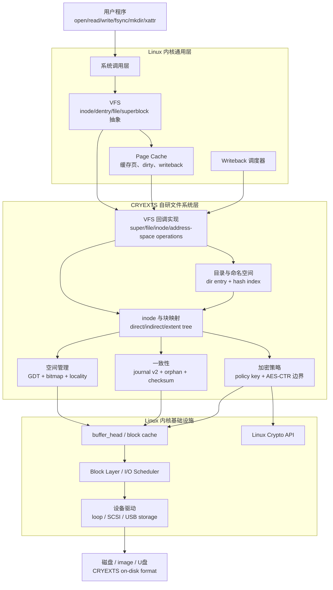
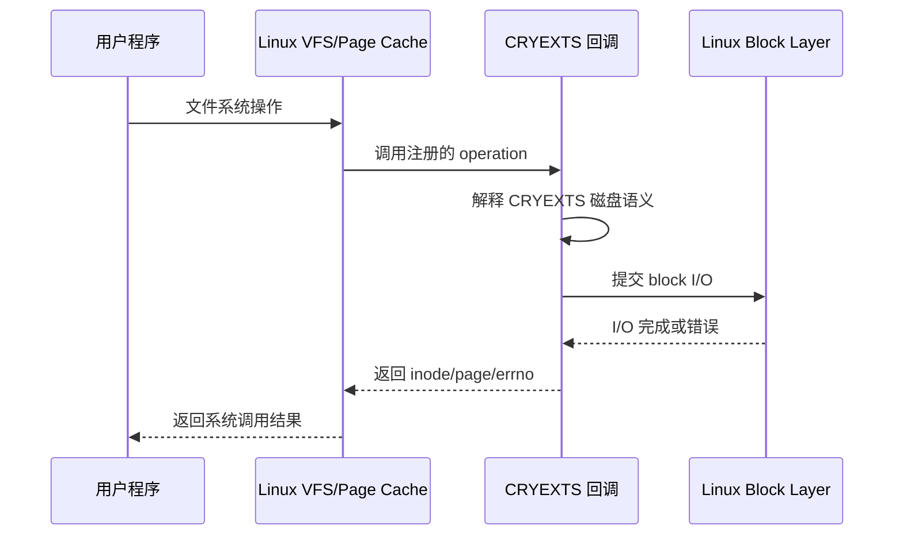
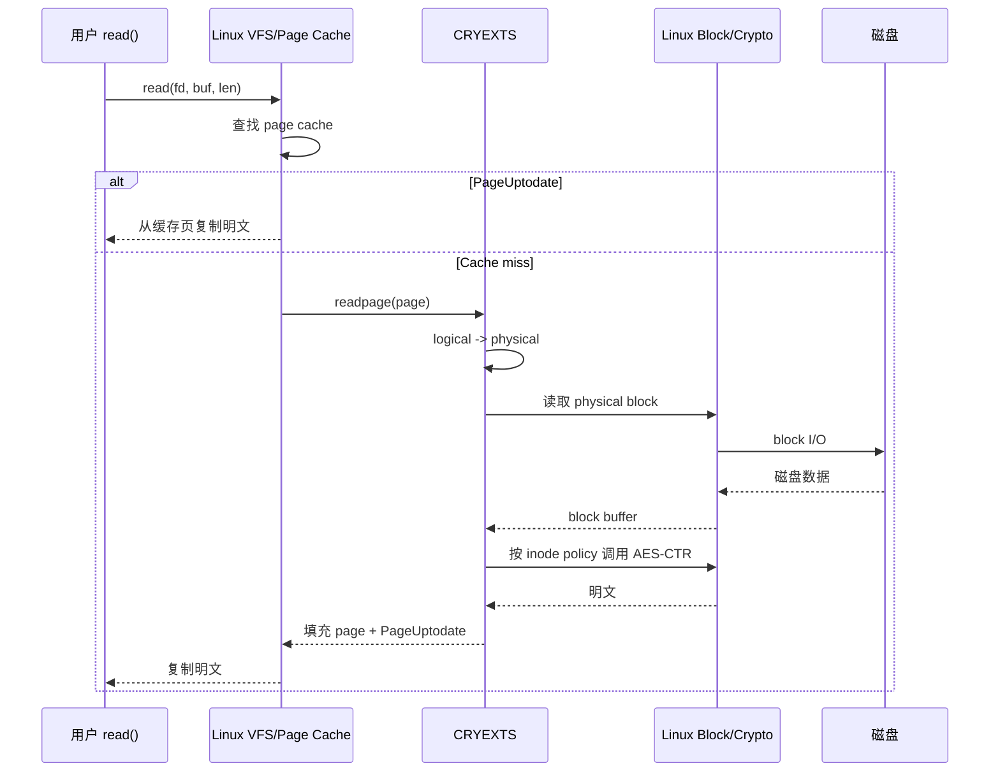
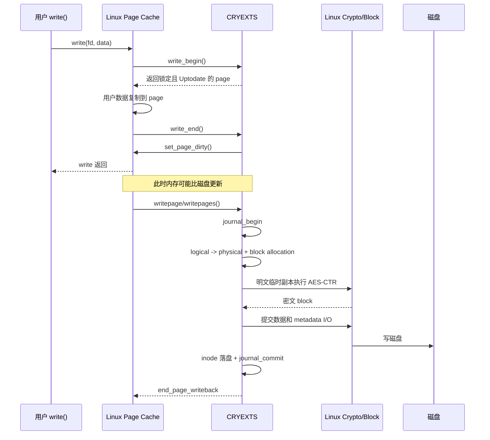
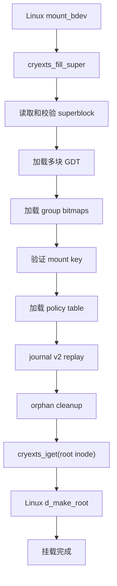
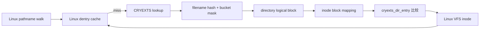
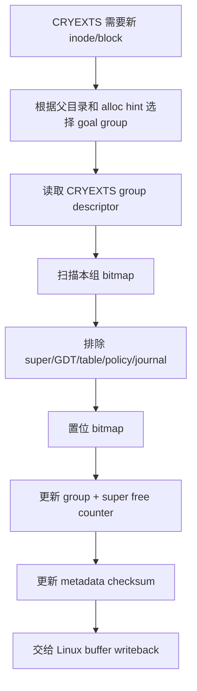
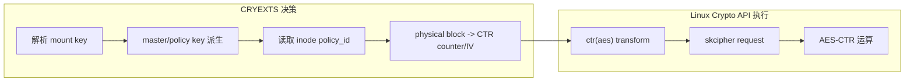

# CRYEXTS 与 Linux 内核职责边界设计

## 1. 文档目标

本文从设计层面说明当前 CRYEXTS 中：

- 哪些能力由 Linux 内核通用框架接管。
- 哪些能力必须由 CRYEXTS 自己实现。
- 哪些路径由 Linux 调度、CRYEXTS 提供具体回调。

核心设计原则：

```text
Linux 提供通用文件系统运行框架；
CRYEXTS 定义并实现自己的磁盘语义。
```

## 2. 总体分层图



这张图中有两个 Linux 区域：

- 上层 Linux 负责把用户操作组织为标准 VFS/page-cache 请求。
- 下层 Linux 负责把 CRYEXTS 的 block I/O 送到具体设备。
- 中间的 CRYEXTS 决定这些请求在自己的磁盘格式中代表什么。

## 3. 职责所有权


### 3.1 Linux 接管的部分

| Linux 能力 | 当前作用 |
| --- | --- |
| 系统调用层 | 接收 `read/write/mkdir/fsync` 等请求 |
| VFS | 提供统一的 `file/inode/dentry/super_block` 模型 |
| Dentry cache | 缓存路径名到 inode 的查找结果 |
| Inode cache | 管理内存 VFS inode 生命周期 |
| Page cache | 缓存 regular-file 明文页 |
| Generic file I/O | 实现通用 `read_iter/write_iter` 主流程 |
| Dirty tracking | 记录哪些缓存页比磁盘更新 |
| Writeback | 选择、锁定和调度 dirty pages 回写 |
| Block layer | 合并、排队并下发块设备请求 |
| Device driver | 操作 loop、SCSI、USB 等具体设备 |
| Crypto API | 提供同步 `ctr(aes)` 算法实现 |

### 3.2 CRYEXTS 自己实现的部分

| CRYEXTS 能力 | 必须自己实现的原因 |
| --- | --- |
| On-disk layout | Linux 不知道 CRYEXTS block 0、GDT、group 和 journal 布局 |
| Mount 校验 | 必须解释 CRYEXTS superblock、feature 和 checksum |
| Inode 序列化 | VFS inode 与 `struct cryexts_inode` 格式不同 |
| Block mapping | Linux 不知道 direct/indirect/extent 如何定位 physical block |
| Allocator | Linux 不知道 CRYEXTS bitmap、group counter 和保留区域 |
| Directory entry | Linux 不知道 CRYEXTS 目录项和 hash index 格式 |
| Journal | Linux 不知道 control/descriptor/payload/commit 协议 |
| Recovery | 必须按 CRYEXTS sequence/checksum 规则 replay |
| Encryption policy | Linux 提供 AES，但不知道 inode policy、key 派生和 IV 规则 |
| Xattr 存储 | Linux 提供 xattr API，CRYEXTS 决定 root+overflow 格式 |
| 用户态工具 | mkfs、fsck、inspect 必须理解同一套磁盘格式 |

## 4. 回调式协作模型

Linux 并不是直接理解 CRYEXTS，而是通过回调向 CRYEXTS 提问。



当前主要注册接口：

| Operation | Linux 负责 | CRYEXTS 回调负责 |
| --- | --- | --- |
| `super_operations` | superblock 生命周期框架 | sync、statfs、evict、卸载资源 |
| `inode_operations` | VFS inode 调度 | lookup/create/mkdir/unlink/rename/setattr |
| `file_operations` | file descriptor 框架 | iterate、fsync、fallocate 与 generic I/O 接入 |
| `address_space_operations` | page cache/writeback 框架 | fill page、prepare write、write dirty page |
| `xattr_handler` | xattr 系统调用框架 | CRYEXTS xattr 格式读写和 policy 校验 |

## 5. 读取路径职责图



设计边界：

```text
Linux 决定“是否需要读取一个 page”；
CRYEXTS 决定“这个 page 对应哪个磁盘块以及如何解密”。
```

## 6. 写入路径职责图



设计边界：

```text
Linux 决定“什么时候回写哪些 dirty pages”；
CRYEXTS 决定“如何分配、加密并保持磁盘一致性”。
```

## 7. Mount 与恢复职责图

Mount 不能交给通用 page cache，因为它需要理解整个 CRYEXTS 格式。



Linux 提供 `mount_bdev()`、buffer I/O 和 root dentry 创建；CRYEXTS 决定每一步校验和恢复规则。

## 8. 命名空间职责图



Linux 管理 pathname walk 和 dentry cache；CRYEXTS 管理目录块、hash 索引和目录项格式。

当前目录索引不是 Linux 自动提供的 HTree。它是 CRYEXTS 自己实现的 `64 buckets + 16-bit block mask` 单层索引。

## 9. 空间管理职责图



Linux 提供 bitmap 位操作、锁和 buffer 写回工具，但不会替 CRYEXTS 决定哪个 block 可以分配。

## 10. 加密职责图



Linux 提供可靠的 AES 实现；CRYEXTS 自己定义：

- 哪些 inode 数据需要加密。
- 使用哪个 policy key。
- 如何由 physical block 构造 counter。
- page cache 明文与磁盘密文的转换位置。

## 11. 一致性责任不能交给 Page Cache

Page cache 只知道“某个文件页是 dirty”，不知道这个页的写回会修改哪些 CRYEXTS metadata。

例如首次写入一个 sparse logical block：

```text
dirty page writeback
-> 分配 physical block
-> 修改 block bitmap
-> 修改 group free_blocks
-> 修改 super free_blocks
-> 新增 extent
-> 修改 inode size/i_blocks
-> 更新 checksum
-> journal transaction
```

这些修改必须由 CRYEXTS 统一处理。Linux writeback 只能触发这个过程，不能替代它。

## 12. 为什么采用这个边界

### 复用 Linux 的理由

- Page cache、VFS、writeback 和 block layer 已处理大量通用并发与生命周期问题。
- 自己重新实现缓存页和 writeback 调度成本高、风险大。
- 使用 generic I/O 后，应用可以按标准 Linux 文件语义工作。

### 保留 CRYEXTS 实现的理由

- 磁盘格式是文件系统的核心知识，不能由通用层猜测。
- Journal、extent、allocator 和 policy 必须遵循同一套 on-disk 不变量。
- `cryextsck` 需要与内核实现看到完全相同的结构。

因此设计上不是：

```text
Linux 接管 CRYEXTS
```

而是：

```text
Linux 管理通用机制，CRYEXTS 提供文件系统策略和格式语义。
```

## 13. 当前边界与后续方向

当前仍由 CRYEXTS 简化处理：

- `PAGE_SIZE` 必须等于 4096-byte 文件系统 block。
- writeback callback 逐 page 提交 journal。
- 没有 readahead、iomap、DIO 和 DAX。
- 加密逐 4 KiB 分配临时副本和 skcipher request。
- 目录仍使用自定义 direct-block + 单层 hash index。

这些功能只有在测试证明当前边界成为瓶颈时才需要继续扩展。

## 14. 一句话架构总结

```text
Linux 管对象、缓存、调度和设备；
CRYEXTS 管格式、映射、分配、安全策略和一致性。
```
