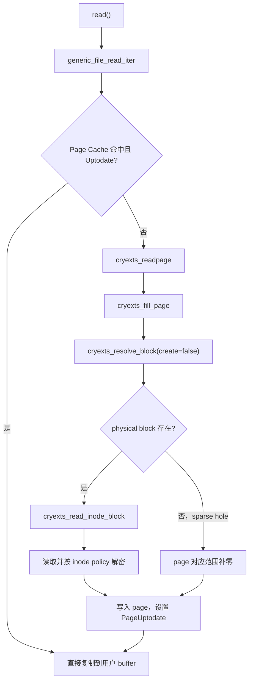
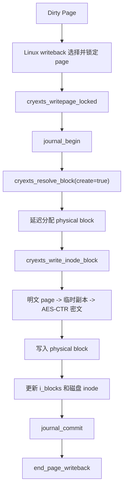

# CRYEXTS Page Cache 接入与自定义 I/O 逻辑对比

## 1. 文档目标

本文解释 CRYEXTS regular file I/O 从早期自定义逐块读写，切换到 Linux page cache 主线后发生了什么变化。

核心结论：

```text
接入 page cache 不是把文件系统逻辑交给 Linux，
而是把“缓存页生命周期和回写调度”交给 Linux，
CRYEXTS 继续负责磁盘格式、块映射、空间分配、加密和一致性。
```

当前实现位于：

- [file.c](../file.c)
- [inode.c](../inode.c)
- [crypto.c](../crypto.c)
- [journal.c](../journal.c)

## 2. 总体差别

| 维度 | 早期自定义 I/O | 当前 Page Cache I/O |
| --- | --- | --- |
| VFS 入口 | 自定义 `read_iter/write_iter` 搬运数据 | `generic_file_read_iter/write_iter` |
| 内存缓存 | 文件系统自己分配临时 block buffer | Linux address space/page cache |
| 重复读取 | 每次重新执行块映射和磁盘读取 | PageUptodate 时直接命中缓存 |
| 小写合并 | 每次 write 都可能 read-modify-write | 同一 page 内先合并，writeback 时落盘 |
| dirty 状态 | 没有标准 dirty-page 生命周期 | Linux 维护 clean/dirty/writeback 状态 |
| 物理块分配 | write 请求中立即分配 | 当前延迟到 `writepage` |
| 回写触发 | 每次 write 主动写盘 | 内核 writeback、`fsync`、`sync`、内存压力 |
| 错误反馈 | 当前 write 请求直接得到 I/O 错误 | writeback 记录 mapping error，`fsync` 等待并返回 |
| 加密位置 | 自定义 write 路径直接加密 block | page cache 明文，writeback 临时副本加密 |
| Journal | write 请求自己开启/提交 | 当前每个 dirty page 写回时开启/提交 |

## 3. 早期自定义读取

早期 regular file 读取大致为：


文件系统需要自己处理：

1. 文件偏移到 logical block 的拆分。
2. logical-to-physical 映射。
3. 临时 buffer 分配。
4. block 读取和解密。
5. 用户迭代器拷贝。
6. partial block 和 EOF。

即使连续两次读取同一范围，这条路径也要重新执行。

## 4. 当前 Page Cache 读取

当前入口只有一行：

```c
ssize_t cryexts_read_iter(struct kiocb *iocb, struct iov_iter *to)
{
	return generic_file_read_iter(iocb, to);
}
```

读取流程变为：



Linux 负责找到、创建、锁定和缓存 page；CRYEXTS 只在 cache miss 时回答：

```text
这个文件页对应哪些 physical blocks，以及如何读取它们？
```

## 5. 早期自定义写入

早期写路径大致为：

```text
write request
-> 按 4 KiB block 拆分
-> partial write 先读取旧 block
-> 修改临时 block buffer
-> 立即分配 physical block
-> 加密并写 block
-> 更新 inode size/mapping
-> journal commit
```

每个用户 write 请求既负责内存搬运，也负责持久化。优点是状态直观，缺点是多个小写无法自然合并。

## 6. 当前 Buffered Write

当前写入口同样交给内核：

```c
ssize_t cryexts_write_iter(struct kiocb *iocb, struct iov_iter *from)
{
	return generic_file_write_iter(iocb, from);
}
```

### 6.1 `cryexts_write_begin()`

功能：为写入准备一个锁定的 page。

流程：

1. 检查偏移、长度和 inode 最大文件大小。
2. 要求 `PAGE_SIZE == CRYEXTS_BLOCK_SIZE == 4096`。
3. 使用 `grab_cache_page_write_begin()` 获取 page。
4. page 尚未 Uptodate 时调用 `cryexts_fill_page()`。
5. 把锁定 page 交给内核复制用户数据。

partial write 必须先装载旧页。例如只覆盖 4096-byte page 中的 512 bytes，剩余 3584 bytes 必须保留旧内容。

### 6.2 `cryexts_write_end()`

功能：结束内存写入，不直接写磁盘。

它只执行：

1. 根据实际 `copied` 扩展 `i_size`。
2. 更新 `mtime/ctime`。
3. 设置 PageUptodate。
4. 调用 `set_page_dirty()`。
5. 解锁并释放 page 引用。

此时可能出现：

```text
page cache 已经是新数据
磁盘仍然是旧数据或尚未分配 block
```

这是 buffered write 的正常状态，不是数据不一致错误。dirty 标志记录了“内存比磁盘新”。

## 7. Writeback 阶段

dirty page 最终通过 `cryexts_writepage()` 或 `cryexts_writepages()` 落盘：



Linux 负责：

- 找出哪些 page 是 dirty。
- 按 writeback_control 范围遍历 page。
- 调度后台回写。
- 管理 page 锁与 writeback 状态。

CRYEXTS 负责：

- logical-to-physical 映射。
- 需要时分配 block、更新 extent。
- 数据块加密。
- inode metadata 持久化。
- journal transaction。
- 把错误记录到 mapping 并重新标脏 page。

## 8. 512-byte 小写案例

假设程序连续执行 8 次 512-byte write，刚好写满一个 4096-byte page。

### 自定义逐块模型

```text
第1次 write -> 读取/修改/写回 4 KiB
第2次 write -> 读取/修改/写回 4 KiB
...
第8次 write -> 读取/修改/写回 4 KiB
```

最坏情况下产生 8 次 block 写和 8 次 journal 提交。

### Page Cache 模型

```text
第1次 write -> 修改 page[0:512]，标脏
第2次 write -> 修改 page[512:1024]，仍是同一 dirty page
...
第8次 write -> 修改 page[3584:4096]
writeback    -> 整页写回一次
```

这就是 page cache 对小写性能最直接的价值：

```text
多个用户 write 合并为较少的磁盘 block write。
```

但当前每个 dirty page 仍单独提交 journal，因此跨 page 的事务合并尚未完成。

## 9. `fsync()` 的差别

自定义同步路径中，每个 write 已经做了大部分落盘工作，`fsync` 主要同步剩余 metadata。

当前路径中，`fsync` 必须先调用：

```c
file_write_and_wait_range(file, start, end);
```

它会等待目标范围内所有 dirty pages 完成 writeback，然后 CRYEXTS 再写 inode 并同步 metadata。writeback 错误通过 address space mapping 返回给 `fsync`。

## 10. Truncate、Punch Hole 与 Unlink

接入 page cache 后，释放 physical block 前必须先处理缓存页，否则会发生：

```text
physical block 已释放并可能分配给其他文件
-> 旧 dirty page 随后写回
-> 覆盖其他文件的数据
```

因此当前实现：

- truncate 缩小时先 `filemap_write_and_wait()`，再释放 block 和截断 page cache。
- punch hole 前等待目标范围 writeback，修改底层映射后 invalidate 对应缓存。
- 删除最后一个 regular-file 链接前等待 dirty pages。
- 释放 inode storage 时调用 `truncate_inode_pages()`。

这些步骤是接入 writeback 后新增的一致性责任。

## 11. 加密边界变化

早期模型中，自定义 write 请求直接操作临时 block buffer，加密后立即写盘。

当前模型中：

```text
Page Cache：始终保存明文
Writeback：把明文复制到临时 4 KiB buffer
Crypto：按 inode policy 使用 AES-CTR 加密临时副本
Block Buffer/磁盘：保存密文
```

读取时顺序相反。这样 VFS 和用户态始终面对明文，也不会因为 writeback 加密而把缓存页原地改成密文。

Journal、xattr 等 metadata 使用 raw block I/O，不进入文件数据 cipher。

## 12. 什么交给 Linux，什么不能交

### 已交给 Linux

- page 查找、创建、锁定和回收。
- clean/dirty/writeback 状态机。
- 用户 buffer 与 page 之间的数据复制。
- repeated read 的缓存命中。
- writeback 扫描和触发。
- `fsync` 等待 page writeback 的通用框架。

### CRYEXTS 必须保留

- inode 与 on-disk format。
- extent/direct/indirect 映射。
- block group allocator 和 bitmap。
- sparse hole 语义。
- policy-aware encryption。
- journal/replay 和 metadata checksum。
- truncate、unlink、orphan 的磁盘一致性。

Linux page cache 不知道 CRYEXTS 的 extent、policy、journal 和 block group，因此不会替文件系统完成这些工作。

## 13. 当前实现边界

当前 page-cache 接入是可工作的最小实现，仍有这些边界：

- 仅 regular file 接入 page cache；目录继续使用目录块逻辑。
- 要求 `PAGE_SIZE == CRYEXTS_BLOCK_SIZE == 4096`。
- Linux 5.15 使用 `readpage`，尚未迁移到较新的 `read_folio`。
- 没有专门实现 readahead 回调。
- `writepages` 使用内核 `write_cache_pages()`，但 callback 仍逐页处理。
- 每个 dirty page 单独执行 journal transaction，没有跨页 batching。
- encrypted write 每个 4 KiB block 分配临时加密副本和 skcipher request。
- 没有实现 DIO、DAX 或 iomap。

这些是后续性能优化方向，不影响当前 page cache 基础语义闭环。

## 14. 最终理解

接入前：

```text
每个 read/write 系统调用，CRYEXTS 自己负责从用户 buffer 一直处理到磁盘。
```

接入后：

```text
用户 I/O 先进入 Linux page cache；
CRYEXTS 在 cache miss 和 writeback 时负责连接自己的磁盘格式。
```

因此当前职责分工可以总结为：

```text
Linux 管页，CRYEXTS 管块；
Linux 管缓存状态，CRYEXTS 管磁盘一致性。
```
