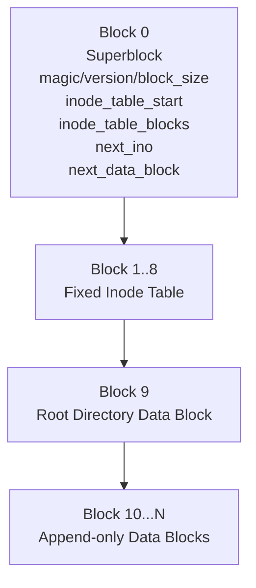
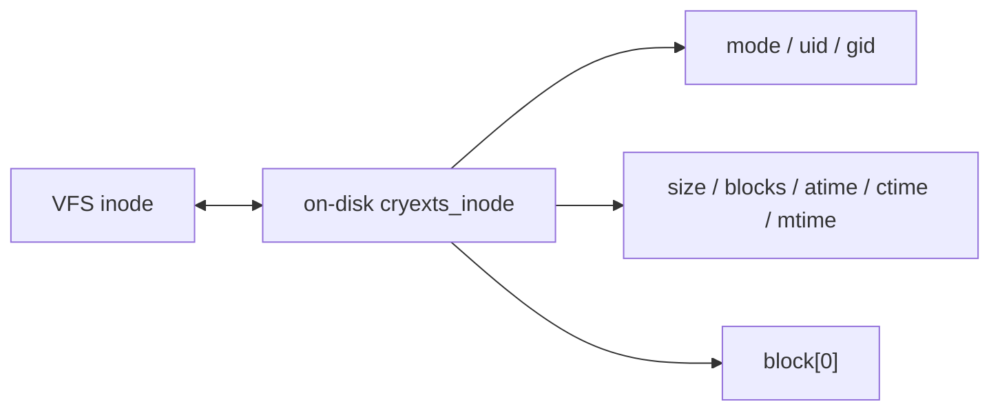
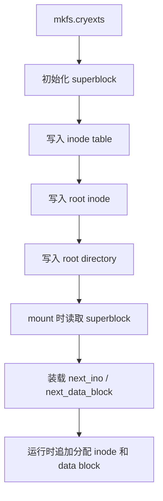
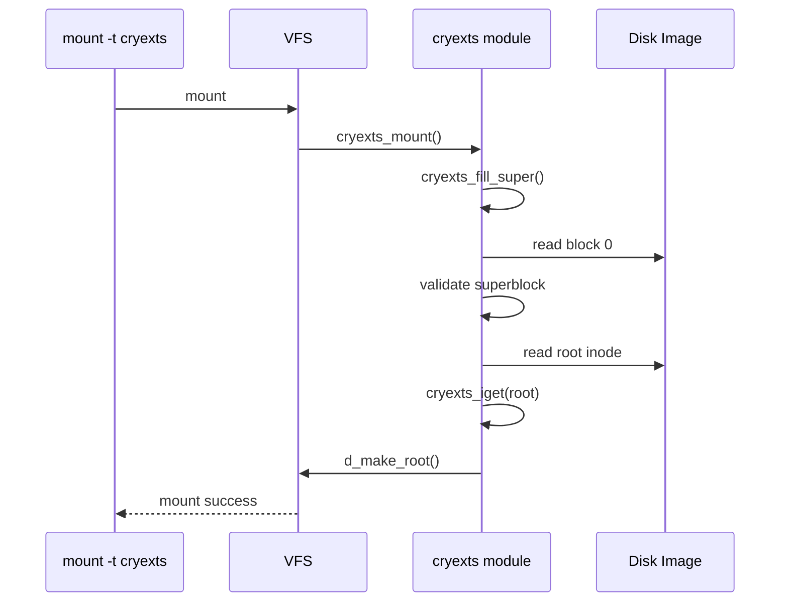
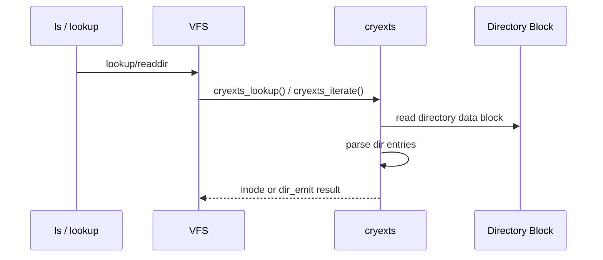
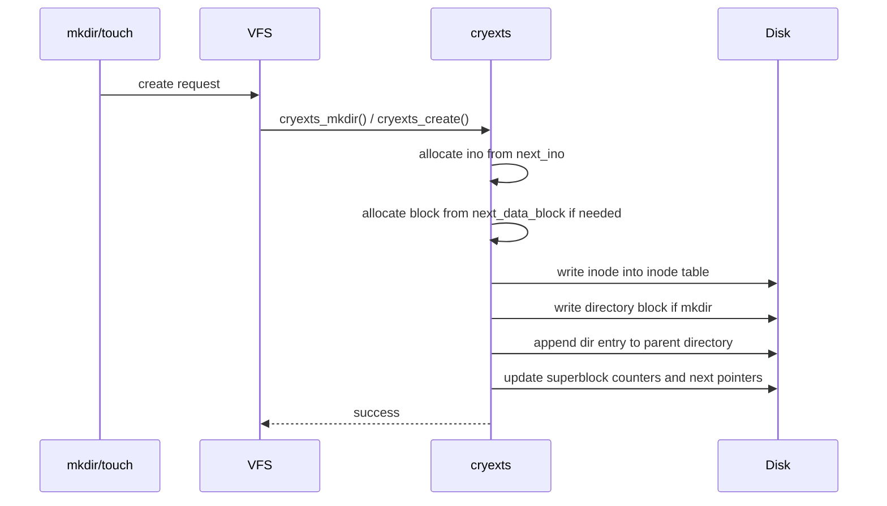
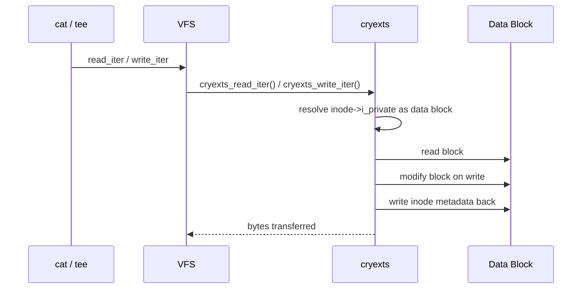
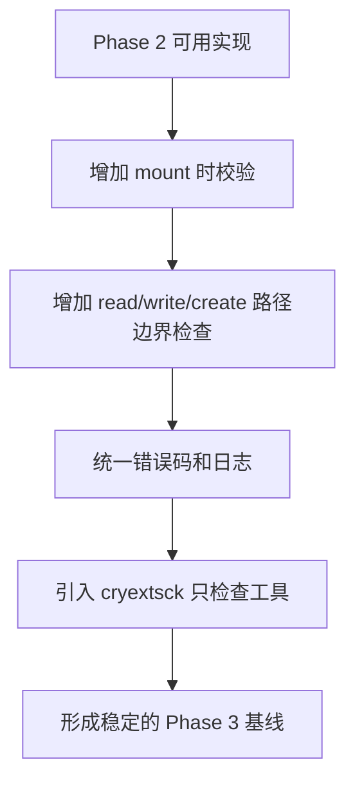

# CRYEXTS Phase 2 架构图

## 概述

当前 CRYEXTS 已经完成第二阶段最小闭环：

```text
mkfs.cryexts -> insmod -> mount -> ls -> mkdir -> touch -> write -> read -> umount -> remount
```

这个版本的设计重点不是复杂特性，而是先让目录和普通文件的最小持久化路径跑通。

## 1. 当前磁盘布局



### 说明

- `Block 0` 保存 superblock。
- `Block 1..8` 是固定 inode table。
- `Block 9` 是 root 目录的 data block。
- `Block 10` 开始按顺序分配给新目录或普通文件。
- 当前没有 bitmap，也没有空闲块回收。

## 2. Inode 结构角色



### 当前约束

- 一个目录只使用一个 data block。
- 一个普通文件只使用一个 data block。
- `block[0]` 是当前唯一真正使用的数据块指针。
- 这让第二阶段足够简单，也意味着文件大小上限暂时是一个 block。

## 3. Superblock 状态机



### 当前 superblock 负责的信息

- 文件系统 magic/version。
- block size。
- inode table 起点和长度。
- root inode block / root dir block。
- `next_ino`。
- `next_data_block`。
- `free_blocks_count`。

## 4. VFS 调用链

### 4.1 挂载链路



### 4.2 目录查找链路



### 4.3 创建链路



### 4.4 读写链路



## 5. 当前模块分工

| 模块 | 职责 |
|---|---|
| `tools/mkfs.cryexts.c` | 初始化磁盘布局，写 superblock、inode table、root inode、root dir |
| `cryexts_fs.h` | 定义当前磁盘格式 |
| `super.c` | 文件系统注册、mount、lookup、readdir、mkdir、create、unlink、rmdir、read、write |
| `scripts/smoke_phase1.sh` | 自动化验证第一阶段 |
| `scripts/smoke_phase2.sh` | 自动化验证第二阶段 |

## 6. 第二阶段的设计取舍

### 已完成的简化

- 固定 inode table。
- 单块目录。
- 单块普通文件。
- 追加式分配。
- 只做最小持久化。

### 暂时没有做

- inode bitmap。
- block bitmap。
- 空间复用。
- 多块文件。
- 多块目录。
- rename 复杂语义。
- fsck。
- 事务或日志。

## 7. 当前风险点

第二阶段已经可用，但还有明显技术债：

1. 分配策略是 append-only，删除后不会复用 inode 和 block。
2. 目录项删除只是清 inode，不做目录压缩与碎片整理。
3. 普通文件暂时只支持单 block，超过 4KB 会失败。
4. mount 时校验还比较弱，对坏 inode、坏 block、坏目录项的保护不够严格。
5. 没有独立的检查工具，损坏镜像只能靠内核日志判断。

## 8. 第三阶段要处理什么

第三阶段目标是“一致性和错误处理”，不是再堆功能。



### 第三阶段建议拆分

#### 3.1 Mount-time 校验

- 校验 superblock 字段范围。
- 校验 inode table 不越界。
- 校验 `next_ino` 不越界。
- 校验 `next_data_block` 不越界。
- 校验 root inode 必须存在且必须是目录。
- 校验 root dir block 号合法。

#### 3.2 Inode 校验

- `mode` 必须是已支持类型。
- `size` 和 `blocks` 必须匹配当前阶段约束。
- 目录 inode 必须有有效 data block。
- 普通文件有大小时必须有有效 data block。
- data block 不能指向保留区。

#### 3.3 Directory Entry 校验

- `rec_len` 不能为 0。
- `rec_len` 必须 4 字节对齐。
- `name_len` 不能超过 `rec_len`。
- 目录项不能越过 block 边界。
- `.` 和 `..` 规则正确。

#### 3.4 运行时边界保护

- `mkdir/create/write/unlink/rmdir` 前做更严格检查。
- 文件写入超过单 block 时返回明确错误。
- 不允许把 data block 指向 inode table 或 superblock。
- 损坏数据时返回 `-EIO` 或 `-EFSCORRUPTED` 风格错误，而不是继续写。

#### 3.5 检查工具 `cryextsck`

第一版只做 check，不做 repair：

- 读 superblock。
- 扫 inode table。
- 扫目录块。
- 打印发现的问题。
- 返回非零退出码。

## 9. 第三阶段验收建议

第三阶段可以按下面几个测试判断是否完成：

```bash
# 正常镜像
./scripts/smoke_phase2.sh

# 损坏 magic 后 mount 失败
# 损坏 root inode 后 mount 失败
# 损坏目录项后 ls 返回错误且内核不崩

# 检查工具
./cryextsck cryexts.img
```

预期结果：

- 坏镜像不会导致 kernel panic。
- mount 或 `ls` 失败时有明确日志。
- `cryextsck` 能发现主要结构错误。

