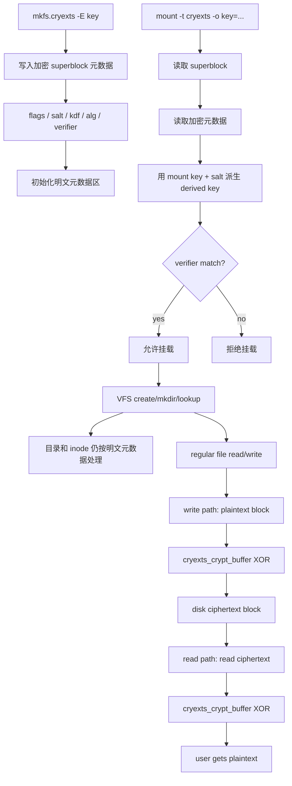

# CRYEXTS Phase 4 MVP：透明加密最小闭环

## 1. 阶段目标

Phase 4 的目标，是先把透明加密的最小闭环跑通：

```text
mkfs -E key -> mount -o key=key -> write plaintext -> disk ciphertext -> read plaintext
```

这个阶段的核心不是做强密码学，而是证明：

- 文件系统可以识别“这是一个加密卷”
- 挂载时可以验证 key 是否正确
- 普通文件的数据块可以在内核里透明加密和解密
- 用户态看到的是明文，镜像里保存的是密文

## 2. 当前实现范围

从今天的代码状态来看，Phase 4 的最初目标已经完成，并且在后续 V2.5 中做了结构整理。

当前已经实现：

- `mkfs.cryexts -E <key>` 创建加密卷
- superblock 记录加密标志
- superblock 记录加密元数据
  - `encryption_flags`
  - `encryption_kdf`
  - `encryption_alg`
  - `salt`
  - `key_hash` 字段当前承载 derived-key verifier
- `mount -o key=<key>` 挂载加密卷
- 缺少 key 时拒绝挂载
- key 错误时拒绝挂载
- 普通文件写入时在内核中加密后落盘
- 普通文件读取时在内核中解密后返回给用户
- `cryextsck` 能识别加密卷并检查加密元数据是否自洽
- `scripts/smoke_phase4.sh` 自动验证加密读写、错误 key 拒绝和镜像无明文

当前仍然不做：

- 文件名加密
- inode / 目录项加密
- per-file key
- 真实生产级密码学算法
- 完整的 Crypto API 接入
- journal 或崩溃恢复
- metadata integrity / MAC

## 3. 现在怎么理解 Phase 4

最早的 Phase 4 可以理解成“加密路径第一次跑通”。

而现在的代码已经比最初版本更进一步，变成了：

```text
Phase 4 MVP 路径可工作
    +
V2.5 对加密元数据和密钥流转做了结构整理
```

所以如果你今天再看 Phase 4，它更准确的定位应该是：

```text
透明加密最小可运行原型
```

而不是：

```text
安全完备的加密文件系统
```

## 4. 当前架构图



## 5. 当前密钥链路

### 5.1 最初设计

最初的 Phase 4 设计更简单：

```text
mount key -> hash(raw key) -> compare -> raw key directly drives XOR
```

它的优点是快，容易证明链路能跑通。

但缺点也明显：

- superblock 虽然预留了 `salt / kdf / alg`，却没有真的用起来
- 数据面直接依赖原始 mount key
- 后面要升级成更正式的加密层时，接口还得再拆一次

### 5.2 当前设计

现在已经整理为：

```text
mount key
  -> read salt/kdf/alg from superblock
  -> derive derived key
  -> compute verifier
  -> compare with stored verifier
  -> if ok, use derived key for XOR data blocks
```

这里有一个很关键的点：

- `key_hash` 这个字段名还保留着
- 但它现在存的已经不是 `hash(raw key)`
- 它现在存的是 `verifier(derived key)`

所以你可以把它理解成：

```text
兼容旧字段名，但新语义已经升级
```

## 6. 为什么当前只加密普通文件 data block

这是一条非常刻意的边界。

当前不加密这些部分：

- superblock
- inode table
- directory entry
- 文件名

原因是：

- 便于 `ls`、`mkdir`、`lookup` 先稳定
- 便于 `cryextsck` 直接检查元数据
- 便于调试时用 hexdump / grep / fsck 分析结构
- 降低 MVP 阶段复杂度

这样 Phase 4 的任务就被压缩成一个非常清晰的问题：

```text
只把 regular file data block 做透明加解密
```

## 7. 测试步骤

在 Ubuntu 目标环境中执行：

```bash
cd ~/cryexts
chmod +x scripts/smoke_phase4.sh
./scripts/smoke_phase4.sh
```

预期输出：

```text
phase4 smoke test passed
```

脚本会自动检查：

- 模块能编译
- 加密镜像能创建
- `cryextsck` 能识别加密卷
- 正确 key 可以挂载
- 写入后 `cat` 能读出原文
- 镜像文件里搜不到写入的明文内容
- 错误 key 不能挂载
- 卸载后重新用正确 key 挂载仍能读出数据

## 8. 手工测试命令

```bash
make
dd if=/dev/zero of=cryexts.img bs=1M count=64
./mkfs.cryexts -f -E "test-key" cryexts.img
./cryextsck cryexts.img
sudo insmod cryexts.ko
sudo mkdir -p /tmp/cryexts-mnt
sudo mount -o loop,key=test-key -t cryexts cryexts.img /tmp/cryexts-mnt
sudo mkdir /tmp/cryexts-mnt/dir1
echo "secret message" | sudo tee /tmp/cryexts-mnt/dir1/a.txt
cat /tmp/cryexts-mnt/dir1/a.txt
sudo umount /tmp/cryexts-mnt
grep -a "secret message" cryexts.img || echo "plaintext not found"
sudo rmmod cryexts
```

## 9. 现阶段的重要说明

当前加密函数仍然是实验用 XOR stream，不是安全加密算法。

它的价值在于证明：

- 挂载时的 key 校验链路成立
- 数据块可以透明加密和解密
- 元数据和数据面的职责边界已经清楚

它不能证明：

- 这个方案有真实安全强度
- 可以保护生产数据

## 10. 和 V2.5 的关系

如果说最初的 Phase 4 是“第一次打通加密闭环”，那么 V2.5 做的就是“把这条闭环整理成可演进架构”。

今天它们之间的关系可以理解成：

```text
Phase 4 = 功能第一次跑通
V2.5   = 对这条功能链路做工程化整理
```

所以这份文档仍然有价值，因为它解释的是“为什么加密功能最初这样落地”；而更细的现状实现细节，可以继续看下面这份文档：

- [V2.5 加密层说明](D:/Carl/cryptext4/cryexts/doc/cryexts-v2.5-encryption-layer.md:1)

## 11. 下一阶段应该做什么

如果后面继续增强加密层，最自然的方向是：

1. 保持现有 `salt / kdf / alg / verifier` 元数据结构不变
2. 把 XOR 数据路径替换为 Linux Crypto API
3. 设计 per-block IV / nonce
4. 再考虑 metadata encryption 或 integrity

这样演进时，不需要推翻当前的 superblock 和挂载校验流程。
