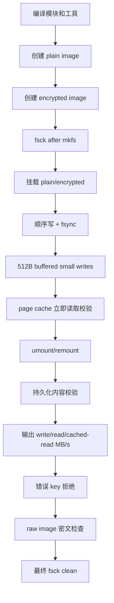

# CRYEXTS v10.5 变更说明

## 1. 版本目标

v10.5 不新增磁盘格式，也不引入新的 I/O 抽象。它把 v10.0 到 v10.4 已经完成的能力收敛成一个可重复执行的回归入口：

```text
page cache
    -> buffered write
    -> dirty page/writeback
    -> metadata journal
    -> policy-aware AES-CTR
    -> remount/fsck
```

核心目标是回答：

```text
性能测试能否重复？
缓存数据是否正确？
写回后是否能恢复？
加密数据是否仍然保持密文？
```

## 2. 新增内容

### 2.1 回归脚本

脚本：`scripts/smoke_v10_5_regression.sh`

默认只操作两个 image：

```text
cryexts-v10_5-plain.img
cryexts-v10_5-encrypted.img
```

不会访问 U 盘或真实块设备。

### 2.2 测试流程



## 3. 验收项

### 3.1 功能验收

- 顺序写入后 `fsync` 成功。
- 512 字节小写入能从 page cache 立即读回。
- `umount/remount` 后顺序文件和小写入文件内容一致。
- plain image 与 encrypted image 都能通过最终 `cryextsck`。
- 错误密钥不能挂载 encrypted image。
- encrypted image 原始字节中不能出现测试文件的明文 marker。

### 3.2 性能验收

脚本输出以下指标：

```text
plain_write_mb_s
plain_read_mb_s
plain_cached_read_mb_s
encrypted_write_mb_s
encrypted_read_mb_s
encrypted_cached_read_mb_s
```

这些数值用于同一台机器、同一套参数下的版本对比，不设置跨机器的硬编码阈值。宿主机 page cache、CPU、loop 设备和底层存储都会影响绝对值。

可调整测试规模：

```bash
BENCH_MB=32 SIZE_MB=256 ./scripts/smoke_v10_5_regression.sh
```

## 4. 运行方式

在 Ubuntu 内核环境执行：

```bash
cd ~/cryexts
chmod +x scripts/smoke_v10_5_regression.sh
./scripts/smoke_v10_5_regression.sh
```

成功标志：

```text
cryextsck: cryexts-v10_5-plain.img clean
cryextsck: cryexts-v10_5-encrypted.img clean
v10.5 page-cache/writeback regression smoke test passed
```

## 5. 与之前版本的关系

| 版本 | 关注点 |
|---|---|
| v10.0 | 顺序读写性能基线 |
| v10.1 | page cache cached read |
| v10.2 | buffered write |
| v10.3 | dirty page 和 writeback |
| v10.4 | page cache 与 policy-aware 加密协同 |
| v10.5 | 统一回归、稳定输出和 MVP 收口 |

v10.5 的定位是测试和验收闭环，不改变 v10.4 的 on-disk layout、加密格式和 journal v2 格式。

## 6. 已知边界

当前脚本仍然是 image-based smoke，不代表真实 USB/NAS 设备吞吐。它也不提供跨机器统计学结论，只保证：同一环境中可以稳定重跑，并能发现 page cache、writeback、加密、挂载恢复和 fsck 之间的回归。

下一阶段若要继续提升性能，应先用这个脚本记录基线，再单独引入批量 writeback、批量加密或 journal 批处理，并为每项改动增加独立对比数据。
