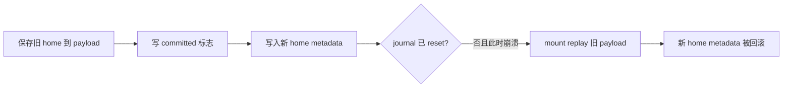
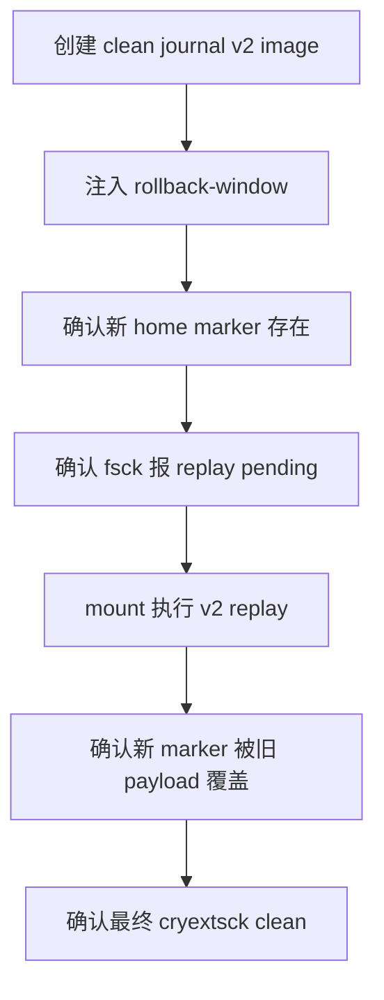

# CRYEXTS v11.0 变更说明

## 1. 版本目标

v11.0 不修正 journal v2，也不引入 journal v3。它先把当前 v2 的提交窗口构造成可重复执行的 image 测试，为后续 redo journal 提供失败基线。

```text
v11.0 = 崩溃模型 + journal v2 回滚窗口复现
```

## 2. 当前问题

journal v2 在 `record_block()` 阶段保存 home metadata 的旧副本，并提前写入 committed commit block。随后调用者修改 home metadata，`commit()` 再同步 home block 并清空 journal。



这意味着下面的磁盘状态虽然 home block 已经包含合法新内容，mount 仍会根据 committed v2 journal 把旧副本覆盖回来：

```text
payload = old home metadata
commit  = valid and committed
home    = new valid metadata
control = active, checkpoint incomplete
```

## 3. 实现内容

### 3.1 injector 新场景

`cryexts_journal_v2_inject` 新增：

```bash
./cryexts_journal_v2_inject IMAGE rollback-window
```

工具沿用现有 v2 control/descriptor/payload/commit 构造代码：

1. 把 root directory block 的旧内容保存到 payload。
2. 写入有效 descriptor 和 committed commit block。
3. 把 superblock 标记为 needs-recovery。
4. 在 root directory 最后一个 dirent 的空闲 slack 中写入新状态 marker。
5. `fsync` image，固定注入结果。

marker 不改变 dirent 的 inode、name、`rec_len` 或目录索引计数，因此注入后的 home block 本身仍是合法目录块。

不带场景参数时保持原有 recovery injector 行为，v6.1 smoke 不受影响。

### 3.2 smoke 测试

运行：

```bash
chmod +x scripts/smoke_v11_0_journal_crash_baseline.sh
./scripts/smoke_v11_0_journal_crash_baseline.sh
```

测试流程：



成功输出：

```text
v11.0 journal v2 crash-window baseline smoke test passed
```

这里的 `passed` 表示已稳定复现 journal v2 回滚行为，不表示问题已经修复。

## 4. v11.0 验收标准

- 原有 `recovery` 注入方式继续可用。
- `rollback-window` 注入后的 home block 是合法新状态。
- 注入后 journal 为 active、checkpoint incomplete。
- mount replay 后 marker 消失，证明旧 payload 覆盖了新 home。
- replay 后 `cryextsck clean`。
- 测试只操作 `.img`，不访问真实块设备。

## 5. 下一步

v11.1 将定义 journal v3 的 incompat feature 和磁盘结构，并同步支持 `mkfs`、`cryextsck` 与 journal inspect。真正修复回滚窗口的 redo commit/replay 从 v11.2 开始。
