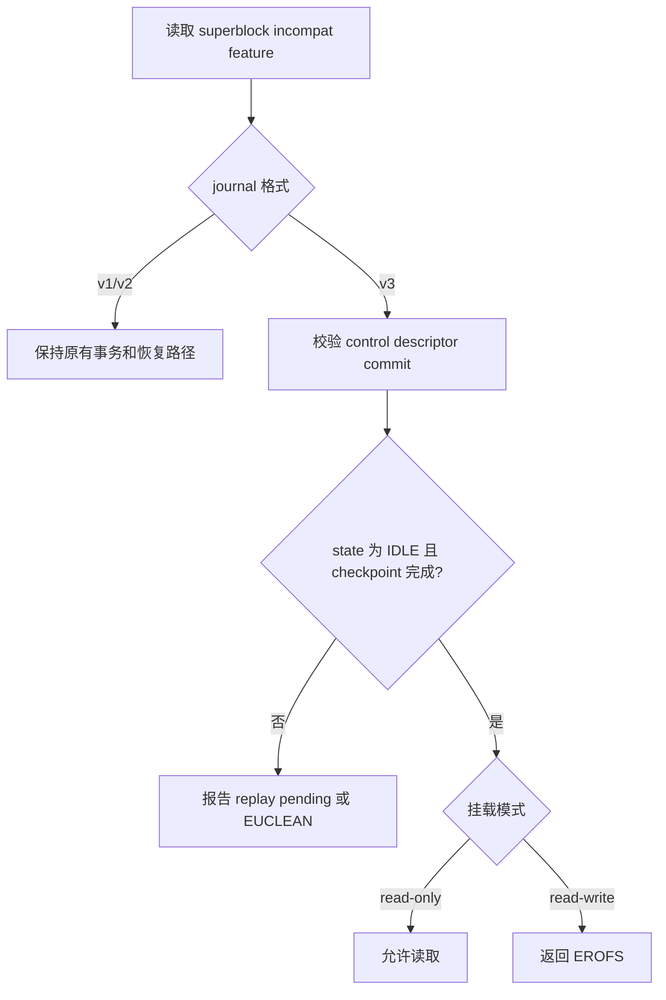

# CRYEXTS v11.1 变更说明

## 1. 版本目标

v11.1 定义 journal v3 的磁盘格式边界，并让格式化、检查、观察和挂载入口都能安全识别该格式。本版本只接受空闲、已完成 checkpoint 的 clean v3 journal，不实现 metadata redo 写入和 replay。

```text
v11.1 = journal v3 on-disk ABI + clean-state toolchain
```

## 2. 磁盘布局

journal v3 继续复用固定 journal 区域，没有引入循环日志：


四类信息的职责如下：

| 区域 | v11.1 定义的内容 |
|---|---|
| control | journal 状态、feature、last/active/checkpoint sequence 和各区域位置 |
| descriptor | sequence、entry count，以及每个 home block、payload checksum、flags |
| payload | 后续版本保存 metadata after-image；v11.1 保持为空 |
| commit | 提交标志、sequence、descriptor checksum、payload 汇总 checksum |

superblock 使用 `CRYEXTS_FEATURE_INCOMPAT_JOURNAL_V3` 标记格式。v2 与 v3 feature 互斥，旧实现由于不认识该 incompat bit，会拒绝挂载而不是把 v3 当成 v1/v2 修改。

## 3. clean 状态

`mkfs.cryexts -R` 创建下面的初始状态：

```text
control.state               = IDLE
control.last_sequence       = 0
control.active_sequence     = 0
control.checkpoint_sequence = 0
descriptor.entry_count      = 0
commit.flags                = 0
commit.entry_count          = 0
```

control、descriptor、commit 都有独立 checksum。commit 还保存 descriptor checksum，使检查器可以验证提交块引用的是同一份 descriptor。空闲 descriptor 中所有未使用 entry 必须为零。

## 4. 组件行为



- `mkfs.cryexts`：新增 `-R`，创建 clean journal v3；`-J` 仍表示 v2。
- `cryextsck`：校验 v3 三类头、布局、序列、空闲 entry 和 checksum；`--repair` 不会把 v3 当成 v1 修复。
- `cryexts_journal_inspect`：输出 `journal_format=v3`、状态、序列、布局和 checksum 对比值。
- 内核模块：只允许 clean v3 镜像只读挂载；读写挂载和 v3 事务入口返回不支持。
- 只读挂载卸载时不更新 mount count、filesystem state 或时间戳，避免只读路径产生磁盘写入。

## 5. 测试

运行：

```bash
chmod +x scripts/smoke_v11_1_journal_v3_layout.sh
./scripts/smoke_v11_1_journal_v3_layout.sh
```

测试使用 128 MiB `.img`，依次验证：

1. `mkfs -R` 成功创建 journal v3。
2. 初始和最终 `cryextsck` 均为 clean。
3. inspect 识别 v3、IDLE、checkpoint complete、零 entry 和三个有效 checksum。
4. journal v3 读写挂载被拒绝。
5. journal v3 只读挂载成功，root directory 可读取。

成功输出：

```text
v11.1 journal v3 layout smoke test passed
```

## 6. 尚未实现

v11.1 不写 redo payload，不生成 committed transaction，也不执行 replay。v11.2 才会实现 metadata after-image 的提交顺序和幂等恢复；`data=ordered` 仍属于后续阶段。
