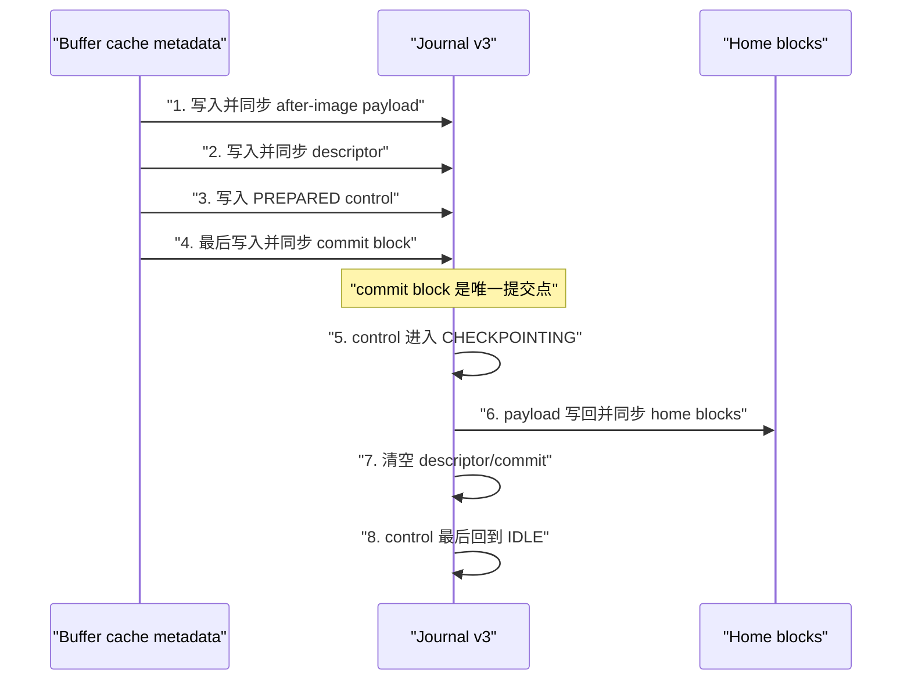

# CRYEXTS v11.2 变更说明

## 1. 版本目标

v11.2 在 v11.1 journal v3 磁盘格式上实现单事务 metadata redo commit。该版本负责生成、提交并 checkpoint after-image，但仍不在挂载时 replay 未完成事务；mount-time redo replay 留给 v11.3。

```text
v11.2 = after-image 收集 + redo commit point + 正常 checkpoint
```

## 2. 事务接口

对 metadata 调用点继续复用现有接口，不引入新的 transaction 对象：

```text
cryexts_journal_begin()
-> cryexts_journal_record_block()/record_bh()
-> 修改并 dirty metadata buffer
-> cryexts_journal_commit()
```

v1/v2 的 `record_block()` 会在登记时读取旧副本。v3 只登记并去重 home block，直到 `commit()` 才从 buffer cache 读取最终内容，因此 payload 保存的是修改后的 after-image。

`struct cryexts_sb_info::journal_error` 保存事务第一次登记错误。即使旧调用点忽略 `record_bh()` 返回值，最终 `commit()` 仍会失败并把错误传回 VFS 操作。

## 3. 写盘顺序



commit block 写入前发生错误，事务不构成已提交事务。commit block 可能已经持久化后发生错误，运行时保留活动序列和错误状态，禁止继续开启新事务，等待重新挂载后的恢复逻辑处理。

## 4. 校验范围

每个 descriptor entry 保存：

```text
home block number
payload block FNV-1a checksum
entry flags
```

commit block 同时保存 descriptor checksum 和全部 payload 串联计算的 aggregate checksum。checkpoint 前会重新读取 journal payload 并核对单块 checksum，避免把损坏的 after-image 写入 home block。

v3 允许登记 superblock、GDT、bitmap、inode table、目录、extent 和 xattr 等 metadata block，因此合法性边界是“位于文件系统块范围内且不属于 journal 自身”，不能沿用普通 data block 的判定。

## 5. v11.2 恢复边界

`cryextsck` 会完整验证非 IDLE v3 事务的 sequence、entry count、home block、重复引用、单块 payload checksum、aggregate checksum 和 commit flag。校验通过后仍返回错误并报告：

```text
journal v3 committed transaction replay pending (v11.2 does not replay)
```

这是预期行为，不表示格式损坏。v11.2 不允许挂载 replay-pending 镜像，v11.3 才会执行幂等 redo replay。

## 6. 测试

```bash
chmod +x scripts/smoke_v11_2_redo_commit.sh
./scripts/smoke_v11_2_redo_commit.sh
```

测试使用两个 128 MiB `.img`：

1. 正常镜像执行 journal v3 读写事务、卸载、fsck，并验证 journal 回到 IDLE。
2. 崩溃镜像注入 committed-before-checkpoint 事务。
3. 验证 home block 不含 marker，而 journal payload 含 after-image marker。
4. 验证 descriptor、payload、aggregate 和 commit checksum 全部一致。
5. 验证 fsck 将其识别为 replay pending，而不是 clean 或随机损坏。

成功输出：

```text
v11.2 single-transaction redo commit smoke test passed
```

## 7. 尚未实现

- v11.3：committed transaction mount-time replay、未提交事务丢弃、partial checkpoint 幂等恢复。
- v11.4：普通文件新数据先于引用它的 metadata commit，即 `data=ordered`。
- 当前仍使用单个 `journal_lock` 和固定 journal 区域，不包含多事务并发或循环日志。
