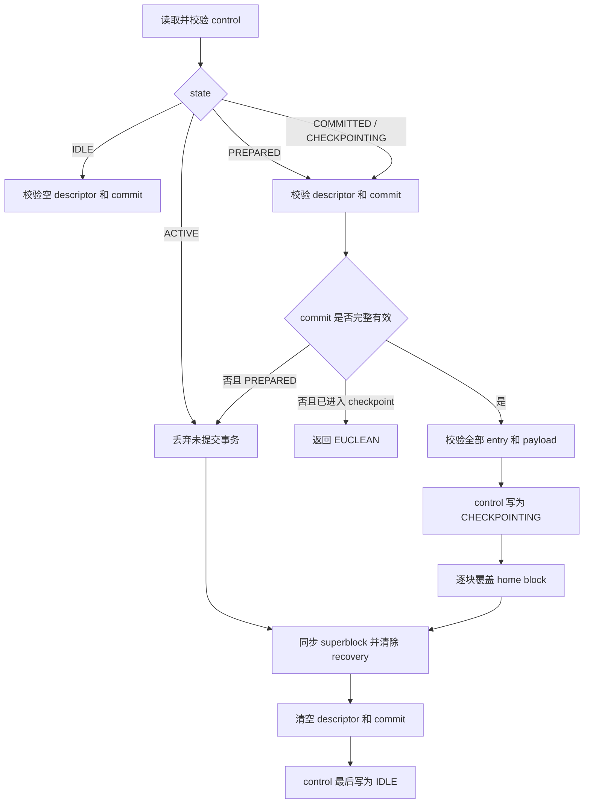

# CRYEXTS v11.3：Journal v3 redo replay 与幂等恢复

## 1. 版本目标

v11.3 在 v11.2 单事务 metadata redo commit 的基础上补齐挂载恢复：只有完整且带有效 commit 的事务才写回 home blocks；没有有效 commit 的事务直接丢弃；已经写回一部分或全部 home blocks 的事务可以从头重复 replay。

本版本不实现普通文件数据的 `data=ordered` 依赖跟踪，该部分属于 v11.4。

## 2. 挂载恢复决策



commit block 是唯一提交证明。`control.state=PREPARED` 并不等于事务已经提交；只有 commit 的 magic、checksum、sequence、entry count、descriptor checksum、payload aggregate checksum 全部匹配，事务才允许 replay。

## 3. replay 前完整校验

恢复代码在修改任何 home block 之前完成以下检查：

- control 格式、布局、状态、sequence window 和 checksum
- descriptor 格式、entry count、sequence、未使用 entry 清零和 checksum
- commit 格式、提交标志、sequence、entry count 和 checksum
- 每个 home block 在文件系统范围内且不位于 journal 区域
- home block 不重复，entry flags 为零
- 每个 payload block checksum 正确
- 所有 payload 的 aggregate checksum 与 commit 一致

任何已提交事务只要有一项不一致，就返回 `-EUCLEAN`，不会猜测性地部分写回。

## 4. 为什么重复 replay 安全

payload 保存完整 metadata block 的 after-image，恢复操作是：

```text
home_block = payload_after_image
```

同一个 4096 字节 after-image 覆盖一次或多次，最终内容相同。因此当系统在 checkpoint 中途再次崩溃，下一次挂载可以重新覆盖全部 entry，不需要记录“已经恢复到第几个 block”。

## 5. 未提交事务处理

`ACTIVE` 状态，或者 `PREPARED` 但没有有效 committed block，表示事务没有越过 commit point。恢复只清理 journal 和 superblock recovery 标志，不把 payload 写入 home block，因此保留旧 metadata 状态。

如果 superblock 带 `NEEDS_RECOVERY`，但磁盘 control 仍是上一笔事务留下的有效 `IDLE`，说明崩溃发生在新 control 写为 `PREPARED` 之前。此时可能只写了一部分 payload 或 descriptor，它们都属于未提交 scratch，可以直接重建为空 journal。

如果 control 已经声明 `COMMITTED` 或 `CHECKPOINTING`，commit 却损坏，则不能安全判断 home blocks 是否已经被部分覆盖，必须返回 `-EUCLEAN`。

## 6. 测试案例

执行：

```bash
cd ~/cryexts
chmod +x scripts/smoke_v11_3_redo_replay.sh
./scripts/smoke_v11_3_redo_replay.sh
```

脚本覆盖三种镜像：

| 场景 | 注入状态 | 挂载结果 |
|---|---|---|
| committed-before-checkpoint | payload/descriptor/commit 已持久化，home 仍是旧值 | replay 后 home 包含 after-image |
| uncommitted | payload/descriptor 已持久化，无有效 commit | 丢弃事务，home 保持旧值 |
| partial-checkpoint | commit 有效，home 已经包含 after-image，journal 未清理 | 重复 replay，最终结果不变 |

三种场景挂载完成后都必须满足：

```text
cryextsck: image clean
control.state=IDLE
descriptor.entry_count=0
commit.entry_count=0
```

最终成功输出：

```text
v11.3 redo replay and idempotent recovery smoke test passed
```

## 7. 当前边界

- 固定 journal 区域和单事务模型保持不变。
- 一个 descriptor entry 仍对应一个完整 payload block 和一个 home block。
- v11.3 只保证 metadata redo recovery。
- 普通文件 data writeback 必须早于相关 metadata commit 的完整 `data=ordered` 语义留给 v11.4。
