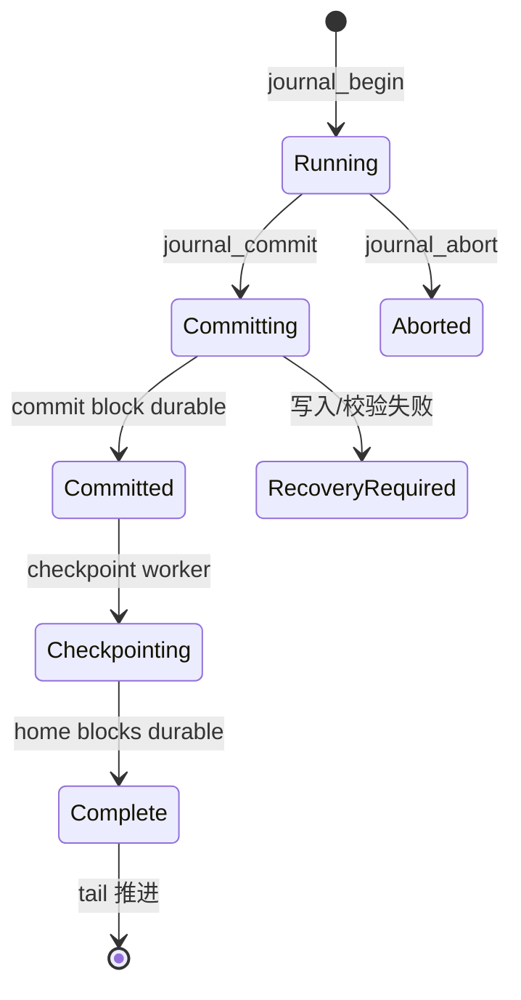

# CRYEXTS v12.2 变更说明

## 版本记录

| 版本 | 日期 | 说明 |
| --- | --- | --- |
| v1.0 | 2026-08-17 | 初始版本：定义 v12.2 后台 checkpoint 目标、设计与实现范围 |

---

## 1. 版本目标

v12.1 已经实现 journal v3 ring 的**单 writer 真实环形分配**，但 checkpoint 仍在 `cryexts_journal_v3_commit()` 内**同步完成**：
commit block 落盘后，同一把 `journal_lock` 下立刻把 payload 写回 home block，再把 ring tail 推到 head。

这意味着：

- 任何一笔 metadata 事务都要等待整段 payload 写回 home block 才能结束；
- 新事务无法在上一次事务 checkpoint 期间开始；
- ring 的 `tail` 在 commit 结束时就已经追上 `head`，实际上没有"多个已提交事务同时存在"的窗口。

v12.2 的目标是把 checkpoint 从 commit 路径里拆出来，做成**后台异步执行**：

```text
单 writer 同步 checkpoint
        -> 单 writer + 后台 checkpoint
        -> running transaction 与旧事务 checkpoint 并行
        -> ring 中可同时存在多笔"已提交、待 checkpoint"事务
```

本版本不引入多 writer，`journal_lock` 仍保证同一时刻只有一笔 running transaction。

## 2. 本版本做什么、不做什么

### 2.1 做

- 新增后台 checkpoint workqueue；
- commit 只负责把事务写到 ring 并落盘 commit block，之后调度 checkpoint，立即返回；
- checkpoint 在后台按 sequence 顺序把 payload 写回 home block，再推进 ring tail；
- `ring_allocate` 增加 tail 感知：新事务不能覆盖尚未 checkpoint 的旧事务；
- mount replay 支持扫描 ring 中**多笔已提交事务**并按 sequence 顺序重放；
- unmount（`put_super`）前 flush 后台 checkpoint，保证干净卸载后 ring 回到 IDLE。

### 2.2 不做（后续版本）

- 多 writer / 多 running transaction 并发；
- transaction 级 data dependency tracking 与 flush/barrier/FUA 抽象；
- `cryextsck` 的完整历史扫描和长时间并发压力测试；本版本的 inspect/replay 已支持多事务 ring，fsck 仍以当前 control 指向事务做快速一致性检查；
- 并发压力与长时间 soak。

## 3. 磁盘格式说明

v12.2 **不新增 on-disk 结构**，复用 v12.0 的 journal v3 + ring 格式。

唯一变化是 `struct cryexts_journal_v3_control` 的 `state` 字段开始使用此前已定义但未启用的状态：

```text
CRYEXTS_JOURNAL_V3_STATE_COMMITTED = 3
```

此前 commit 的 control 状态流转是：

```text
IDLE -> PREPARED -> CHECKPOINTING -> IDLE
```

v12.2 起变为：

```text
IDLE -> PREPARED -> COMMITTED        （commit 完成，等待后台 checkpoint）
     -> CHECKPOINTING -> IDLE        （后台 checkpoint 完成）
```

## 4. 事务生命周期

```text
Running（内存中收集 home blocks）
  -> Committing（写 payload / descriptor / commit block）
  -> Committed（commit block durable，等待 checkpoint）
  -> Checkpointing（后台把 payload 写回 home block）
  -> Complete（tail 推进，ring 空间回收）
```

状态机（本版本单 writer）：



## 5. control 状态语义

| 状态 | 值 | 含义 |
| --- | --- | --- |
| IDLE | 0 | ring 空（head == tail），无待 checkpoint 事务 |
| ACTIVE | 1 | 保留，本版本不写该状态 |
| PREPARED | 2 | descriptor/payload 已写，commit block 尚未 durable |
| COMMITTED | 3 | commit block durable，等待 checkpoint |
| CHECKPOINTING | 4 | 正在把 payload 写回 home block |

commit block 的 `COMMITTED` 标志仍是**唯一提交点**；control 的 `COMMITTED` 状态只表示"存在已提交、待 checkpoint 的事务"。

## 6. ring 分配与 tail 语义

- `ring_head`：下一笔事务的分配位置；commit 成功时推进。
- `ring_tail`：最早一笔"已提交但尚未 checkpoint 完"事务的 descriptor block；checkpoint 完成时推进。
- 空闲条件：`head == tail`。
- 空间不足：新事务段会越过 `tail` 时返回 `-ENOSPC`，绝不覆盖未回收事务。

```text
ring:  [ tail ........... head ]        （已提交待 checkpoint 区段）
            checkpoint 顺序推进 tail
```

## 7. commit 写盘顺序（v12.2）

```text
1 分配 ring 段（tail 感知）
2 写 payload after-image 并同步
3 写 descriptor 并同步
4 写 control = PREPARED
5 写 commit block = COMMITTED        <- 唯一提交点
6 写 control = COMMITTED
7 schedule_work(checkpoint)
8 释放 journal_lock，事务返回
```

checkpoint worker（后台）按序对 `ring_tail` 指向的事务执行：

```text
1 写 control = CHECKPOINTING
2 校验并逐块把 payload 写回 home block
3 推进 ring_tail 到下一笔事务
4 若 head == tail：写 control = IDLE，清 recovery
5 否则：写 control = COMMITTED（还有待 checkpoint 事务）
```

## 8. 恢复语义

mount 时 `cryexts_journal_v3_replay()`：

- 读 control，校验 magic / feature / checksum / ring 范围；
- `state == IDLE` 且无需 recovery：走 clean 校验；
- 否则从 `ring_tail` 开始**扫描 ring**：
  - 每段是一个 descriptor，携带 `sequence / entry_count / payload_start / commit_block`；
  - 只有 commit block 完整且 `COMMITTED` 的事务才 replay（payload -> home）；
  - 末段若未提交（PREPARED 且无有效 commit）则丢弃；
  - 已提交事务按 sequence 顺序重复 replay 是幂等的；
- 全部完成后清 recovery，重置 ring 为 IDLE。

## 9. 工具与测试

- 新增 `scripts/smoke_v12_2_background_checkpoint.sh`：
  - `mkfs -Q` 建 ring 镜像；
  - 多笔 metadata 事务（mkdir/write/rename）后立即开启下一笔，验证运行正常；
  - unmount 触发 checkpoint flush；
  - remount 后目录内容完整；
  - 最终 `cryextsck` clean，ring 回到 IDLE；
  - 通过 `cryexts_journal_inspect` 观察 head/tail 推进与回绕。

## 10. 已知边界

- 单 writer：`journal_lock` 仍串行化 begin -> commit；并发只体现在 checkpoint 与新事务之间；
- checkpoint 失败会保留 `NEEDS_RECOVERY`，下次 mount 重放；
- ring 分配保留一个空闲区分隔，单笔事务不能占满整个 ring；当 head 接近 ring 尾部时，允许回绕到 tail 之前的空闲前缀；
- checkpoint/replay 会校验每个 payload 以及整笔事务的聚合 checksum，校验完成前不会写回 home block；
- 不宣称具备生产级 NAS 的多事务并发、barrier/FUA 矩阵。
