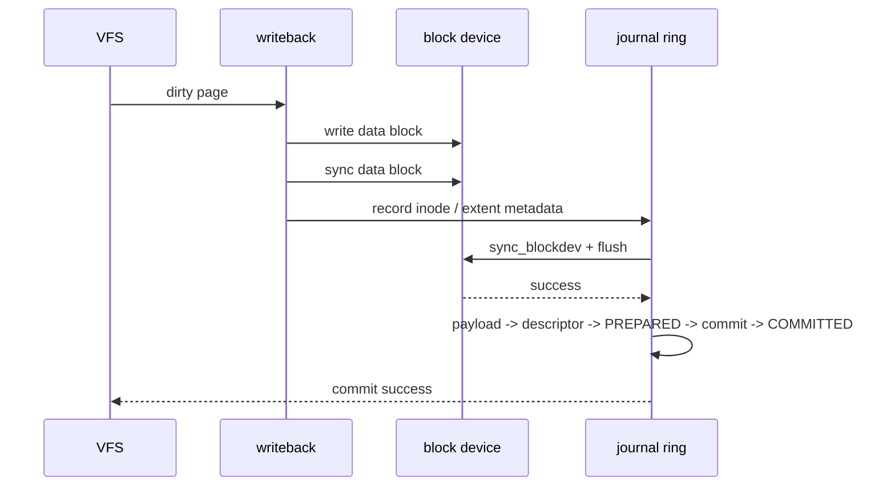

# CRYEXTS v12.3 变更说明

## 目标

v12.3 收口当前 `data=ordered` 的持久化边界：普通文件页在 writeback 中先写入数据块；随后 journal 提交前，统一等待块设备已有写入完成并发出 cache flush。只有该 barrier 成功，descriptor、payload 和 commit record 才允许继续写入。



## 实现

- 在 `cryexts_journal_commit()` 的统一入口加入 `cryexts_journal_ordered_barrier()`；v1、v2、v3 journal 共用此边界。
- barrier 先执行 `sync_blockdev()`，再调用 `blkdev_issue_flush()`；任一步失败即中止当前事务并把原始错误返回调用方。
- 不在文件系统层做盲目重试。瞬态重试属于底层块设备/驱动职责；上层收到错误后通过 page writeback 的 redirty、mapping error 和 `fsync()` 错误完成可见传播。

## 语义边界

当前实现是 transaction 级 flush barrier，不是每次写入的 FUA：

```text
已写 data block
    -> transaction-wide flush
    -> journal commit marker durable
```

这满足当前镜像和 loop 设备的 ordered 验证路径。未来如果需要降低 flush 延迟或面向具备写缓存的真实 NVMe/SATA 设备，可在 BIO 写入路径增加 `REQ_FUA`，但不能在未建立 BIO 生命周期管理前直接替换当前 barrier。

## 验证

执行：

```bash
cd ~/cryexts
./scripts/smoke_v12_3_ordered_durability.sh
```

脚本验证 buffered write + 两次 `fsync()`、目录 metadata 更新、卸载重挂载后数据一致，以及 journal ring 已回收为 `IDLE` 且 `head == tail`。
