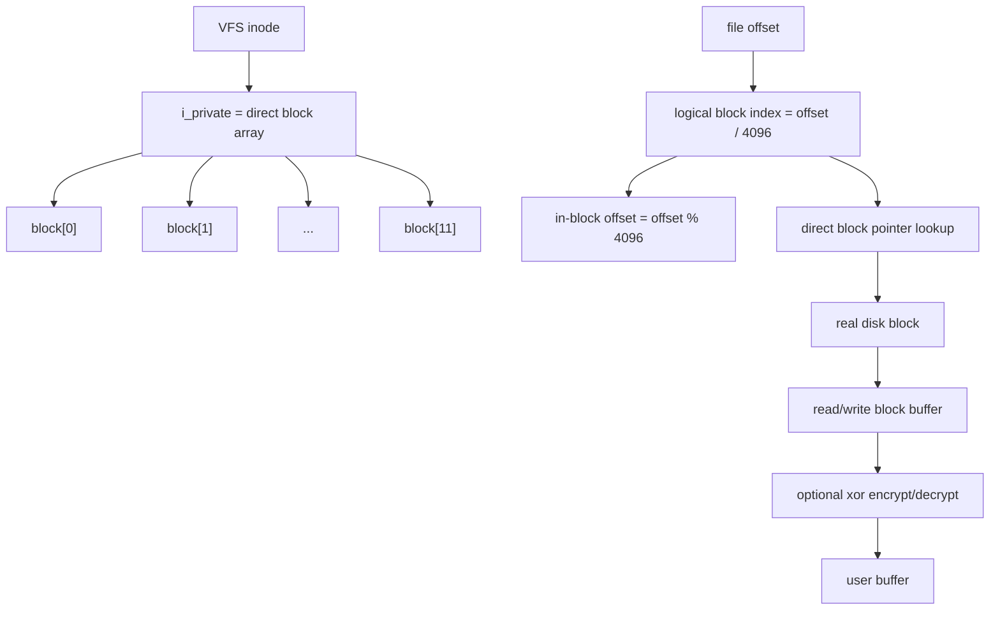

# CRYEXTS V2.2 Direct Blocks 设计说明

## 1. 这次改了什么

V2.2 的目标是把普通文件从“只能使用 1 个 data block”的雏形，升级成“可以使用多个 direct blocks”的版本。

这次修改后的能力边界：

- 目录仍然保持单 block。
- 普通文件支持 `12` 个 direct blocks。
- 最大普通文件大小变为 `12 * 4096 = 49152 bytes`。
- 读、写、覆盖、追加、truncate 都按 direct block 工作。
- 加密路径继续有效，并且支持多 block 普通文件。

也就是说，V2.1 的普通文件模型是：

```text
inode -> block[0]
```

V2.2 的普通文件模型变成：

```text
inode -> block[0..11]
```

## 2. 当前架构图



## 3. 原理

### 3.1 inode 里的 block 数组

`cryexts_inode` 结构里本来就有：

```c
__le64 block[CRYEXTS_DIRECT_BLOCKS];
```

所以 V2.2 没有修改磁盘格式，而是把“只使用 `block[0]`”改成“真正使用整个 `block[]` 数组”。

普通文件的逻辑块映射关系是：

```text
logical block 0 -> inode.block[0]
logical block 1 -> inode.block[1]
...
logical block 11 -> inode.block[11]
```

如果某个 `inode.block[i] == 0`，表示这个逻辑块当前还没有分配真实磁盘块。

### 3.2 为什么 `inode->i_private` 要改成数组

之前的代码把 `inode->i_private` 当成一个整数 block 号来用，所以最多只能指向一个 data block。

V2.2 改成：

```text
inode->i_private -> kmalloc 出来的 u64[12]
```

这样内核内存中的 VFS inode 和磁盘 inode 就能保持一致：

- 磁盘 inode 保存 `block[0..11]`
- 内存 inode 也保存 `block[0..11]`

这样 `read_iter`、`write_iter`、`truncate`、`unlink` 都可以统一按数组处理。

### 3.3 读路径

读文件时，不再假设整个文件都在一个 block 中，而是按偏移拆分：

```text
file offset
  -> logical block index = offset / 4096
  -> in-block offset = offset % 4096
  -> 找到 inode.block[index]
  -> 读取该真实 block
  -> 把对应范围拷贝给用户
```

如果该 logical block 还没分配真实 block，则读零值。

这等价于一个最小版本的 sparse 行为，但当前我们主要还是通过顺序写入创建这些 block。

### 3.4 写路径

写文件时同样按偏移拆成多段：

```text
用户写入 buffer
  -> 计算 logical block index
  -> 如果 inode.block[index] 为空，则分配新 block
  -> 读旧 block 或创建全零 block buffer
  -> 修改本次写入范围
  -> 写回真实 block
```

如果一次写跨越多个 block，就循环处理多个 direct blocks。

### 3.5 truncate 路径

V2.2 的 `truncate` 核心规则：

- `truncate` 到更小：
  - 释放超出新文件大小范围之外的 direct blocks
  - 如果最后保留的 block 只保留前半段，则把后半段清零
- `truncate` 到 `0`：
  - 释放全部 direct blocks
- `truncate` 到更大：
  - 只更新 size，未分配的逻辑块读出来是 0

这样做的好处是实现简单，而且和后续 `indirect block` 阶段不冲突。

## 4. 这次顺手修正的点

除了 direct block 主逻辑，这次还顺手补了几个关键点：

- `cryextsck` 同步支持多 direct block 普通文件校验。
- `sb->s_maxbytes` 从单 block 上限提升到 `12 * block_size`。
- inode 回收时释放 `i_private` 对应的 direct block 数组，避免内核内存泄漏。
- `unlink/rmdir` 的 block 释放逻辑从“释放一个 block”改成“释放所有 direct blocks”。

## 5. 和 V2.1 的差异

V2.1：

- 普通文件只能占用一个 data block。
- `inode->i_private` 本质上是一个 block number。
- `read/write/truncate` 都建立在单 block 假设上。

V2.2：

- 普通文件最多可使用 12 个 direct blocks。
- `inode->i_private` 是 direct block 数组。
- 读写逻辑正式变成：

```text
offset -> logical block -> real block -> data
```

## 6. 本阶段仍然没做的内容

这次仍然刻意没有做下面这些内容：

- 多 block 目录
- indirect blocks
- extent
- journaling
- 崩溃恢复
- 生产级加密算法

所以 V2.2 的定位仍然是：

```text
ext2-like skeleton + bitmap allocator + multi-direct-block regular file MVP
```

## 7. 建议你怎么理解这一版

如果从学习路径看，V2.2 已经是一个很关键的分水岭：

1. V2.0 解决“磁盘布局有元数据边界”。
2. V2.1 解决“资源分配不再只会单向递增”。
3. V2.2 解决“普通文件终于像真正文件系统一样，可以跨多个 block 存储”。

所以这一步之后，`cryexts` 才真正从“教学雏形”迈向“最小可扩展文件系统原型”。
