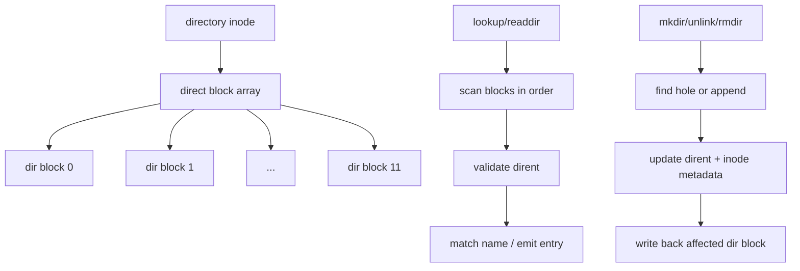

# CRYEXTS V2.3 Large Directory 设计说明

## 1. 这次的目标

V2.3 的目标是把目录从“只能放进一个 4KB block”升级成“可以跨多个 direct blocks 扩展”。

也就是说，V2.2 解决的是：

- 普通文件能不能跨多个 block 存。

V2.3 要解决的是：

- 一个目录能不能容纳很多文件。
- `lookup` / `readdir` 能不能跨 block。
- `mkdir` / `unlink` / `rmdir` 能不能正确复用目录空间。

## 2. 当前能力边界

V2.3 计划保留这些前提：

- 普通文件继续沿用 V2.2 的 12 个 direct blocks。
- 目录仍然不使用 indirect block。
- 目录块内仍然使用 ext2-like dirent 结构。
- 透明加密仍然只作用于普通文件 data blocks。
- 当前默认镜像布局已把 inode table 扩到 `16` 个 block，避免大目录测试先被 inode 数量耗尽。

## 3. 目录模型

V2.2 的目录模型是：

```text
dir inode -> block[0]
```

V2.3 的目录模型变成：

```text
dir inode -> block[0..11]
```

目录项可以分布在多个目录块里：

```text
dir block 0 -> entry A, entry B
dir block 1 -> entry C, entry D
dir block 2 -> entry E ...
```

## 4. 架构图



## 5. 原理

### 5.1 目录为什么要多 block

单 block 目录很快就会满。

比如一个目录里有很多小文件时，目录项本身就会把 4KB 填满，导致：

- 新文件无法创建。
- `lookup` 仍然能工作，但 `mkdir/touch` 会失败。
- 删除目录项后如果空洞复用不好，也会提前耗尽空间。

所以 V2.3 要让目录像普通文件一样，能够继续申请新的 data block。

### 5.2 目录项布局不变

目录块内部仍然沿用：

```c
inode | rec_len | name_len | file_type | name...
```

也就是说，V2.3 不改 dirent 格式，只改“一个目录能有几个目录块”。

### 5.3 查找目录项

`lookup` / `readdir` 的扫描逻辑变成：

```text
for each dir block in inode.block[]
    scan dirent in this block
    if match name -> return inode
```

也就是说，目录项搜索从“只看一个 block”变成“顺序扫描多个 block”。

### 5.4 插入目录项

`mkdir` / `touch` / `create` 插入新目录项时：

1. 先扫描所有已分配目录块。
2. 找到足够大的空洞就直接复用。
3. 如果所有块都放不下，再申请一个新的目录块。
4. 把新目录项写进这个块。

这样能避免目录空间不断碎片化后直接失败。

### 5.5 删除目录项

`unlink` / `rmdir` 删除目录项时：

- 先把对应 entry 标记为空。
- 尝试和前后空洞合并。
- 如果某个目录块已经完全空闲，后续可以考虑释放该块。

V2.3 第一版可以先不做“自动回收空目录块”，但至少要保证：

- 删除不会破坏目录结构。
- 新 entry 能复用空洞。

## 6. 需要改的核心函数

V2.3 需要重点升级这些路径：

- `cryexts_find_entry`
- `cryexts_add_entry`
- `cryexts_delete_entry`
- `cryexts_dir_empty`
- `cryexts_validate_dir_block`
- `cryexts_iterate`
- `cryexts_mkdir`
- `cryexts_unlink`
- `cryexts_rmdir`

## 7. 规则建议

### 7.1 目录大小

建议目录 size 表示“已分配目录内容的总字节数”，并保持 block 对齐。

### 7.2 目录块分配

目录块分配建议继续复用 bitmap allocator。

### 7.3 目录块释放

建议先做保守策略：

- 删除 entry 时不立刻释放块。
- 只有在整块都空且确认安全时，才考虑释放。

这样更容易保证正确性。

## 8. 验收目标

V2.3 的验收建议如下：

```bash
sudo mkdir /mnt/cryexts/bigdir
for i in $(seq 1 200); do sudo touch /mnt/cryexts/bigdir/file_$i; done
ls /mnt/cryexts/bigdir | wc -l
for i in $(seq 1 200); do sudo rm /mnt/cryexts/bigdir/file_$i; done
sudo rmdir /mnt/cryexts/bigdir
```

预期结果：

- 大目录能创建成功。
- `ls` 能跨多个目录块输出。
- 删除后目录可以正常清空并 `rmdir`。
- `cryextsck` 对 clean image 仍然通过。

## 9. 和 V2.2 的关系

V2.2 解决的是“文件能跨多个 block”。

V2.3 解决的是“目录也能跨多个 block”。

所以这一步的本质是把 `direct block` 机制从普通文件推广到目录。

## 10. 仍然不做的内容

V2.3 仍然不做：

- indirect blocks
- extents
- journal
- rename 优化
- hard link
- xattr
- 目录索引树

## 11. 下一步建议

V2.3 做完后，文件系统会进入一个更像真实系统的阶段：

- 普通文件能长大。
- 目录能长大。
- bitmap 分配器继续复用。
- `cryextsck` 可以继续增强成更严格的结构检查工具。

这也会为后面的 `rename`、`indirect block` 和更完整的加密层打基础。
