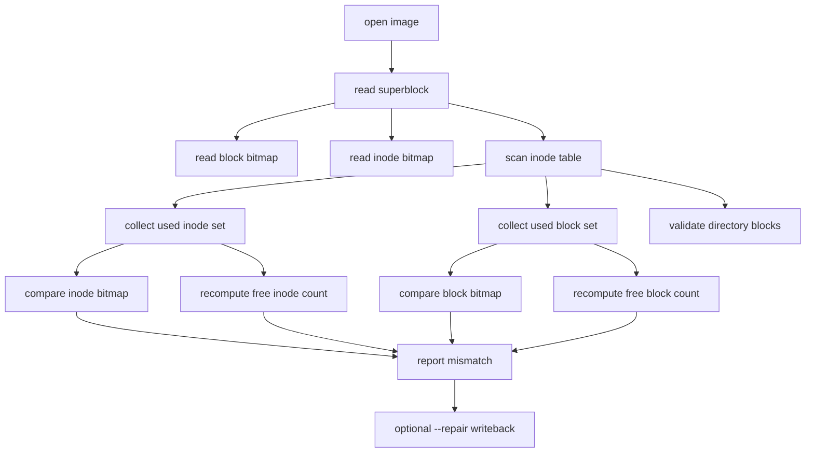

# CRYEXTS V2.4 cryextsck 增强设计说明

## 1. 目标

V2.4 的目标是把 `cryextsck` 从“只能做基础 clean check”的工具，升级成“能发现 bitmap 与真实引用不一致，并支持低风险修复”的版本。

这一阶段不碰内核主数据路径，重点放在离线检查工具。

## 2. 本阶段要解决的问题

当前 `cryextsck` 已经能检查：

- superblock 基本字段
- inode 基本布局
- directory entry 基本格式
- `.` / `..`

但还不够检查下面这些关键一致性问题：

- inode bitmap 标记为 free，但 inode table 里其实有有效 inode
- block bitmap 标记为 free，但 inode 正在引用对应 data block
- superblock 的 `free_blocks_count` / `free_inodes_count` 和真实值不一致
- 同一个 data block 被多个 inode 重复引用

## 3. V2.4 的能力边界

V2.4 计划新增：

- 扫描所有 inode，重建“实际正在使用的 inode/block 集合”
- 对比 inode bitmap / block bitmap 是否一致
- 对比 superblock free count 是否一致
- 报告更具体的位置
- 支持 `--repair`

V2.4 暂时不修：

- 目录树断链
- 多 inode 共享同一 block 的冲突数据
- 文件内容损坏
- 加密密钥错误

## 4. 架构图



## 5. 核心原理

### 5.1 真实状态和磁盘声明状态分开

磁盘上有两类“真相”：

1. inode / directory / block pointer 形成的真实引用关系
2. superblock free count 和 bitmap 的声明状态

V2.4 的思路是：

- 先从 inode 表和目录块里收集“真实使用情况”
- 再和 bitmap / free count 做对比

### 5.2 repair 只修低风险项

`--repair` 第一版只修下面几类低风险问题：

- free count 重算
- 已被 inode 引用但 bitmap 未标记的 inode/block

原因是这几类问题本质上是“元数据统计不一致”，修复不会直接改文件内容。

## 6. 新命令接口

```bash
./cryextsck cryexts.img
./cryextsck --repair cryexts.img
```

建议行为：

- 默认模式只检查，不写盘
- `--repair` 才允许写回 superblock / bitmap

## 7. 验收建议

```bash
./cryextsck cryexts.img
./cryextsck --repair broken.img
./cryextsck broken.img
```

预期：

- clean image 返回 success
- 损坏 bitmap 的 image 能被发现
- `--repair` 后再次检查 clean

## 8. 阶段定位

V2.4 的本质不是“让文件系统更大”，而是“让我们更知道它什么时候坏了、坏在哪里、哪些能安全修”。
