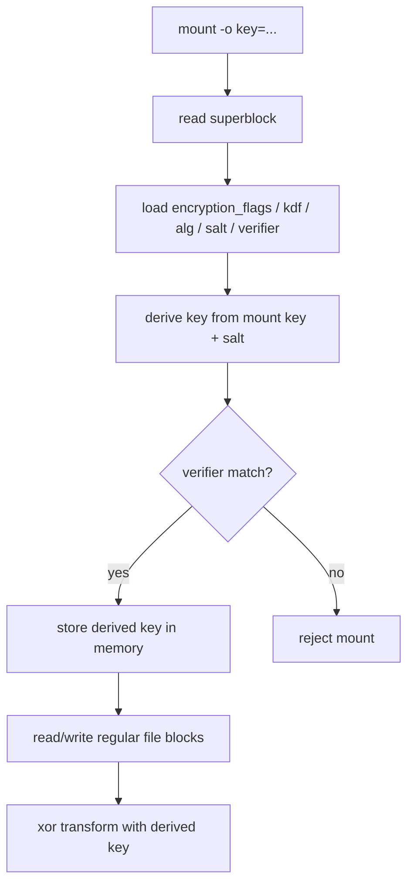

# CRYEXTS V2.5 加密层整理说明

## 1. 目标

V2.5 不追求一步切到真正的 Linux Crypto API，而是先把现有加密 MVP 从“能跑”整理成“结构清楚、便于后续替换”的版本。

这一版保持两件事同时成立：

- 数据面继续沿用当前可工作的 XOR 数据块加密路径。
- 控制面升级为 `mount key -> salt/kdf -> derived key -> verifier -> data path`。

也就是说，V2.5 的重点不是把算法变强，而是把接口、元数据和校验链路变规范。

## 2. 这一版解决了什么问题

V2.4 之前，加密链路大致是：

```text
mkfs -E key
  -> superblock.flags = encrypted
  -> superblock.key_hash = hash(raw key)

mount -o key=...
  -> hash(raw key) == key_hash ?
  -> yes: 直接拿 raw key 做 XOR
```

这个版本虽然能工作，但有几个明显问题：

- superblock 里虽然已经预留了 `salt / encryption_kdf / encryption_alg`，实际上并没有真正使用。
- 挂载校验直接依赖原始口令 hash，不利于后续替换成更规范的密钥派生流程。
- 内核数据路径直接依赖原始 mount key，抽象层次不够清楚。

V2.5 改成：

```text
mkfs -E key
  -> 生成 salt
  -> 根据 salt + key 派生 derived key
  -> superblock 保存:
     - encrypted flag
     - encryption_flags
     - encryption_kdf
     - encryption_alg
     - salt
     - verifier(derived key)

mount -o key=...
  -> 读取 superblock encryption metadata
  -> 用同样规则派生 derived key
  -> 比较 verifier
  -> 成功后只把 derived key 留在内存里做数据块 XOR
```

## 3. 当前 superblock 中加密字段的含义

V2.5 实际启用了这些字段：

- `flags`
  - 是否为加密卷。
- `key_hash`
  - 兼容保留原字段名，但语义已经变成“派生后密钥的校验值 verifier”。
- `encryption_flags`
  - 当前使用 `CRYEXTS_ENC_FLAG_DATA`，表示只加密 regular file data blocks。
- `encryption_kdf`
  - 当前使用 `CRYEXTS_KDF_SALTED_FNV1A`。
- `encryption_alg`
  - 当前使用 `CRYEXTS_ALG_XOR`。
- `salt`
  - `mkfs` 生成的非零 salt。

当前仍然不加密：

- superblock
- inode table
- directory entry
- 文件名

所以 `cryextsck` 仍然可以直接检查元数据结构。

## 4. 挂载时的工作流



## 5. 派生规则

当前派生规则是一个教学版的 salted FNV1a 方案：

```text
derived_key[32 bytes]
  = multiple rounds of FNV1a(key, salt, round)
```

注意这里的定位：

- 它比“直接 hash 原始 key”更像一个真正的 KDF 流程。
- 但它仍然不是生产级密码学 KDF。
- 它的价值是把接口整理正确，而不是提供强安全性。

当前 verifier 规则为：

```text
verifier = FNV1a(derived_key)
```

所以 `key_hash` 字段现在本质上存的是：

```text
verifier(derived_key)
```

不是：

```text
hash(raw mount key)
```

## 6. 内核侧结构变化

V2.5 的 `struct cryexts_sb_info` 不再长期保存原始口令字符串用于数据面，而是保存：

- `encrypted`
- `key_verifier`
- `encryption_flags`
- `encryption_kdf`
- `encryption_alg`
- `salt`
- `derived_key[32]`

这样做的意义是：

- mount-time key parsing 和 data-path encryption 分层了。
- 后续把 XOR 替换成 Crypto API 时，只需要改“derived key 如何驱动 block cipher”，不需要再重做 superblock 元数据流程。
- 卸载时可以清空内存中的 `derived_key`。

## 7. cryextsck 在 V2.5 多做了什么

`cryextsck` 现在除了原来的 superblock/inode/bitmap 检查，还会额外检查：

- 加密卷必须带有非零 verifier。
- 加密卷必须带有 `CRYEXTS_ENC_FLAG_DATA`。
- 加密卷必须带有受支持的 `encryption_kdf`。
- 加密卷必须带有受支持的 `encryption_alg`。
- 加密卷的 `salt` 不能全零。
- 非加密卷不应该残留这些加密元数据。

所以 V2.5 的 clean 不仅表示“结构没坏”，也表示“加密元数据自洽”。

## 8. 为什么这一步很重要

这一步最大的价值是给后续版本留接口：

### 8.1 对 V2.6 / V3 的帮助

如果后面要替换成 Linux Crypto API，大致只需要把：

```text
derived key -> XOR transform
```

替换成：

```text
derived key -> AES-CTR / AES-XTS / other crypto backend
```

而这些部分不需要重做：

- mkfs 写加密元数据
- mount 时读取和校验元数据
- wrong key 拒绝挂载
- cryextsck 校验 metadata consistency

### 8.2 对调试的帮助

现在你分析问题时，可以明确分成三层：

1. 镜像是否是加密卷
2. mount key 是否能正确派生出 verifier
3. data block 加解密算法是否正确

这比之前把所有事情都塞进“raw key XOR”更容易定位问题。

## 9. 当前边界

V2.5 依然明确不是生产级安全方案：

- KDF 不是 PBKDF2 / scrypt / Argon2
- 数据算法不是 AES / XTS
- 没有 per-file key
- 没有 IV/nonce 设计
- 没有 metadata encryption
- 没有 anti-tamper / integrity MAC

所以 V2.5 的正确定位是：

```text
可演进的透明加密层骨架
```

不是：

```text
安全可上线的加密文件系统
```

## 10. 你可以怎么理解这一版

如果 V2.4 的重点是“fsck 把元数据关系看清楚”，那么 V2.5 的重点就是“把加密层的控制链路理顺”。

从工程角度看，V2.5 做的是：

- 保住现有可运行能力
- 减少后续推翻重做
- 给真正的密码学替换留出稳定接口

这正适合我们现在这个教学型、自研型文件系统原型的推进节奏。
