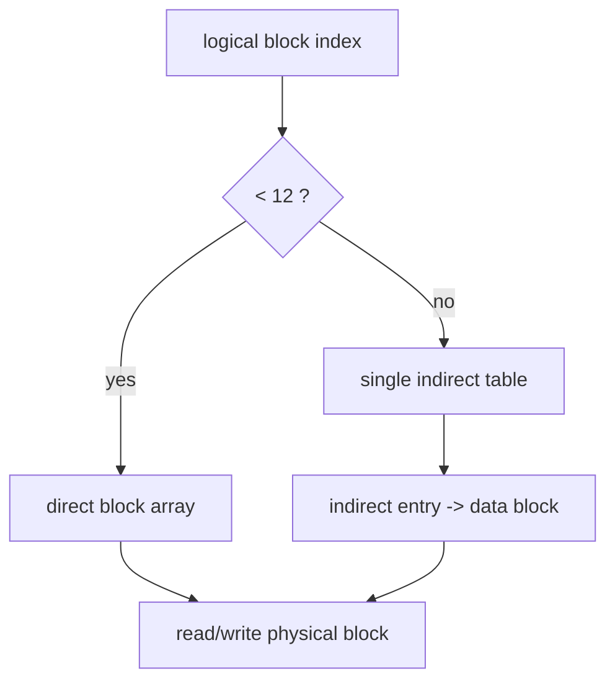

# CRYEXTS V3.0 single indirect block

## 1. 这一阶段做了什么

V3.0 的目标是把普通文件从：

```text
最多 12 个 direct block
```

升级到：

```text
12 个 direct block + 1 个 single indirect block
```

也就是：

```text
logical block 0..11     -> inode.block[0..11]
logical block 12..N     -> inode.indirect_block 指向的一张 block 表
```

这样普通文件就不再被 48KB 上限卡死，可以开始支持明显更大的文件。

## 2. 当前设计

### 2.1 inode 结构

V3.0 在 inode 里新增：

- `indirect_block`
- `inode_flags` 预留字段

目录仍然只允许使用 direct block。

普通文件才允许走 indirect 路径。

### 2.2 block 计数语义

`i_blocks` / 磁盘 inode 的 `blocks` 现在统计的是：

- direct data block
- indirect table block
- indirect table 里引用的数据块

所以如果一个文件使用了：

- 12 个 direct block
- 1 个 indirect table block
- 4 个 indirect data block

那么总 block 数就是：

```text
12 + 1 + 4 = 17 blocks
```

换算到 512-byte sector 后写入 `inode->i_blocks`。

## 3. 读写路径

V3.0 把普通文件数据块访问统一收敛成一条逻辑：



现在 `file.c` 不再自己硬编码 direct block 数组，而是通过统一的 block resolve 接口处理：

- 查询已有 block
- 按需分配新 block
- indirect table 不存在时自动创建

## 4. truncate 路径

`truncate` 现在会：

- 释放超出新文件大小的 direct block
- 释放 indirect table 中超出的 data block
- 如果 indirect table 已空，再释放 indirect table 自身
- 对保留的尾块做尾部清零

所以这个阶段的关键不是只“能写大文件”，而是：

```text
大文件写入后还能正确缩回去
```

## 5. 稀疏块语义

当前实现允许 regular file 存在 hole。

也就是说：

- 某个逻辑块没有实际 data block
- 读取时返回 0

这让 direct/indirect 路径的未来扩展更自然，也更接近真实文件系统的行为。

## 6. fsck 新增检查点

`cryextsck` 在 V3.0 需要认识：

- inode 是否使用了 indirect block
- indirect table block 本身是否合法
- indirect entry 是否越界
- indirect entry 是否与别的 inode 重复引用同一 data block
- regular file 的 block count 是否包含 indirect table

目录 inode 仍然要求：

- 不能使用 indirect block
- size 必须按块对齐
- block 数不能超过 direct 上限

## 7. 验收重点

这一阶段重点不只是“能写 1MB 文件”，还要看：

- direct / indirect 边界是否正确
- 重挂载后数据是否正确
- truncate 后空间是否释放
- `cryextsck` 是否 clean

## 8. 典型边界例子

### 8.1 direct 边界

12 个 direct block 刚好是：

```text
12 * 4096 = 49152 bytes = 48KB
```

所以：

- `0..49151` 字节都还在 direct 区
- `49152` 字节开始就进入 indirect 区

### 8.2 为什么要单独分配 indirect table block

因为 indirect table 本质上也是一个磁盘块，只是它里面存的不是文件内容，而是一组 block 号。

所以当文件第一次越过 12 个 direct block 时，实际上会发生两次新的磁盘分配：

1. 分配 indirect table block
2. 分配真正的数据块

## 9. 当前边界

V3.0 仍然还没有：

- double indirect block
- extent
- fsync 最小持久化语义
- Linux Crypto API 替换

所以这一版的定位是：

```text
大文件映射能力打通
```

而不是：

```text
完整的现代文件系统 block mapping
```
