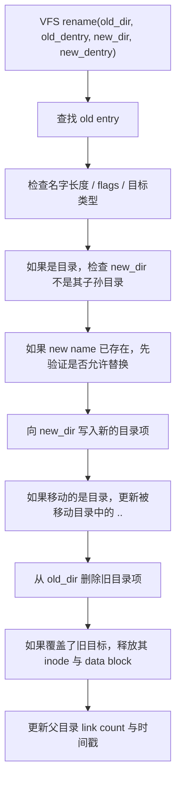

# CRYEXTS V3.1 rename 与目录一致性

## 1. 这一阶段解决什么问题

V2.5 之前，CRYEXTS 已经能完成：

```text
mkfs -> mount -> mkdir -> touch -> write/read -> 大目录 -> cryextsck -> 加密卷
```

但目录层还缺一个很关键的真实文件系统能力：

- 文件改名
- 跨目录移动
- 目标已存在时的替换
- 目录移动后 `..` 的父目录修正

所以 V3.1 的目标不是增加新的磁盘格式，而是把目录命名空间操作补到更接近 ext2 风格。

## 2. 当前实现的 rename 语义

当前版本已经支持：

- 同目录 rename
- 跨目录 rename
- 用一个文件覆盖已有文件
- 用一个空目录覆盖已有空目录
- 目录跨父目录移动时更新 `..`

当前版本明确不支持：

- `RENAME_EXCHANGE`
- `RENAME_NOREPLACE`
- hard link 场景下的复杂 rename 语义
- symlink 相关 rename 语义

也就是说，这一版的定位是：

```text
支持 mv 的主路径
```

而不是：

```text
完整覆盖 Linux 全部 rename flag 语义
```

## 3. VFS 到 CRYEXTS 的处理路径



## 4. 这次修复了哪几个关键逻辑点

### 4.1 目录不能被移动到自己的子树下面

这是 `rename` 里一个很重要的保护。

例如：

```bash
mkdir -p /mnt/a/sub
mv /mnt/a /mnt/a/sub/a
```

如果这种操作被允许，会形成目录环：

```text
a
└── sub
    └── a   <- 又指回自己
```

一旦出现这种结构，后续 `lookup`、`ls`、`fsck`、递归遍历都会变得不可靠。

所以当前实现里，目录移动前会从 `new_dir` 一直沿着 `..` 往上找，只要发现祖先链里出现了被移动目录本身，就直接拒绝本次 rename。

### 4.2 跨目录移动目录时，必须更新 `..`

比如：

```bash
mkdir /mnt/d1
mkdir /mnt/d2
mkdir /mnt/d1/sub
mv /mnt/d1/sub /mnt/d2/sub
```

移动前：

```text
sub/.. -> d1
```

移动后如果不修正：

```text
sub/.. -> 仍然指向 d1
```

这样目录树就逻辑错乱了。

所以当前实现会在目录跨父目录移动时，把被移动目录里 `..` 对应的 inode 号改成新父目录 inode。

### 4.3 覆盖已有普通文件时，必须释放它的数据块

例如：

```bash
echo old > /mnt/b.txt
echo new > /mnt/a.txt
mv /mnt/a.txt /mnt/b.txt
```

如果只删除 `b.txt` 的目录项和 inode，但不释放它占用的 data block，就会产生 block 泄漏：

- 文件系统里已经没有任何名字指向旧 `b.txt`
- 但 bitmap 里这些 block 还是占用状态
- `free_blocks_count` 也不会回升

这样时间久了，会出现“空间越来越少，但找不到是谁占了”的问题。

这次修正后，不管被覆盖目标是普通文件还是空目录，都会走统一的 block 释放路径。

### 4.4 覆盖已有空目录时，父目录 link count 要正确变化

目录的 link count 和普通文件不一样。

父目录里每多一个子目录，父目录的链接数就会多一份来自子目录中的 `..`。

所以当我们做：

```bash
mv /mnt/d1/srcdir /mnt/d2/dstdir
```

并且 `dstdir` 本来就是一个空目录时，语义上发生了两件事：

- `d2` 失去旧的 `dstdir`
- `d2` 得到新的 `srcdir`

这两步在 link count 上应该一减一加，最终总体不变。

如果只做其中一步，`new_dir->i_nlink` 就会不准确，后续 `fsck` 也更难扩展。

这次实现里已经把这个计数关系补齐。

## 5. 当前 rename 的大致伪代码

```text
1. 校验 flags
2. 找到 old entry
3. 如果 old inode 是目录：
   - 禁止移动到自身子树下
4. 如果 new name 已存在：
   - 检查文件/目录类型是否兼容
   - 如果目标是目录，必须为空目录
5. 先删 new name（如果存在）
6. 把 old inode 以 new name 加入 new_dir
7. 如果移动的是目录且跨父目录：
   - 更新该目录里的 ".."
8. 从 old_dir 删除 old name
9. 释放被覆盖目标的资源
10. 更新 link count / ctime / mtime
```

## 6. 这一版和 ext2-like 设计的关系

这一步本质上是在补“命名空间元数据操作”。

前面的阶段更偏向：

- 数据块分配
- inode 生命周期
- 文件读写
- 目录项扫描

而 V3.1 开始更像真实文件系统会面对的问题：

- 一个 inode 可以换名字
- 一个目录项可以从一个父目录搬到另一个父目录
- 目录树结构必须始终自洽

所以这一步虽然没有改 superblock 格式，但它是从“能存文件”走向“更像真实文件系统”的关键台阶。

## 7. 建议测试点

这一阶段建议至少验证下面几类场景：

- 同目录改名
- 跨目录移动普通文件
- 普通文件覆盖已有普通文件
- 空目录跨目录移动
- 空目录覆盖已有空目录
- 禁止把目录移动到自己的子树下面
- 卸载重挂后名称与内容仍然正确
- `cryextsck` 对 clean image 返回 clean

## 8. 目前仍然保留的边界

当前版本仍有这些限制：

- 目录项还是线性扫描，不是 hash/index
- 没有 hard link，因此不需要处理多名字同 inode 的 rename 复杂语义
- 没有 symlink
- 还没有增强版目录 link-count 检查型 `cryextsck`
- 失败回滚仍属于“尽量恢复”的工程风格，不是 journal 级别保证

## 9. 结论

V3.1 的核心价值是把目录命名空间操作真正打通：

```text
create/unlink/rmdir
    ->
rename + cross-directory move + replacement
```

这会直接为后面的两条线打基础：

- V3.2 的 `fsync` 与更稳的元数据落盘
- V3.3 的更真实加密数据路径
