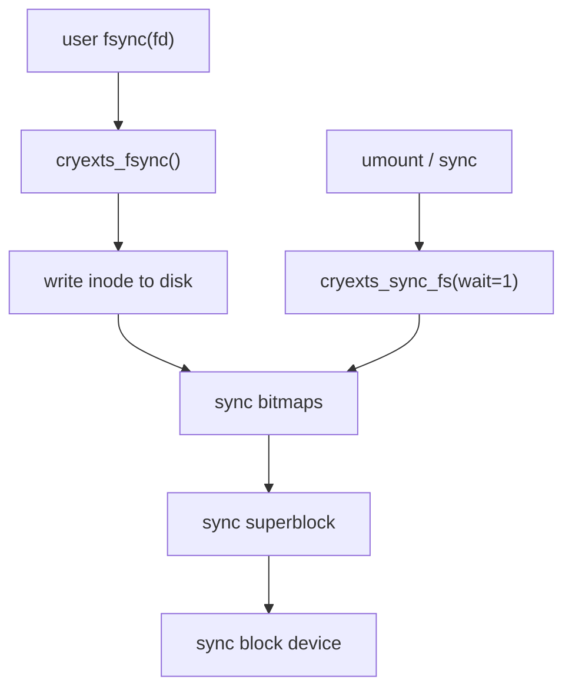

# CRYEXTS V3.2 最小 fsync / sync_fs

## 1. 这一阶段的目标

V3.2 不做 journal，也不追求 ext4 那种完整持久化语义。

这一阶段只做一件务实的事：

```text
给 CRYEXTS 补上一条最小可工作的“主动刷盘”路径
```

也就是：

- 用户态 `fsync(file)` 可以真正进入文件系统
- 文件 inode 能被显式写回
- superblock / bitmaps 也能跟着落盘
- 卸载前的 `sync_fs` 有最小实现

## 2. 当前语义边界

这一版的定位是：

```text
minimum durable write path
```

不是：

```text
power-loss safe journaled filesystem
```

所以它能改善的是：

- 正常工作流里主动调用 `fsync()` 后，数据和关键 metadata 更大概率真正落盘
- `umount` / `sync_fs` 时，superblock 和 bitmap 不再只依赖脏页回写时机

但它不能保证：

- 掉电中途的复杂原子性
- rename / truncate / 分配路径的事务一致性
- journal 回放

## 3. 当前实现结构



## 4. 这次新增了什么

### 4.1 file_operations.fsync

给 regular file 增加了 `.fsync`。

当前做法是：

1. 先把当前 inode 写回磁盘 inode table
2. 再刷：
   - block bitmap
   - inode bitmap
   - superblock
3. 最后 `sync_blockdev`

这意味着当前 `fsync(file)` 不只是把数据块刷下去，还会顺手把最关键的 filesystem metadata 一起推到底层块设备。

### 4.2 super_operations.sync_fs

给 superblock 增加了 `.sync_fs`。

当前仅在 `wait=1` 的情况下做真实刷盘，这样更符合“同步语义”而不是每次 hint 都强制刷。

### 4.3 统一 metadata flush helper

为了避免以后刷盘逻辑到处散落，当前把：

- `block_bitmap_bh`
- `inode_bitmap_bh`
- `s_sbh`
- `sync_blockdev`

收敛到一条统一 helper 里。

这样后面如果要继续增强：

- mount count
- filesystem state
- last_check

也更容易集中演进。

## 5. 为什么现在先做这个最小版本

因为 V3 前面几步已经把：

- block allocation
- inode update
- rename
- truncate

这些元数据操作都慢慢补起来了。

如果没有一个明确的主动刷盘入口，测试和调试时会很难区分：

- 是逻辑没写对
- 还是只是还没被刷下去

所以 V3.2 的价值，更多是工程上的：

```text
让文件系统开始拥有“我现在就要把关键状态落盘”的能力
```

## 6. 当前测试重点

这一阶段建议重点验证：

- `fsync()` 路径可以被调用
- 正常写入后 remount 结果一致
- `cryextsck` 仍然 clean
- `dmesg` 无 oops / BUG / warning flood

## 7. 当前限制

这一版仍然没有：

- 事务
- ordered write barrier 设计
- rename 原子持久化保证
- 崩溃恢复
- orphan inode 处理

所以正确理解是：

```text
V3.2 让 CRYEXTS 从“依赖脏页何时回写”
升级到
“至少有显式的最小同步路径”
```

这一步非常适合放在 V3.3 的真实加密数据路径之前，因为后续一旦加密层更复杂，主动刷盘调试价值会更大。
