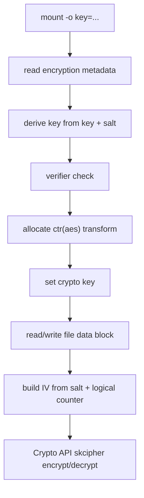

# CRYEXTS V3.3 Crypto API 数据路径替换

## 1. 这一阶段的目标

V3.3 的核心不是重做加密元数据格式，而是：

```text
保留现有 mount key -> KDF -> derived key -> verifier 控制链
把数据面的 XOR 替换成 Linux Crypto API
```

所以这一步的本质是：

- 元数据流程尽量不动
- data block 加解密后端升级

## 2. 当前实现选择

这一版采用：

```text
AES-CTR
```

原因很直接：

- 是块数据流式加解密的自然选择
- 加密和解密路径对称
- 适合 regular file data block 这种“按块处理”的场景

## 3. 当前结构



## 4. 和 V2.5 / V3.2 的关系

V2.5 / V3.2 时代的数据面是：

```text
derived key -> custom XOR transform
```

V3.3 改成：

```text
derived key -> ctr(aes) skcipher
```

但下面这些不变：

- `salt`
- `encryption_kdf`
- `key verifier`
- `wrong key` 拒绝挂载
- 只加密 regular file data block

## 5. 当前 IV / counter 思路

当前版本用：

- `salt` 的一部分作为 IV 前缀
- `block` 与 `pos` 推导 counter

也就是说每个数据块不是直接复用同一个 keystream，而是按块位置变化。

这比 V2.5 的 XOR 路径已经更接近真实的块加密实现。

## 6. 为什么这一步重要

这一步的价值不只是“更安全一点”，更重要的是工程方向变了：

```text
从教学型自定义异或
升级到
真正依赖 Linux 内核密码学框架
```

这样后面如果你继续往前走：

- 更正式的 IV/tweak 规则
- XTS
- 不同数据单元的独立策略

都更自然。

## 7. 当前边界

这一版仍然没有：

- filename encryption
- metadata encryption
- authentication tag / MAC
- anti-tamper
- per-file key

所以它仍然不是生产级加密文件系统，只是：

```text
真实 Crypto API 版本的透明加密原型
```
