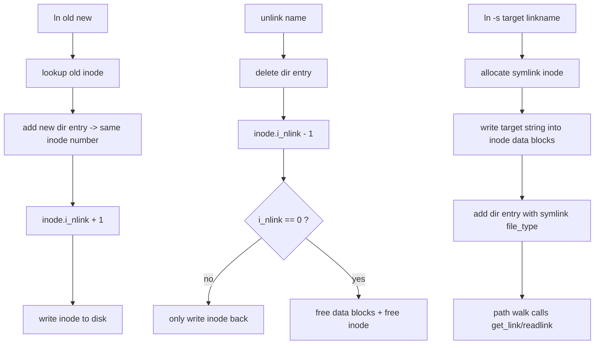

# CRYEXTS V3.4 hard link / symlink

## 1. 这一阶段做了什么

V3.4 把 CRYEXTS 的命名空间能力继续补齐到一个更像传统 Unix 文件系统的形态：

```text
普通文件不再只能有一个名字
+ 同时支持符号链接作为路径跳转对象
```

这次新增两条能力：

- `hard link`
- `symlink`

同时把 `links_count` 的维护从“只有 0 或 1 的教学型处理”升级成更真实的 Unix 语义。

## 2. 当前实现策略

### 2.1 hard link

hard link 的本质是：

```text
多个目录项 -> 指向同一个 inode
```

因此这次实现里：

- `ln old new` 只是给同一个 inode 再增加一个目录项
- 不复制 inode
- 不复制 data block
- 只增加 `i_nlink`

这样删除其中一个名字时，真正的数据不会立刻释放。
只有最后一个名字也被删掉，`i_nlink` 变成 `0`，inode 和 data block 才会被回收。

### 2.2 symlink

这次的 symlink 走的是“最小可用、容易验证”的方案：

```text
symlink inode
  -> 自己拥有 data block
  -> data block 里保存目标路径字符串
```

也就是说它不是 ext2/ext4 那种 inline fast symlink，而是先复用我们已经稳定的普通数据块读写路径。

好处是：

- 不需要修改 inode 磁盘格式
- 不需要额外发明一套新存储规则
- `readlink/get_link` 可以复用现有 block mapping

## 3. links_count 语义这次怎么修正

V3.4 前，`unlink` 更接近：

```text
删目录项 -> 直接 clear_nlink -> 直接释放 inode/data
```

这只适合“一个 inode 永远只有一个名字”的阶段。

V3.4 改成：

```text
删目录项
  -> drop_nlink(inode)
  -> 写回 inode
  -> 只有 i_nlink == 0 时，才释放 data blocks 和 inode
```

这一步非常关键，因为这才是 hard link 能成立的基础。

同样，`rename` 覆盖已有目标时，也不再默认马上销毁目标 inode，而是：

- 先 `drop_nlink(victim)`
- 若 `victim->i_nlink == 0` 才真正释放资源

## 4. 目录项类型这次增加了什么

目录项 `file_type` 新增：

```text
CRYEXTS_FT_SYMLINK
```

这样 `readdir/ls` 可以知道这是一个符号链接，而不是普通文件。

`cryextsck` 也同步接受这个新类型，避免把合法 symlink 误判成坏镜像。

## 5. 当前数据流



## 6. 当前边界

这次实现的是 V3.4 的最小闭环，不包括：

- fast symlink
- 相对复杂的 symlink 安全策略增强
- hard link 到目录
- 更完整的 fsck link-count 交叉验证

所以这版更准确的定位是：

```text
支持 Unix 风格 link/symlink 的 CRYEXTS 原型
```

## 7. 测试重点

建议重点验收这些场景：

- `ln a b` 后两个路径读到同一份内容
- `rm a` 后 `b` 仍然可读
- `stat` 看到 link count 先增加，再在 `unlink` 后减少
- `ln -s target linkname` 后 `cat linkname` 正常跟随
- remount 后 hard link / symlink 仍然成立
- `cryextsck` 对镜像仍然返回 clean
