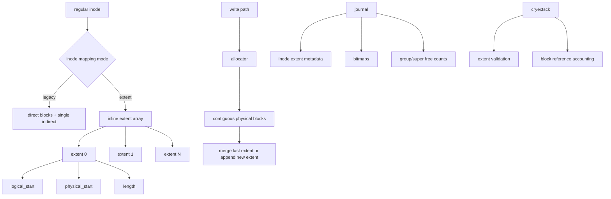

# CRYEXTS V4.3 Extent Design

## 1. Goal

V4.3 is the first step that upgrades CRYEXTS from:

```text
direct blocks + single indirect block
```

toward:

```text
extent-capable file mapping
```

The goal is not to build a full extent tree immediately. The goal is to add a
minimal extent-capable mapping skeleton that can coexist with the current
legacy single-indirect path.

## 2. Why V4.3 Is the Next Step

After V4.2, Version 4 already has:

- Version 4 superblock and feature flags
- block groups
- minimal metadata journal and replay

The next bottleneck is file mapping.

Current V3/V4.2 regular file mapping still has these limits:

- direct blocks fragment quickly
- single indirect is simple but not scalable
- contiguous allocation cannot be expressed compactly
- larger files need too many block pointers
- future sparse-file and policy evolution becomes awkward

Extent mapping is the natural next stage.

## 3. V4.3 Scope

V4.3 should implement:

- a new incompat feature flag for extents
- a minimal on-disk extent layout
- inode flag or mode to indicate extent-based mapping
- regular-file read path for extent-backed files
- regular-file write / append / truncate path for extent-backed files
- basic extent-aware `mkfs`
- extent-aware `cryextsck`
- smoke test for extent-backed large-file IO

V4.3 should not yet implement:

- full B-tree extent index
- multi-level extent tree
- hole punching
- sparse extent optimization
- online extent defrag

## 4. Design Principle

V4.3 should be:

```text
one inode -> small inline extent array
```

not:

```text
full ext4 extent tree
```

That keeps implementation understandable while unlocking a better mapping model.

## 5. Proposed On-Disk Model

### 5.1 New feature flag

Add:

- `CRYEXTS_FEATURE_INCOMPAT_EXTENTS`

Meaning:

- if set, kernel and `cryextsck` must understand extent-backed inodes
- older drivers that do not understand extents must reject mount

### 5.2 New extent record

Recommended minimal extent entry:

```text
logical_start
physical_start
length
flags/reserved
```

Meaning:

- `logical_start`
  first logical file block covered by this extent
- `physical_start`
  first physical disk block
- `length`
  number of consecutive blocks

### 5.3 Inode storage strategy

Recommended V4.3 starting point:

- keep current inode layout stable as much as possible
- reserve part of inode payload area for inline extents
- mark inode as extent-backed using inode flag

This gives two inode mapping modes:

1. legacy block-pointer inode
2. extent-backed inode

That is safer than rewriting every inode immediately.

## 6. Mixed-Mode Compatibility

V4.3 should support mixed behavior:

- old images or old inodes can still use direct + single indirect
- new extent-capable images can create extent-backed files

Recommended rule:

- extent feature enabled at filesystem level
- per-inode flag decides whether a specific file uses extents

This is useful because:

- testing is easier
- migration is safer
- fallback remains available during development

## 7. Allocation Logic for Extents

Extent mapping should cooperate with the existing group-aware allocator.

### 7.1 Preferred allocation behavior

For writes:

- try to allocate consecutive blocks within the same group
- if the new blocks are adjacent to the file's last extent, extend that extent
- otherwise allocate a new extent entry

This gives the first real benefit of extents:

```text
many contiguous data blocks
-> one compact extent entry
```

### 7.2 Initial limits

V4.3 should define a small maximum number of inline extents per inode.

Example idea:

- 4 inline extents
- or 6 inline extents

Once that limit is reached, V4.3 can:

- fail with `ENOSPC` for extent metadata growth
- or temporarily fall back to legacy path if explicitly designed

For the first implementation, clear failure is better than a half-implemented
overflow path.

## 8. Read / Write Semantics

### 8.1 Read path

Given logical file block `L`:

1. scan inode extent array
2. find extent where:
   - `logical_start <= L < logical_start + length`
3. map to:
   - `physical_start + (L - logical_start)`

### 8.2 Write path

For sequential append or extension:

1. allocate new physical blocks
2. if physically adjacent to last extent and logically adjacent, merge
3. else create new extent entry
4. update inode size / block count

### 8.3 Truncate path

On shrink:

1. identify extents partially or fully beyond EOF
2. free fully removed physical blocks
3. shorten or remove affected extent entries
4. update inode size / block count

## 9. Journal Interaction

V4.3 must remain compatible with V4.2 journal rules.

That means these metadata updates must be journaled:

- inode extent array changes
- allocator bitmap changes
- inode block count changes
- superblock / group free-count changes

The important rule is:

```text
extent metadata is still metadata
```

So once inode extent entries are modified, journal must protect those inode
table blocks before overwrite, just like other metadata.

## 10. `cryextsck` Requirements for V4.3

`cryextsck` should validate:

- extent feature flag consistency
- extent entry count bounds
- logical ranges do not overlap
- extent lengths are non-zero
- physical blocks are valid data blocks
- physical blocks are not multiply referenced by different inodes
- inode `blocks` count matches referenced extent blocks

For mixed-mode support, `cryextsck` must choose validation path per inode:

- legacy pointer path
- extent path

## 11. Suggested On-Disk Architecture



## 12. Suggested Milestone Plan

### V4.3.0

- extent metadata definitions
- feature flag
- inode flag / extent mode detection
- extent-aware `cryextsck` parsing

### V4.3.1

- extent-backed sequential write and read
- contiguous allocation merge
- smoke test for large regular files

### V4.3.2

- truncate support for extent-backed files
- remount persistence validation
- fsck validation hardening

### V4.3.3

- mixed-mode cleanup
- better error paths
- document limits and next-stage gaps

## 13. Review Focus

When reviewing V4.3 design, the important questions are:

1. Can legacy mapping and extent mapping coexist safely?
2. Is extent metadata small enough to fit current inode design without a large
   format rewrite?
3. Are extent metadata updates fully covered by the existing journal path?
4. Can `cryextsck` reason about extent block ownership without ambiguity?
5. Does the first implementation stay small enough to debug?

## 14. Recommended Implementation Style

Keep V4.3 narrow:

- inline extents only
- regular files only
- no extent tree yet
- no sparse optimization yet
- no fancy migration path yet

That gives a good first extent milestone:

```text
extent-backed regular file MVP
```

and keeps the code reviewable.
