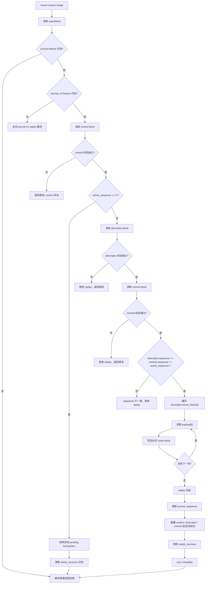

# CRYEXTS V6.0 Journal V2 设计说明

## 1. 为什么 V6.0 先做这个

从 `v4.2` 到 `v5.6`，我们已经有了一个能工作的 metadata journal。

它能做：

- metadata block 备份
- mount-time replay
- checksum
- recovery state 联动

但它更像：

```text
教学型 metadata replay log
```

而不是：

```text
语义完整的 journal transaction 系统
```

所以 `V6.0` 的任务不是把所有 journal 逻辑立刻重写完，而是先定义：

- 新 layout
- 新事务边界
- mount / fsck 如何识别它

也就是先把“语义壳子”搭起来。

## 2. V6.0 目标

### 2.1 这一版要实现

- journal v2 on-disk layout
- descriptor block
- commit block
- transaction sequence
- checkpoint / tail 的基础字段预留
- mount path 能识别 v2
- `cryextsck` 能检查 v2 header 基本一致性

### 2.2 这一版不强求

- 所有写路径都已经全面切换到 v2 transaction
- 完整 revoke 语义
- 完整 checkpoint 回收
- full data journaling

所以它的定位是：

```text
V6.0 = journal v2 baseline
```

## 3. 当前 journal 的主要不足

当前 journal 更接近：

```text
header block
+ payload blocks
```

然后 mount 时看 header 是否有效，再决定回放哪些 home blocks。

这个模型的问题是：

- “一个事务从哪里开始到哪里结束”不够明确
- “事务是否真的 commit 完成”缺少独立 commit 结构
- “checkpoint 后哪些记录还能回放”没有单独语义
- 结构继续复杂化后，replay 判断会越来越脆弱

## 4. V6.0 建议布局

建议把 journal v2 设计成至少三个概念：

```text
journal super/header
descriptor block(s)
payload block(s)
commit block
```

更直观地说：

```text
[journal head]
  -> descriptor 说“这笔事务包含哪些 home block”
  -> payload 存“这些 home block 的镜像内容”
  -> commit 说“这笔事务已经完整落盘”
```

只有看到合法 commit，replay 才承认事务有效。

## 5. 建议磁盘结构

### 5.1 journal super / control block

建议保留并扩展当前 journal 起始块，记录：

- magic
- version
- feature flags
- head sequence
- tail sequence
- checkpoint sequence
- checksum

作用是：

- 说明 journal 区域本身的版本
- 说明当前有效事务区间
- 为以后 checkpoint / wrap-around 打基础

### 5.2 descriptor block

descriptor 至少记录：

- `sequence`
- `entry_count`
- `payload_start`
- `home_blocks[]`
- checksum

它负责回答：

```text
这笔事务到底描述了哪些 home block
```

### 5.3 commit block

commit 至少记录：

- `sequence`
- `descriptor_sequence`
- `entry_count`
- checksum

它负责回答：

```text
这笔事务是否完整提交
```

replay 时：

- descriptor 存在但 commit 不存在 -> 不回放
- descriptor 和 commit sequence 对不上 -> 不回放
- checksum 不对 -> 不回放

## 6. 推荐 replay 规则

`V6.0` 虽然未必马上把所有 replay 都改成最终版本，但语义规则应该先定下来。

建议规则：

1. 扫描 journal control block，找到候选 sequence 范围
2. 读取 descriptor
3. 校验 descriptor checksum
4. 读取 commit
5. 只有 descriptor / commit 都合法时，才回放 payload
6. 否则整笔事务视为未完成

这比当前“只看一个 header 是否 valid”更清晰。

## 6.1 为什么顺序是 control -> descriptor -> commit

很多人第一眼会觉得：

```text
descriptor -> commit
```

不就够了吗？

但这里还要先放一个 `control`，原因是：

```text
descriptor / commit 是“单笔事务级元数据”
control 是“整个 journal 级元数据”
```

也就是说：

- `descriptor`
  只回答：这一笔事务包含哪些 home block
- `commit`
  只回答：这一笔事务是否完整提交
- `control`
  回答的是 journal 全局状态：
  - 当前是不是 journal v2
  - 当前有没有 active transaction
  - 当前 active sequence 是多少
  - descriptor 在哪里
  - payload 从哪里开始
  - commit 在哪里
  - tail/checkpoint 当前推进到哪里

所以 mount 时一定先读 `control`，再决定要不要继续读 `descriptor` 和 `commit`。

一句话说：

```text
control 决定“要不要恢复”
descriptor 决定“恢复什么”
commit 决定“能不能恢复”
```

## 6.2 V6.0 mount-time replay 流程图

下面是当前 `v6.0` 的 mount-time replay 逻辑：



## 6.3 V6.0 mount-time replay 文字版步骤

如果不用图，当前流程可以直接理解成下面 10 步：

1. 挂载时先读 superblock
2. 判断是否开启 journal
3. 判断是旧 journal 还是 `journal v2`
4. 如果是 `journal v2`，先读取 `control block`
5. 如果 `control.active_sequence == 0`，说明当前没有待恢复事务，可以直接继续挂载
6. 如果 `active_sequence != 0`，继续读取 `descriptor block`
7. 校验 `descriptor` 的 magic / version / entry_count / checksum
8. 再读取 `commit block`
9. 校验 `commit` 的 magic / version / sequence / checksum，并检查它是否和 `descriptor` / `control` 对得上
10. 只有三者都合法时，才把 payload 拷回对应 home block，然后清空 journal 状态，继续挂载

## 6.4 当前 v6.0 的语义边界

需要特别说明：

- `v6.0` 已经实现了 `control -> descriptor -> commit -> replay` 这条语义链
- 但它还不是完整的多事务循环 journal

当前仍然是：

- 单事务区域
- 固定 control / descriptor / commit block 位置
- payload 区固定在中间
- 没有真正的 tail 推进和 checkpoint 回收

所以 `v6.0` 的重点不是“功能完全体”，而是：

```text
先把 mount-time recovery 的事务边界明确化
```

## 7. 建议 feature flag / version 处理

### 7.1 superblock

`V6.0` 建议引入新的 journal incompat/compat 标记，或者至少在现有 feature 上细分出：

- `JOURNAL_V2`

这样 mount 和 fsck 都能明确知道：

- 当前 image 还是旧 journal
- 还是新 journal v2

### 7.2 向后兼容

建议原则：

- 老 image 仍然能按旧 journal 路径挂载
- 新 image 明确打 `JOURNAL_V2`
- `cryextsck` 同时理解 v1 / v2

也就是说，`V6.0` 先实现：

```text
双栈理解
```

再逐步切默认写入。

## 8. `cryextsck` 需要理解什么

`V6.0` 对 `cryextsck` 的最低要求：

- 能识别 journal v2 control block
- 能识别 descriptor / commit 结构
- 能检查：
  - magic
  - version
  - sequence
  - entry_count
  - checksum
  - payload / home block 是否越界

还可以先不做：

- 自动修复杂 transaction 链
- 自动 checkpoint 重建

## 9. 建议测试

### 9.1 layout smoke

建议脚本：

```text
scripts/smoke_v6_0_journal_layout.sh
```

测试：

- `mkfs` 创建 v6.0 image
- inspect journal control / descriptor / commit 结构
- `cryextsck` 能 clean

### 9.2 commit 判定 smoke

建议脚本：

```text
scripts/smoke_v6_0_journal_commit_boundary.sh
```

测试：

- 人工注入只有 descriptor、没有 commit 的事务
- mount / fsck 应拒绝把它当作有效事务

## 10. 一句话结论

`V6.0` 的任务不是“把 journal 一步做成 ext4 JBD2”，而是：

```text
先把 descriptor / commit / sequence / checkpoint 这些关键概念落到磁盘格式里，
让 Version 6 后续所有恢复语义都有一个稳定基座。
```
