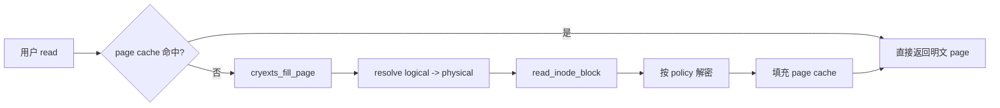

# CRYEXTS Version 10 MVP 总结

## 1. 版本定位

Version 10 的目标是把普通文件 I/O 从自定义 block 搬运路径推进到 Linux page cache 和 writeback 框架，并验证缓存、回写、journal 和加密之间的边界。

```text
VFS
  -> generic_file_read_iter/generic_file_write_iter
  -> inode->i_mapping page cache
  -> CRYEXTS address_space_operations
  -> extent/direct mapping
  -> encrypted or raw block I/O
```

Version 10 MVP 已经完成“可运行、可恢复、可比较”的闭环，但不是生产级 NAS 性能版本。

## 2. 已完成能力

| 能力 | 实现结果 |
|---|---|
| cached read | 重复读取优先使用 Linux page cache |
| buffered write | 小写入先修改 page cache 中的明文页 |
| dirty page | `write_end` 标记 dirty page |
| writeback | `writepage/writepages` 将 dirty page 写回文件 block |
| 元数据事务 | writeback 中通过 journal begin/record/commit 保护 metadata |
| page cache 加密边界 | cache 保存明文，写入 block 前再加密 |
| policy-aware encryption | regular file/symlink 按 inode policy 选择 key |
| remount recovery | unmount/remount 后数据可读，fsck clean |
| 性能基线 | plain/encrypted 输出顺序读写和 cached-read MB/s |

## 3. 关键数据流

### 3.1 读取



### 3.2 写入


### 3.3 加密边界

```text
page cache:       明文
inode extent:     明文 metadata
directory:        明文 metadata
journal:          明文 metadata
regular data:     磁盘上 AES-CTR 密文
```

这使 VFS 可以正常合并小写入，同时避免把明文 page cache 误当作磁盘密文。`cryexts_read/write_file_block()` 用于 raw metadata；`cryexts_read/write_inode_block()` 用于文件数据和加解密。

## 4. 版本推进

```text
v10.0  顺序读写性能基线
v10.1  cached read
v10.2  buffered write
v10.3  dirty page/writeback
v10.4  page cache + policy-aware AES-CTR
v10.5  统一回归和 MVP 收口
```

## 5. v10.5 验收标准

入口：

```bash
./scripts/smoke_v10_5_regression.sh
```

测试同时覆盖 plain image 和 encrypted image：

- 顺序写入并 `fsync`。
- 512 字节小写入并校验 cached read。
- `umount/remount` 后校验持久化内容。
- 输出 plain/encrypted 的 write、read、cached-read MB/s。
- 错误 key 拒绝挂载。
- 扫描 raw encrypted image，确认测试 marker 没有明文泄漏。
- 最终两个 image 都通过 `cryextsck clean`。

## 6. 当前性能结论

Version 10 MVP 证明的是架构路径正确：

```text
Linux page cache 接管缓存生命周期
CRYEXTS 负责 logical/physical mapping、加密和 metadata consistency
```

它还不能证明已经达到 NAS 产品所需吞吐。当前主要开销包括：

- 每个文件 block 独立执行加解密。
- writeback 仍以 page/block 为粒度处理。
- journal 仍是单事务固定区域模型。
- loop image 的 page cache 可能影响绝对 benchmark 数值。
- 未实现批量 crypto request、批量 writeback 和并发 journal transaction。

下一阶段应先基于 v10.5 输出的同机基线，再一次只改一个变量，分别评估批量写回、加密批处理和 journal 批处理。

## 7. 版本边界

Version 10 MVP 不修改当前 on-disk layout、extent tree、directory index、GDT、journal v2 或 encryption policy 格式。后续性能优化必须保持：

```text
现有 image 可被 fsck 识别
现有 page cache 读写语义不回退
encrypted data 不泄漏明文
mount/replay 后 metadata 仍然一致
```
