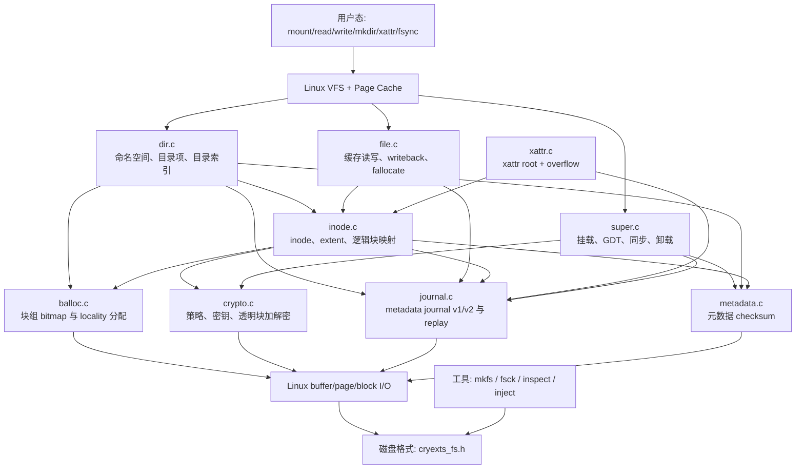

# CRYEXTS 项目知识地图

本目录描述 CRYEXTS **当前主线代码**，目标是让开发者或 AI 在不通读全部历史版本文档的情况下，快速建立正确的文件系统模型。源码是最终事实来源；本目录用于解释模块边界、核心调用链、稳定 API、磁盘结构和修改约束。

## 文档导航

| 文档 | 解决的问题 |
| --- | --- |
| [architecture.md](architecture.md) | 系统由哪些层组成，mount/read/write/目录/日志如何流动，磁盘如何布局 |
| [api-and-structures.md](api-and-structures.md) | 公共 API 做什么，磁盘结构体和运行时结构体的每个字段表示什么 |
| [ai-onboarding.md](ai-onboarding.md) | AI 应按什么顺序读代码，修改某类功能时看哪些文件，如何验证不破坏格式 |

## 一页式知识地图

## 当前能力边界

- 固定块大小为 4096 字节，默认每组 4096 块，每组 inode table 为 4 块。
- 支持多块 GDT、块组 bitmap、分配 locality、预分配窗口和末组 journal 区域。
- 普通文件支持 direct/single-indirect 兼容映射、extent、单层 extent tree v2、稀疏文件与 hole punch。
- 目录数据仍通过 inode 的 direct block 映射，当前目录最多使用 12 个 logical block。
- 目录索引不是完整 ext4 HTree，而是 `64 bucket + 每 bucket 16-bit logical-block mask` 的单层候选索引。
- journal v2 使用 `control -> descriptor -> payload -> commit`，保护元数据事务并支持 mount-time replay。
- 文件数据支持按文件系统密钥和 policy 的透明加解密；xattr 使用 root block 加一个 overflow block。
- v10.4 主线已接通 cached read、buffered write、dirty page/writeback，并固定 page cache 明文、block I/O 加解密及错误传播边界。

## 推荐阅读顺序

1. 先读本页，记住模块边界与当前能力上限。
2. 阅读 [architecture.md](architecture.md) 的 mount、read、write 和磁盘布局。
3. 对照 `cryexts_fs.h` 阅读 [api-and-structures.md](api-and-structures.md) 的 on-disk 结构。
4. 对照 `cryexts.h` 阅读 runtime 结构和跨模块 API。
5. 准备修改代码前，执行 [ai-onboarding.md](ai-onboarding.md) 中对应功能的阅读与验证清单。

## 事实优先级

当文档与实现不一致时，按以下顺序判断：

1. `cryexts_fs.h` 中的 on-disk 定义和 feature bit。
2. `tools/mkfs.cryexts.c` 实际写出的布局。
3. 内核模块读取、校验和更新该格式的实现。
4. `cryextsck` 与 inspect 工具对格式的独立校验。
5. 本知识地图及历史版本文档。

`cryexts_fs.h` 中存在早期单区布局兼容常量。当前块组布局不能只依据这些旧常量推导，必须结合 superblock、GDT 和 mkfs 实现。
