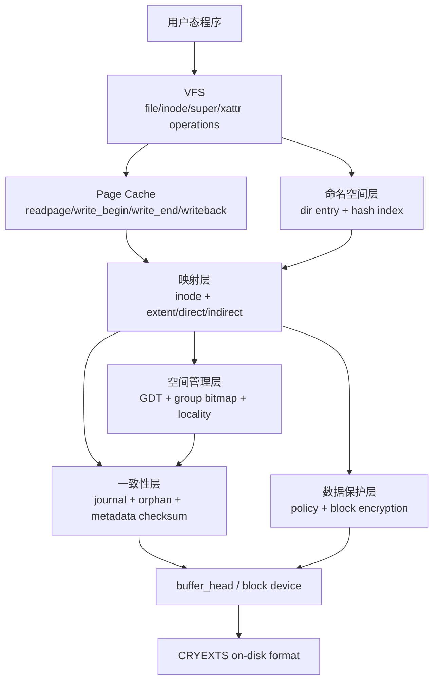
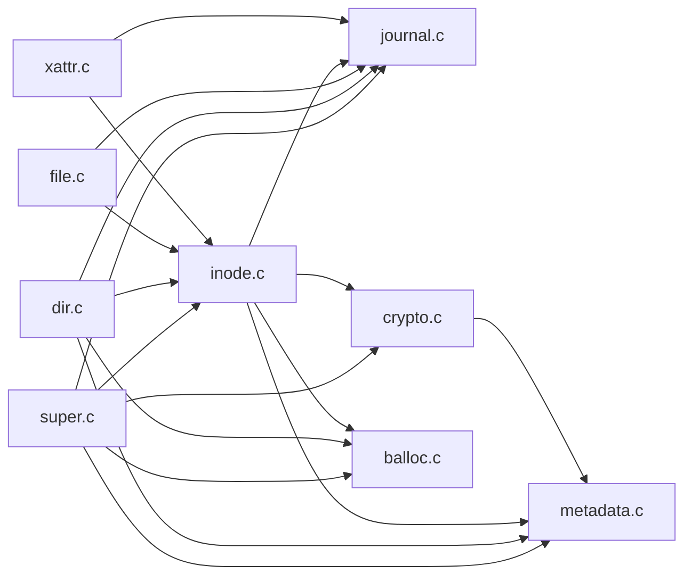
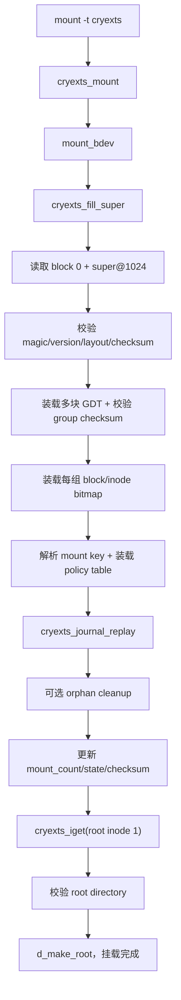
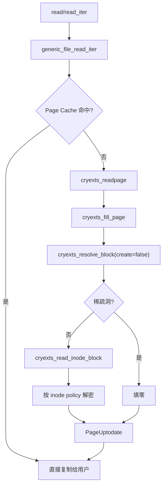
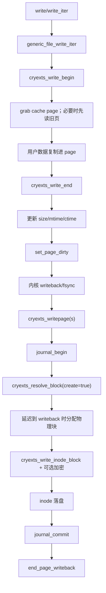
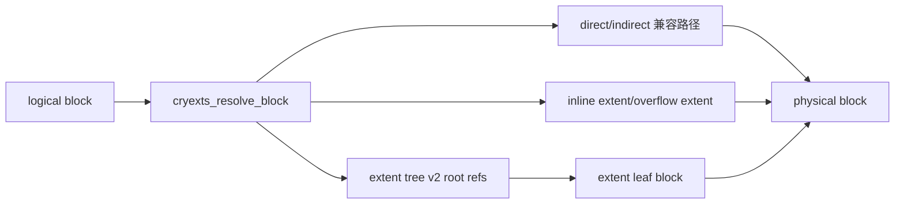
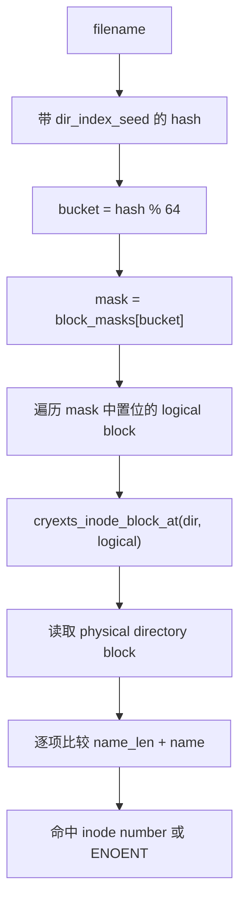
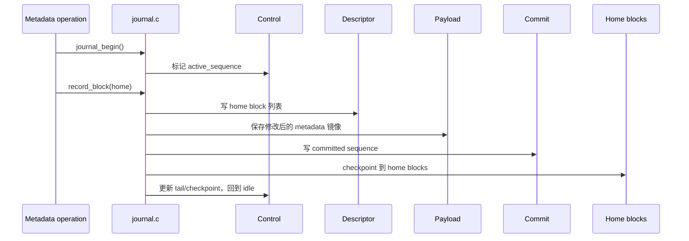

# CRYEXTS 当前项目架构

## 1. 分层模型



| 层 | 主要文件 | 职责 |
| --- | --- | --- |
| 格式定义 | `cryexts_fs.h` | 所有 on-disk 结构、feature bit、固定上限 |
| 内核公共边界 | `cryexts.h` | runtime 状态、跨模块 API、VFS operation 导出 |
| 挂载与全局状态 | `super.c` | 校验 super、装载 GDT/bitmap/policy、replay、root inode、sync/unmount |
| 元数据校验 | `metadata.c` | super、GDT、目录索引、policy、extent 块 checksum |
| 空间分配 | `balloc.c` | group bitmap、inode/block 分配释放、goal/locality、统计更新 |
| inode 与块映射 | `inode.c` | inode 装载/落盘、direct/indirect/extent、truncate、hole punch |
| 目录命名空间 | `dir.c` | lookup、iterate、create、mkdir、link、unlink、rename、symlink、目录索引 |
| 文件数据路径 | `file.c` | page cache read、buffered write、writeback、fsync、fallocate、属性 |
| 日志与恢复 | `journal.c` | journal v1/v2 事务、记录 home block、commit、replay、orphan |
| 加密策略 | `crypto.c` | mount key、KDF、policy table、块级加解密 I/O |
| 扩展属性 | `xattr.c` | user xattr、policy xattr、root+overflow 存储 |

## 2. 模块依赖



依赖中心是 `inode.c`：目录和文件最终都要把 logical block 转换为 physical block。全局序列化主要由 `cryexts_sb_info.alloc_lock` 和 `journal_lock` 承担。

## 3. 磁盘布局

当前 mkfs 默认布局如下，具体块号由设备大小、`group_count` 和 `gdt_blocks` 决定：

```text
block 0
  byte 0..1023       保留
  byte 1024..        cryexts_super_block

block 1..G           GDT，G = group_desc_table_blocks

group 0
  GDT 之后第 1 块    group 0 block bitmap
  下一块             group 0 inode bitmap
  后续 4 块          group 0 inode table
  下一块             root directory data block
  可选下一块         policy table
  其余               data / directory / extent / xattr metadata blocks

group 1..N-2
  group start        本组 block bitmap
  group start + 1    本组 inode bitmap
  后续 4 块          本组 inode table
  其余               本组可分配块

last group
  组头 metadata      bitmap + inode table
  中间               可分配块
  最后最多 512 块    journal v2 区域
```

`root_inode_block` 和 `root_dir_block` 是 superblock 中的快速定位字段，不是额外的 root 专属 bitmap。root inode 仍由 group 0 inode bitmap 标记，并存放在 group 0 inode table；root directory block 是 root inode 的第一个数据块。

### 特殊块组

- group 0 额外容纳 super/GDT 邻近元数据、root inode、root directory 和可选 policy table。
- last group 预留 journal 尾部区域，该区域不得进入普通数据分配。
- 其他 group 结构一致，每组独立管理 block bitmap、inode bitmap 和 inode table。

## 4. Mount 调用链



任一步骤返回负 errno 都会进入 `cryexts_put_super` 清理已装载资源。日志 replay 必须早于 root inode 对外可见。

## 5. 文件读取路径



第二次读取可能完全来自 page cache，因此基准测试必须区分 cached read 与真实设备 cold read。

## 6. 文件写入与 writeback



当前 v10.3 要求 `PAGE_SIZE == CRYEXTS_BLOCK_SIZE`。`cryexts_file_aops` 必须保留 `.set_page_dirty = __set_page_dirty_nobuffers`，否则 `set_page_dirty()` 会通过空函数指针触发 kernel Oops。

## 7. inode logical-to-physical 映射



extent 表示连续范围：`logical_start + physical_start + length`。extent tree v2 深度固定为 1，inode 中最多 4 个 root ref，每个 ref 指向一个 leaf；它是固定深度的多叉有序映射，不是通用的自平衡 B+Tree。

目录是例外：目录数据目前使用 inode 的 direct block 表，目录 logical block 上限为 12；目录索引只负责缩小候选 logical block，不负责 logical-to-physical 映射。

## 8. 目录索引路径



`block_masks[bucket]` 是 16 位候选集合。目录项写入某个 logical block 时，把该名称对应 bucket 的相应 bit 置 1；删除或移动目录项后重建/更新 mask。因为目录只允许 12 个 direct block，实际只使用低 12 位。

这不是“bucket 内再走一棵树”。它是单层 hash 辅助索引，真正权威数据仍是 directory data block 中的 `cryexts_dir_entry`。

## 9. Journal v2 事务与恢复



Mount-time replay 从 control 获得事务状态和各区域位置，再验证 descriptor、payload 与 commit。只有 descriptor/commit 序列一致、entry count 合法且 checksum 正确的已提交事务才可 replay；完成后清空活动项并推进 checkpoint sequence。

## 10. 加密与 xattr

- `cryexts_set_encryption_key` 从 mount options 获取密钥并校验 verifier。
- policy table 定义 policy id、flags 和 context；inode 的 `encryption_policy_id` 选择策略。
- `cryexts_read_inode_block` / `cryexts_write_inode_block` 是文件数据加解密边界，元数据不能误走数据加密路径。
- `cryexts_read_file_block` / `cryexts_write_file_block` 是 journal/xattr 的 raw metadata I/O，不执行数据加密，确保 fsck 无密钥也能检查结构。
- page cache 始终保存明文；读取在填页前解密，写回先加密临时副本，成功后才覆盖 `buffer_head`，失败返回到 readpage/writeback。
- xattr root block 由 inode extra 指向；空间不足时可链到一个 overflow block。
- `user.cryexts.policy_id` 与 inode policy 字段联动，设置前必须确认 policy 存在。

## 11. 一致性不变量

- super、GDT、bitmap、inode table、目录项、extent leaf、索引和 journal 的引用块必须在设备范围内，且不能落入保留区。
- bitmap 的占用状态、group free counter 和 super free counter 必须同步更新。
- directory index 只是缓存式加速结构，目录项才是权威数据；两者不一致应被 fsck 检出。
- extent 必须按 logical range 有序、无重叠，physical range 合法，checksum 匹配。
- journal 的 home block 列表不得包含 journal 自身非法区域，事务 sequence 必须单调推进。
- 加密数据只能通过 inode-aware I/O 访问，否则会绕过 policy 或发生重复加密。
