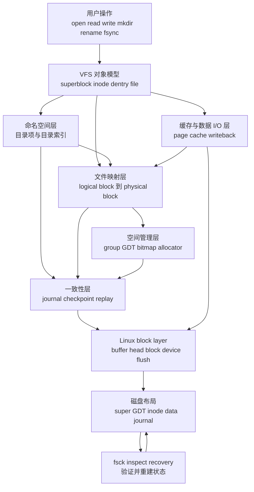
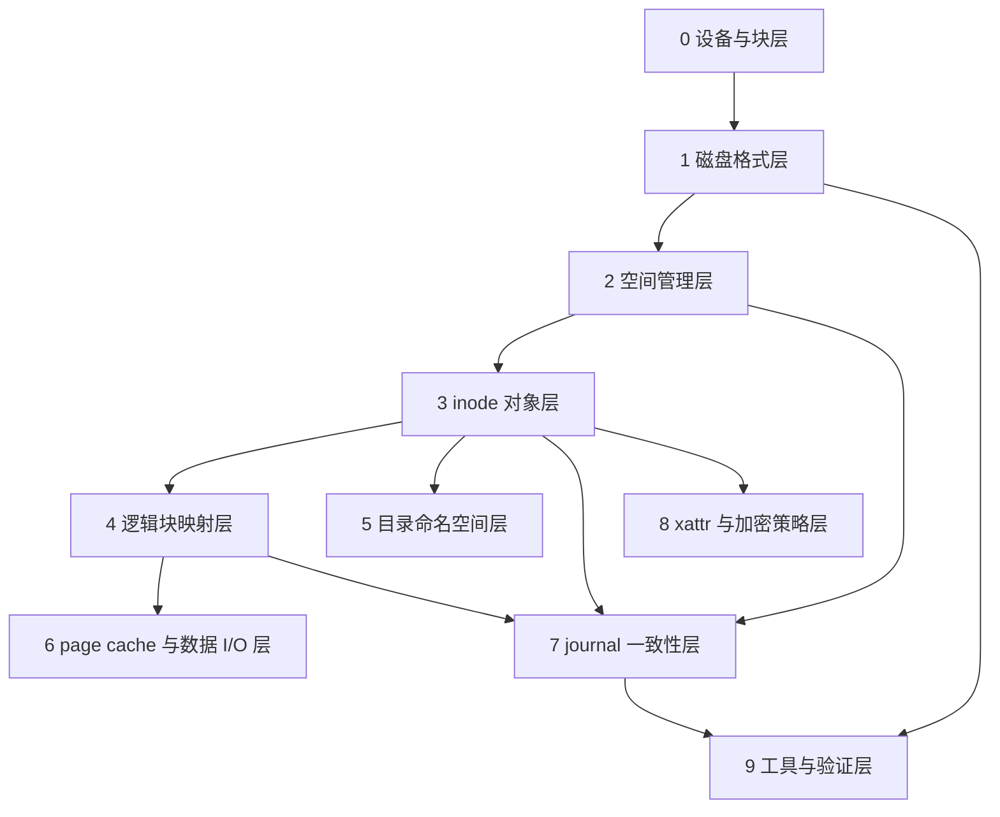
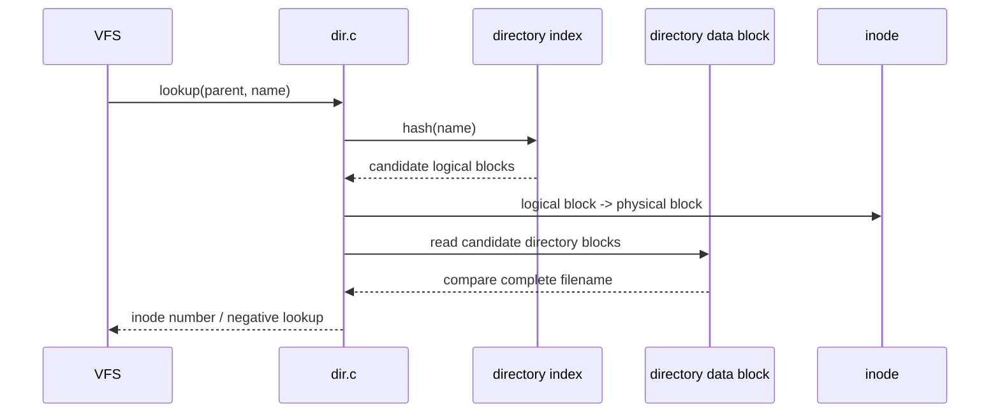
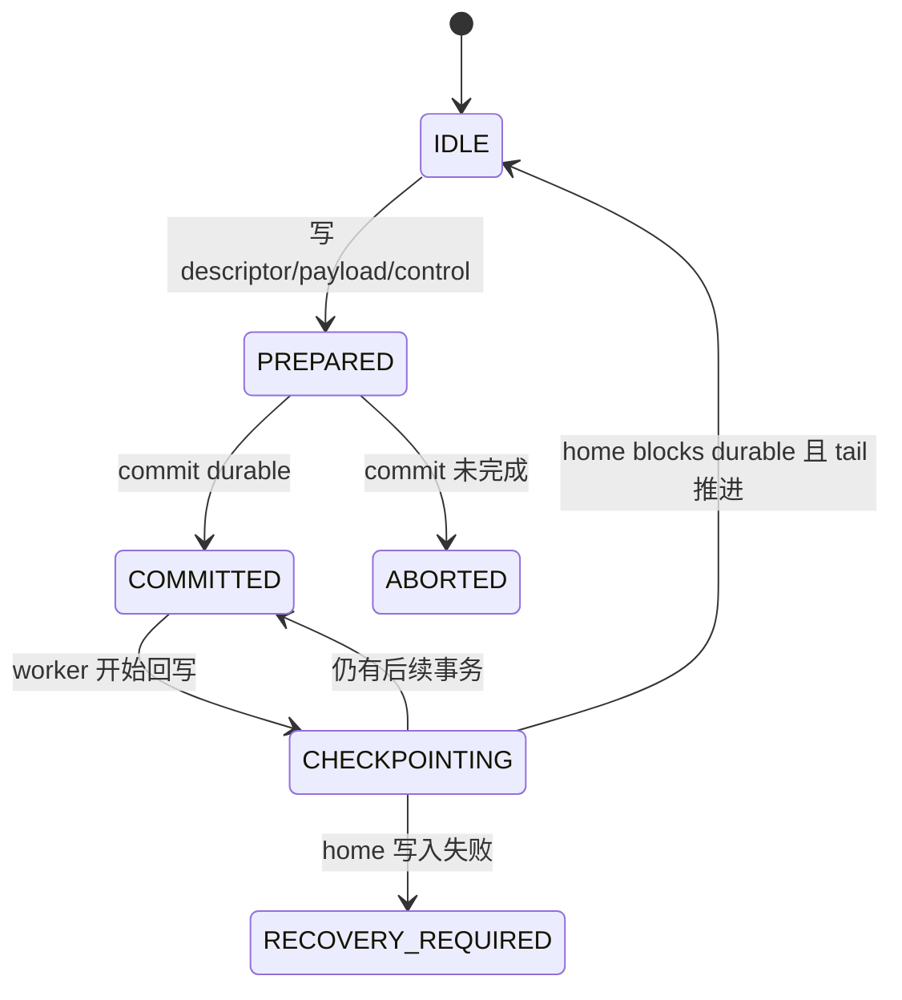

# CRYEXTS 文件系统问题模型

这份文档用于建立 CRYEXTS 的总分学习方法。阅读代码、定位 bug、设计新版本时，先从总模型判断问题属于哪一层，再进入对应的局部模型。不要从某个结构体开始孤立记忆。

## 1. 总模型

文件系统要解决的总问题是：

```text
把用户看到的持久化对象
安全、可恢复、高效地映射到块设备上的物理空间
```

可以把一次文件系统操作抽象成一个状态转换：

```text
用户意图
    -> VFS 操作
    -> 文件系统逻辑状态变化
    -> 空间分配与逻辑块映射
    -> 内存缓存变化
    -> 持久化顺序控制
    -> 物理块 I/O
    -> 可恢复的磁盘状态
```

### 1.1 总体架构图



### 1.2 总模型的六个核心对象

| 对象 | 回答的问题 | CRYEXTS 中的代表 |
| --- | --- | --- |
| 用户对象 | 用户正在操作什么 | 文件、目录、符号链接、xattr |
| 逻辑对象 | 文件系统如何描述它 | inode、目录项、extent、policy |
| 空间对象 | 它占用了哪些空间 | inode number、logical block、physical block |
| 内存对象 | 当前哪些内容在内存中 | VFS inode、page cache page、buffer_head |
| 持久化对象 | 磁盘上保存了什么 | superblock、GDT、bitmap、inode table、data block |
| 一致性对象 | 崩溃后如何判断和恢复 | journal transaction、sequence、checksum、replay |

### 1.3 总模型的五个状态

分析任意问题时，先区分这五种状态：

```text
逻辑状态       文件、目录、大小、权限、目录关系
映射状态       logical block 到 physical block 的关系
分配状态       bitmap、free counter、inode 使用状态
缓存状态       page cache 中的内容与 dirty 状态
持久化状态     数据、元数据、journal 是否已经到达磁盘
```

它们在写操作期间可以暂时不一致。例如文件大小已经变成 8192 字节，page cache 已经有内容，extent 也已经建立，但数据页和 inode 元数据可能还没有完全持久化。`writeback`、`fsync`、journal commit 和 checkpoint 负责让这些状态最终收敛。

### 1.4 总模型的统一问题清单

面对一个新功能或 bug，先问：

1. 用户希望改变哪个逻辑对象？
2. 这个对象对应哪个 inode、目录项或 metadata block？
3. 是否需要分配或释放 inode/block？
4. logical block 如何映射到 physical block？
5. 哪些内容在 page cache，哪些内容已在磁盘？
6. 哪些 metadata 必须进入 journal？
7. 崩溃发生在操作的哪一个持久化边界？
8. 重新挂载和 `cryextsck` 如何判断结果是旧状态还是新状态？

## 2. 分层总览



每层使用同一个局部模型：

```text
管理对象 -> 要解决的问题 -> 输入/输出 -> 不变量 -> 失败处理 -> 上下层关系
```

## 3. 第 0 层：设备与块层

### 3.1 管理对象

Linux block device、逻辑扇区、物理扇区、设备容量、读写请求和 flush。

### 3.2 要解决的问题

```text
如何把文件系统的 block I/O 安全地交给不同类型的磁盘设备
```

CRYEXTS 不直接控制 SATA、NVMe、virtio 或 USB 控制器。它通过 Linux block layer 提交块读写，并接收成功或 errno。

### 3.3 输入与输出

```text
输入：physical block number、读写 buffer、持久化要求
输出：block data、完成状态、-EIO/-ENODEV 等错误
```

### 3.4 不变量

- physical block 必须小于设备可用 block 数；
- 不能访问文件系统保留区以外的块；
- 设备报告错误时，上层不能伪造成功；
- flush 失败时，不能把 journal commit 当作已持久化。

### 3.5 与上下层的关系

这一层只知道“第 N 个物理块”，不知道这个块是 inode、bitmap 还是普通文件数据。块的含义由磁盘格式层和上层 metadata 决定。

## 4. 第 1 层：磁盘格式层

### 4.1 管理对象

superblock、GDT、block group 几何、inode table、journal 区域、feature flags。

### 4.2 要解决的问题

```text
设备上的字节如何被解释成一个可挂载的 CRYEXTS 文件系统
```

### 4.3 典型布局

```text
block 0
  保留区域 + superblock

block 1 .. GDT_END
  group descriptor table

group 0 .. group N
  block bitmap
  inode bitmap
  inode table
  data area

最后保留区域
  journal control / descriptor / payload / commit
```

### 4.4 不变量

- superblock 中的总 block 数、group 数和 GDT 几何相互一致；
- GDT 项数量覆盖所有 group；
- group 起始位置、bitmap、inode table 不越界；
- journal 不被普通 allocator 分配；
- 未知 incompat feature 必须拒绝挂载；
- checksum 覆盖范围和写入顺序一致。

### 4.5 局部问题模型

遇到布局问题时，按这个顺序排查：

```text
设备大小
 -> blocks_count
 -> group_count
 -> GDT blocks
 -> 每组 metadata 起始位置
 -> journal 起始位置与保留范围
 -> mkfs / mount / fsck 是否使用同一公式
```

## 5. 第 2 层：空间管理层

### 5.1 管理对象

block group、block bitmap、inode bitmap、inode table free slot、group free counters、分配提示。

### 5.2 要解决的问题

```text
从哪里分配一个新的 inode 或 data block，释放后如何让所有统计恢复一致
```

### 5.3 分配模型


`next_data_block`、goal 和 locality 是搜索提示；bitmap 才是占用状态的权威来源。

### 5.4 不变量

- 已分配 inode 必须在 inode bitmap 中置位；
- 已分配 data block 必须在对应 group block bitmap 中置位；
- free counter 必须与 bitmap 的实际空闲数量一致；
- 被 super/GDT/bitmap/inode table/policy/journal 占用的块不能再次分配；
- 分配失败时不能留下半更新的 bitmap 或 counter。

### 5.5 典型故障

```text
bitmap 已置位但 inode table 没写成功
bitmap 已释放但 inode 仍引用该块
group counter 更新了但 bitmap 没更新
```

这些问题不能只修一个字段，必须沿着“bitmap、counter、inode/extent 引用、journal”一起检查。

## 6. 第 3 层：inode 对象层

### 6.1 管理对象

磁盘 inode、VFS inode、inode number、文件类型、大小、权限、时间、link count 和私有映射状态。

### 6.2 要解决的问题

```text
一个文件系统对象是什么，以及它在内存和磁盘上如何表示
```

### 6.3 双重表示

```text
disk inode
  持久化字段：mode、size、times、block mapping、xattr、orphan

VFS inode
  Linux 运行时字段：i_mode、i_size、i_mapping、operations、lock

cryexts_inode_info
  CRYEXTS 运行时字段：direct、extent、policy、dir index 等缓存状态
```

### 6.4 不变量

- inode number 能准确定位 group 和 inode table slot；
- 文件类型决定可用的 inode operations；
- `i_size` 与磁盘映射范围一致；
- link count、目录引用和 orphan 状态一致；
- inode 被删除前，数据块、xattr 和索引块必须按规则释放；
- VFS inode 与 disk inode 写回必须受 journal 保护。

### 6.5 生命周期模型

```text
磁盘 inode
    -> iget / load
    -> VFS inode
    -> lookup / open / write
    -> dirty
    -> write inode to disk
    -> evict
    -> free 或 orphan cleanup
```

## 7. 第 4 层：逻辑块映射层

### 7.1 管理对象

文件 logical block、physical block、direct/indirect 指针、extent 和 extent tree。

### 7.2 要解决的问题

```text
文件偏移对应哪个磁盘块
没有物理块时是否分配
释放、截断和 hole 如何表达
```

### 7.3 统一映射公式

```text
file offset
    -> logical block = offset / block_size
    -> inode mapping lookup
    -> physical block
```

extent 表示连续范围：

```text
logical_start + length
    -> physical_start + length
```

### 7.4 不变量

- logical range 有序且不能重叠；
- physical range 在设备内且不能指向保留区；
- hole 返回“没有物理块”的结果，不应被误当成 I/O 错误；
- 分配新映射必须同步更新 bitmap、inode 和 journal；
- truncate/punch hole 释放的物理块不能仍被 extent 引用。

### 7.5 典型问题定位

```text
读到错误内容       -> 先查 logical-to-physical 映射
写入后 fsck 报引用错 -> 查 extent/inode 与 bitmap
大文件到上限失败   -> 查映射树容量，而不是先查 page cache
稀疏文件读全零     -> 确认 hole 语义和 page cache 填页路径
```

## 8. 第 5 层：目录命名空间层

### 8.1 管理对象

目录 inode、directory entry、文件名、父子关系、hash index、readdir 顺序。

### 8.2 要解决的问题

```text
如何把名字找到 inode number，并维护目录结构变化
```

### 8.3 lookup 模型



索引只是候选范围，不是权威数据。最终结果必须从 directory entry 中完整比较文件名。

### 8.4 增删改模型

```text
create
  -> 分配 inode
  -> 找目录空槽或新目录 block
  -> 写 directory entry
  -> 更新 index
  -> 更新父目录 inode
  -> journal commit

unlink/rename
  -> 修改目录项
  -> 更新 link count / inode 状态
  -> 更新 index
  -> 释放或加入 orphan
  -> journal commit
```

### 8.5 不变量

- 目录项 inode number 必须指向有效 inode；
- `.` 和 `..` 的父子关系正确；
- index 的候选范围不能遗漏真实目录项；
- 增删改后 entries、dir_blocks、hash index 和 checksum 一致；
- 目录扩展不能依赖 inode 中固定的 12 个 direct slot。

## 9. 第 6 层：page cache 与数据 I/O 层

### 9.1 管理对象

page cache page、XArray index、dirty page、writeback、address_space_operations、文件数据 block。

### 9.2 要解决的问题

```text
如何让应用访问缓存中的文件内容，并在合适的时机把内容写回物理块
```

### 9.3 读路径

```text
read()
  -> generic_file_read_iter
  -> 查找 mapping/XArray 中的 page
  -> 命中：直接返回 page cache 内容
  -> 未命中：readpage/read_folio
  -> logical-to-physical lookup
  -> 读取物理块并解密（如启用）
  -> 填充 page cache
  -> 返回用户
```

### 9.4 写路径

```text
write()
  -> generic buffered write
  -> 获取或创建 page cache page
  -> 修改 page 内容
  -> write_end 标记 dirty
  -> writeback 触发
  -> 分配/查找 physical block
  -> 写数据 block
  -> 写回 inode/extent 等 metadata
  -> journal commit
```

### 9.5 不变量

- page lock、dirty、writeback 状态必须成对变化；
- writeback 失败必须 redirty page 并设置 mapping error；
- 同一个 page 不能被重复并发写回；
- page cache 中是逻辑文件内容，不能把加密后的磁盘内容再次当作明文缓存；
- `fsync` 返回成功前，要求的 data 和 metadata 持久化顺序必须完成。

### 9.6 性能问题模型

```text
慢读：page cache miss、物理 I/O、解密、映射查询
慢写：频繁分配、page writeback、journal commit、flush
重复 I/O：缓存页没有正确命中或错误失效
数据错误：page cache、映射、加密 buffer 或 block I/O 任一层不一致
```

## 10. 第 7 层：journal 一致性层

### 10.1 管理对象

transaction、home block、descriptor、payload、commit、control、sequence、head/tail、checkpoint。

### 10.2 要解决的问题

```text
一次操作修改多个 metadata block 时，崩溃后如何避免只落盘一部分
```

### 10.3 redo journal 模型

```text
home metadata block
    -> 复制 after-image 到 journal payload
    -> descriptor 记录 home block 和 checksum
    -> commit 标记事务完整
    -> checkpoint 把 payload 写回 home block
    -> 推进 tail 回收空间
```

### 10.4 状态模型



### 10.5 不变量

- 只有 commit 完整且 checksum 正确的事务可以 replay；
- descriptor entry 与 payload block 一一对应；
- 一个事务中的 home block 不能重复；
- payload、descriptor、commit、control 的 sequence 必须相互匹配；
- checkpoint 失败时不能推进 tail；
- head 不能覆盖 tail 之前仍未回收的事务。

### 10.6 崩溃分析方法

```text
崩溃位置
  -> 最后一个 durable record
  -> commit 是否有效
  -> payload checksum 是否有效
  -> home block 是否已写回
  -> mount replay 或 fsck 的预期结果
```

## 11. 第 8 层：xattr 与加密策略层

### 11.1 管理对象

xattr name/value、policy id、policy table、mount key、加密数据 block。

### 11.2 要解决的问题

```text
如何给 inode 附加扩展属性，并让文件数据按 inode policy 透明保护
```

### 11.3 数据边界

```text
文件数据 I/O
  -> inode policy
  -> 加密/解密 buffer
  -> block device

元数据 I/O
  -> super/GDT/inode/dir/journal/xattr raw metadata
  -> 不走文件数据加密路径
```

### 11.4 不变量

- page cache 保存明文文件内容；
- 磁盘数据 block 才执行文件数据加密；
- journal、inode、文件名和目录关系的可见性必须符合设计声明；
- policy id 必须存在于 policy table；
- 密钥材料不能写入 superblock、journal 或日志。

当前 CRYEXTS 的 AES-CTR 和教学型 KDF 需要单独进行安全评审，不能把“实现了加密路径”直接等同于生产级静态数据保护。

## 12. 第 9 层：工具与验证层

### 12.1 管理对象

mkfs、fsck、inspect 工具、smoke 脚本、故障注入镜像和测试报告。

### 12.2 要解决的问题

```text
如何证明磁盘状态正确，如何复现故障，如何区分代码问题和设备问题
```

### 12.3 工具职责

| 工具 | 问题模型 |
| --- | --- |
| `mkfs.cryexts` | 如何从空设备建立合法初始状态 |
| `cryextsck` | 当前磁盘状态是否满足所有不变量 |
| `*_inspect` | 某个结构在磁盘上的实际字段是什么 |
| journal inject | 在指定持久化边界制造崩溃状态 |
| smoke 脚本 | 正常路径和恢复路径是否可重复 |
| dmesg | 内核路径是否出现 Oops、I/O error 或错误传播 |

### 12.4 验证闭环

```text
构造状态
  -> 执行操作
  -> 保存日志
  -> 卸载/模拟崩溃
  -> inspect
  -> mount replay
  -> fsck
  -> 内容和结构比对
```

## 13. 四个纵向案例

### 13.1 创建文件

```text
VFS create
  -> 目录层：确认父目录并增加 name -> inode
  -> inode 层：分配并初始化 inode
  -> allocator：设置 inode bitmap
  -> 目录层：分配或修改 directory block
  -> journal：记录 inode bitmap、inode table、directory block、GDT/super
  -> checkpoint：写回 home blocks
```

核心问题是：文件创建涉及多个 metadata block，必须把它们看成一个一致性事务。

### 13.2 写入 8 KiB 文件

```text
VFS write
  -> page cache：产生两个 dirty page
  -> mapping：logical block 0/1 找到或分配 physical block
  -> allocator：更新 block bitmap/counter
  -> writeback：写两个 data block
  -> inode：更新 size、mapping、timestamps
  -> journal：保护 inode、extent、bitmap、GDT
  -> fsync：等待 data，再提交 metadata
```

核心问题是：数据内容、文件大小和物理映射必须在持久化顺序上匹配。

### 13.3 创建目录索引项

```text
create name
  -> hash(name)
  -> 目录索引给出候选 logical block
  -> inode mapping 转成 physical block
  -> 比较完整 filename
  -> 写 directory entry
  -> 更新 index mask/node
  -> journal 保护目录数据和 index metadata
```

核心问题是：索引只能加速查找，directory entry 才是名字和 inode 关系的事实来源。

### 13.4 崩溃恢复

```text
mount
  -> 读取 superblock/journal control
  -> 判断是否需要 recovery
  -> 验证 descriptor、payload、commit、checksum、sequence
  -> 只 replay 完整 committed transaction
  -> checkpoint home metadata
  -> 更新 super recovery 状态
  -> fsck 验证 bitmap、inode、目录、extent、journal
```

核心问题是：恢复逻辑不能根据“看起来像写过”来猜测，而必须根据持久化记录和校验结果做确定判断。

## 14. 总分学习顺序

后续学习和修改建议按以下方式推进：

```text
第一轮：总模型
  用户操作 -> VFS -> 文件系统逻辑状态 -> 映射 -> 持久化 -> 磁盘

第二轮：结构模型
  super/GDT -> group/bitmap -> inode -> mapping -> directory

第三轮：运行模型
  page cache -> writeback -> journal commit -> checkpoint -> replay

第四轮：专项模型
  allocator、HTree、extent、xattr、encryption、性能、错误恢复

第五轮：代码验证
  选择一个操作，从 VFS 入口一路跟到物理 block 和 fsck 结果
```

每次研究一个问题时，使用下面的记录模板：

```text
问题：
它属于哪一层：
管理对象：
正常路径：
涉及的上层调用者：
涉及的下层依赖：
磁盘状态如何变化：
需要保护的不变量：
崩溃发生时的结果：
验证命令和预期输出：
```

这样学习的结果不是记住“某个函数做了什么”，而是能够解释：

```text
为什么需要这个结构
它改变了哪一种状态
它依赖哪一层完成什么工作
如果中途失败，系统如何恢复
```
